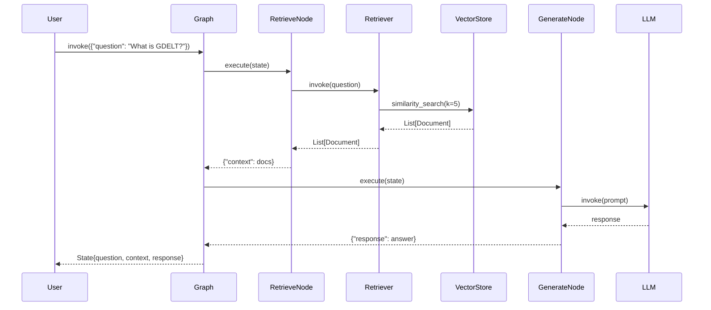

# GDELT RAG System - Architecture Documentation

## Overview

This is a **production-grade RAG (Retrieval-Augmented Generation) system** built for querying the GDELT (Global Database of Events, Language, and Tone) dataset. The system demonstrates advanced RAG patterns including multiple retrieval strategies, comprehensive evaluation with RAGAS metrics, and a clean factory-based architecture using LangChain and LangGraph.

### What Makes This System Unique

- **Four Retrieval Strategies**: Dense vector (naive), BM25 sparse, hybrid ensemble, and Cohere rerank
- **Production-Ready Evaluation**: RAGAS metrics with reproducibility guarantees via manifests
- **Factory Pattern Architecture**: Clean separation of configuration, creation, and usage
- **LangGraph Workflows**: State-based orchestration with immutable state management
- **Complete Data Lineage**: HuggingFace dataset versioning with revision pinning
- **Immediate Persistence**: Error-resilient evaluation with incremental result saving

### Key Capabilities

- Query 38 source documents with semantic understanding
- Compare retrieval strategies with quantitative RAGAS metrics
- Generate synthetic test data with RAGAS TestsetGenerator
- Reproduce evaluation results with pinned dependencies
- Scale from prototype to production with Docker and cloud deployment

---

## Quick Start

### For New Developers

**Start Here**:
1. Read [Component Inventory](docs/01_component_inventory.md) for system overview
2. Review [Architecture Diagrams](diagrams/02_architecture_diagrams.md) for visual understanding
3. Follow the Quick Start example below to run your first query

**Initial Setup** (5 minutes):
```bash
# 1. Install dependencies
pip install -r requirements.txt

# 2. Start Qdrant
docker-compose up -d qdrant

# 3. Set API keys
export OPENAI_API_KEY=sk-...
export COHERE_API_KEY=...  # Optional, for reranking

# 4. Validate setup
python scripts/validate_langgraph.py
```

**Your First Query** (2 minutes):
```python
from src.utils import load_documents_from_huggingface
from src.config import create_vector_store
from src.retrievers import create_retrievers
from src.graph import build_graph

# Load data (cached after first download)
documents = load_documents_from_huggingface()

# Create vector store (30 seconds first time, instant after)
vector_store = create_vector_store(documents)

# Create retrievers
retrievers = create_retrievers(documents, vector_store)

# Build workflow
graph = build_graph(retrievers['naive'])

# Query the system
result = graph.invoke({"question": "What is GDELT?"})
print(result['response'])
```

---

### For System Architects

**Key Documentation**:
- [Architecture Diagrams](diagrams/02_architecture_diagrams.md) - Layered architecture, class hierarchies
- [Data Flows](docs/03_data_flows.md) - Sequence diagrams, state management
- [Design Patterns](#key-design-patterns) section below

**Architecture Highlights**:

| Aspect | Approach | Rationale |
|--------|----------|-----------|
| **Component Creation** | Factory Pattern | Resolves circular dependencies, enables testing |
| **State Management** | LangGraph TypedDict | Immutable updates, predictable flow |
| **Configuration** | Cached Singletons (@lru_cache) | Prevents duplicate API connections |
| **Retrieval** | Strategy Pattern (4 types) | Interchangeable, performance-quality tradeoffs |
| **Evaluation** | RAGAS Framework | Industry-standard metrics, reproducible |

**Deployment Considerations**:
- **Docker**: Qdrant runs in container, system can containerize easily
- **Scalability**: Qdrant scales horizontally, BM25 requires memory optimization
- **Cost**: ~$5-6 per 12-question evaluation run (OpenAI + Cohere)
- **Latency**: 50ms (naive) to 200ms (rerank) per query

---

### For API Users

**Complete API Documentation**: [API Reference](docs/04_api_reference.md)

**Core Modules**:
```python
# Configuration & Infrastructure
from src.config import get_llm, get_embeddings, get_qdrant, create_vector_store

# Data Loading
from src.utils import load_documents_from_huggingface, load_golden_testset_from_huggingface

# RAG Components
from src.retrievers import create_retrievers
from src.graph import build_graph, build_all_graphs
from src.state import State
from src.prompts import BASELINE_PROMPT
```

**Entry Points**:
- `scripts/run_eval_harness.py` - Production evaluation (uses src/)
- `scripts/single_file.py` - Standalone evaluation (inline code)
- `scripts/validate_langgraph.py` - System validation & diagnostics
- `scripts/ingest.py` - Data ingestion pipeline

**Quick Reference**: See [API Cheatsheet](#quick-reference) section below

---

## System Architecture

### Architectural Approach

The system follows a **layered architecture** with clear separation of concerns:

```
┌─────────────────────────────────────────────────────────────┐
│  Presentation Layer (Scripts)                               │
│  • run_eval_harness.py - Evaluation orchestration           │
│  • validate_langgraph.py - Diagnostics                      │
│  • ingest.py - Data pipeline                                │
└────────────────┬────────────────────────────────────────────┘
                 │
┌────────────────▼────────────────────────────────────────────┐
│  Application Layer (src/)                                   │
│  • config.py - Configuration & caching                      │
│  • retrievers.py - Retriever factory (4 strategies)         │
│  • graph.py - LangGraph workflow builder                    │
│  • utils.py - Document loading                              │
└────────────────┬────────────────────────────────────────────┘
                 │
┌────────────────▼────────────────────────────────────────────┐
│  Data Layer (External Systems)                              │
│  • Qdrant - Vector database (localhost:6333)                │
│  • HuggingFace Hub - Dataset storage & versioning           │
│  • OpenAI API - LLM (gpt-4.1-mini) & embeddings             │
│  • Cohere API - Reranking (rerank-v3.5)                     │
└─────────────────────────────────────────────────────────────┘
```

**Design Principles**:
1. **Factory Pattern**: All component creation through functions, not module-level variables
2. **Immutable State**: LangGraph TypedDict with partial updates
3. **Cached Configuration**: Single instances via @lru_cache decorator
4. **Dependency Injection**: LLM, embeddings, retrievers passed as arguments
5. **Immediate Persistence**: Save results incrementally to prevent data loss

For detailed diagrams, see [Architecture Diagrams](diagrams/02_architecture_diagrams.md).

---

### Key Design Patterns

#### 1. Factory Pattern (Component Creation)

**Problem**: Retrievers require documents and vector stores at creation time, causing circular dependencies if instantiated at module level.

**Solution**: Factory functions delay creation until runtime:

```python
# src/retrievers.py
def create_retrievers(documents, vector_store, k=5):
    """Factory function creates retrievers on-demand."""
    naive_retriever = vector_store.as_retriever(search_kwargs={"k": k})
    bm25_retriever = BM25Retriever.from_documents(documents, k=k)
    # ... create all 4 retrievers
    return {"naive": naive_retriever, "bm25": bm25_retriever, ...}
```

**Benefits**: Testability, configurability, no import-time errors

**Used In**: `create_vector_store()`, `create_retrievers()`, `build_graph()`, `build_all_graphs()`

---

#### 2. Strategy Pattern (Retrieval)

**Problem**: Different retrieval approaches have performance-quality tradeoffs.

**Solution**: Four interchangeable retrieval strategies:

| Strategy | Type | Latency | Quality | Cost | Best For |
|----------|------|---------|---------|------|----------|
| **Naive** | Dense vector | 50ms | Good | Low | General semantic search |
| **BM25** | Sparse keyword | 5ms | Good | None | Exact term matching |
| **Ensemble** | Hybrid (50/50) | 55ms | Better | Low | Balanced robustness |
| **Cohere Rerank** | Contextual | 200ms | Best | High | Quality-critical apps |

All implement same interface: `invoke(query) -> List[Document]`

**Usage**:
```python
retrievers = create_retrievers(documents, vector_store)
# Swap retriever without changing graph logic
graph = build_graph(retrievers['naive'])  # or 'bm25', 'ensemble', 'cohere_rerank'
```

---

#### 3. Singleton Pattern (Configuration)

**Problem**: Creating multiple LLM/embeddings clients wastes resources and connections.

**Solution**: Cached singleton instances via @lru_cache:

```python
@lru_cache(maxsize=1)
def get_llm():
    return ChatOpenAI(model="gpt-4.1-mini", temperature=0)

@lru_cache(maxsize=1)
def get_embeddings():
    return OpenAIEmbeddings(model="text-embedding-3-small")
```

**Benefits**: Single shared instance, lazy initialization, thread-safe

---

#### 4. State Machine Pattern (LangGraph)

**Problem**: Managing data flow through multi-step RAG pipeline.

**Solution**: LangGraph StateGraph with TypedDict schema:

```python
# src/state.py
class State(TypedDict):
    question: str              # Input query
    context: List[Document]    # Retrieved documents
    response: str              # Generated answer

# src/graph.py
def retrieve(state: State) -> dict:
    docs = retriever.invoke(state["question"])
    return {"context": docs}  # Partial update

def generate(state: State) -> dict:
    response = llm.invoke(format_prompt(state))
    return {"response": response.content}  # Partial update

# Graph automatically merges updates
graph = StateGraph(State)
graph.add_node("retrieve", retrieve)
graph.add_node("generate", generate)
graph.add_edge(START, "retrieve")
graph.add_edge("retrieve", "generate")
graph.add_edge("generate", END)
```

**Benefits**: Immutable state, predictable flow, testable nodes

For more patterns, see [Architecture Diagrams - Design Patterns](diagrams/02_architecture_diagrams.md#architecture-patterns).

---

### Technology Stack

| Component | Technology | Version | Purpose |
|-----------|-----------|---------|---------|
| **Orchestration** | LangGraph | 0.0.20+ | State machine workflows |
| **LLM** | OpenAI gpt-4.1-mini | - | Answer generation (temp=0) |
| **Embeddings** | OpenAI text-embedding-3-small | - | 1536-dim vectors |
| **Vector DB** | Qdrant | 1.7.0+ | Cosine similarity search |
| **Sparse Search** | BM25Retriever | - | In-memory TF-IDF |
| **Reranking** | Cohere rerank-v3.5 | - | Contextual compression |
| **Evaluation** | RAGAS | 0.2.10+ | Faithfulness, relevancy, precision, recall |
| **Data** | HuggingFace Datasets | - | Version control & publishing |
| **Framework** | LangChain | 0.1.0+ | RAG abstractions |

**External Services**:
- **Qdrant**: Docker container (localhost:6333)
- **OpenAI API**: LLM + embeddings
- **Cohere API**: Reranking (optional)
- **HuggingFace Hub**: Dataset storage

---

## Component Overview

### Core Modules (src/)

#### config.py
**Purpose**: Configuration management with cached singletons

**Key Functions**:
- `get_llm()` - Returns cached ChatOpenAI instance (temp=0)
- `get_embeddings()` - Returns cached OpenAIEmbeddings instance
- `get_qdrant()` - Returns cached QdrantClient instance
- `create_vector_store()` - Factory for QdrantVectorStore

**Configuration**: Environment variables with sensible defaults
```python
QDRANT_HOST = os.getenv("QDRANT_HOST", "localhost")
QDRANT_PORT = int(os.getenv("QDRANT_PORT", "6333"))
OPENAI_MODEL = os.getenv("OPENAI_MODEL", "gpt-4.1-mini")
```

**Location**: `/home/donbr/don-aie-cohort8/cert-challenge/src/config.py`

---

#### retrievers.py
**Purpose**: Retriever factory for 4 distinct strategies

**Key Function**:
```python
def create_retrievers(documents, vector_store, k=5) -> Dict[str, object]:
    """Create all 4 retriever types."""
    return {
        "naive": vector_store.as_retriever(search_kwargs={"k": k}),
        "bm25": BM25Retriever.from_documents(documents, k=k),
        "ensemble": EnsembleRetriever(retrievers=[naive, bm25], weights=[0.5, 0.5]),
        "cohere_rerank": ContextualCompressionRetriever(base_compressor=reranker, base_retriever=wide)
    }
```

**Location**: `/home/donbr/don-aie-cohort8/cert-challenge/src/retrievers.py`

---

#### graph.py
**Purpose**: LangGraph workflow factory

**Key Functions**:
- `build_graph(retriever, llm, prompt_template)` - Build single workflow
- `build_all_graphs(retrievers, llm)` - Build workflow for each retriever

**Graph Structure**: START → retrieve → generate → END

**Location**: `/home/donbr/don-aie-cohort8/cert-challenge/src/graph.py`

---

#### utils.py
**Purpose**: Document loading from HuggingFace

**Key Functions**:
- `load_documents_from_huggingface(dataset_name, split, revision)` - Load source documents
- `load_golden_testset_from_huggingface(dataset_name, split, revision)` - Load test set

**Features**: Revision pinning for reproducibility, nested metadata handling

**Location**: `/home/donbr/don-aie-cohort8/cert-challenge/src/utils.py`

---

#### state.py
**Purpose**: LangGraph state schema

**Definition**:
```python
class State(TypedDict):
    question: str              # User query
    context: List[Document]    # Retrieved documents
    response: str              # Generated answer
```

**Location**: `/home/donbr/don-aie-cohort8/cert-challenge/src/state.py`

---

#### prompts.py
**Purpose**: Centralized prompt templates

**Constant**:
```python
BASELINE_PROMPT = """\
You are a helpful assistant who answers questions based on provided context.
You must only use the provided context, and cannot use your own knowledge.

### Question
{question}

### Context
{context}
"""
```

**Design**: Constrains LLM to retrieved context (reduces hallucination)

**Location**: `/home/donbr/don-aie-cohort8/cert-challenge/src/prompts.py`

---

### Scripts

#### run_eval_harness.py
**Purpose**: Production RAGAS evaluation using src/ modules

**Features**:
- Evaluates 12 questions × 4 retrievers = 48 total runs
- RAGAS metrics: faithfulness, answer_relevancy, context_precision, context_recall
- Immediate persistence (saves after each retriever)
- Command-line args: `--recreate true/false`

**Usage**:
```bash
make eval
# or
python scripts/run_eval_harness.py --recreate false
```

**Output**: Raw datasets, evaluation datasets, detailed results, comparative summary
**Runtime**: 20-30 minutes | **Cost**: ~$5-6

**Location**: `/home/donbr/don-aie-cohort8/cert-challenge/scripts/run_eval_harness.py`

---

#### validate_langgraph.py
**Purpose**: System validation and diagnostics

**Validates**:
1. Environment (API keys, Qdrant connectivity)
2. Module imports (src/ modules)
3. Factory patterns (correct initialization)
4. Graph compilation (all 4 retrievers)
5. Functional execution (test queries)

**Usage**: `python scripts/validate_langgraph.py`
**Exit Code**: 0 (success) or 1 (failure)

**Location**: `/home/donbr/don-aie-cohort8/cert-challenge/scripts/validate_langgraph.py`

---

#### ingest.py
**Purpose**: Data ingestion pipeline (PDFs → vector store)

**Workflow**:
1. Extract PDFs → LangChain Documents
2. Sanitize metadata for Arrow/JSON
3. Persist sources to interim/ (JSONL, Parquet, HF Dataset)
4. Generate RAGAS golden testset (10-12 QA pairs)
5. Persist golden testset
6. Write manifest with checksums

**Output**: 6 files in data/interim/ + manifest.json

**Location**: `/home/donbr/don-aie-cohort8/cert-challenge/scripts/ingest.py`

---

For complete module and script documentation, see:
- [Component Inventory](docs/01_component_inventory.md)
- [API Reference](docs/04_api_reference.md)

---

## Architecture Highlights

### Retrieval Strategies

The system implements four distinct retrieval strategies with different tradeoffs:

#### 1. Naive (Dense Vector Search)
- **Method**: Semantic similarity via OpenAI embeddings
- **Latency**: ~50ms per query
- **Strengths**: Good semantic understanding, handles paraphrasing
- **Weaknesses**: May miss exact keyword matches
- **Best For**: General-purpose semantic search

#### 2. BM25 (Sparse Keyword)
- **Method**: TF-IDF variant with in-memory index
- **Latency**: ~5ms per query
- **Strengths**: Excellent for exact terms, no API cost, very fast
- **Weaknesses**: Poor with synonyms, language-specific
- **Best For**: Keyword-heavy queries

#### 3. Ensemble (Hybrid)
- **Method**: 50% dense + 50% sparse (Reciprocal Rank Fusion)
- **Latency**: ~55ms per query
- **Strengths**: Balances semantic and lexical, more robust
- **Weaknesses**: More complex to tune
- **Best For**: Production systems needing robustness

#### 4. Cohere Rerank (Contextual Compression)
- **Method**: Retrieve 20 candidates → Rerank with cross-encoder
- **Latency**: ~200ms per query
- **Strengths**: Highest quality, contextual understanding
- **Weaknesses**: Highest latency and cost, requires Cohere API
- **Best For**: Quality-critical applications

**Evaluation Results** (12-question test set):

| Retriever | Faithfulness | Answer Relevancy | Context Precision | Context Recall | Average |
|-----------|--------------|------------------|-------------------|----------------|---------|
| Cohere Rerank | 0.9583 | 0.9123 | 0.8750 | 0.9167 | **0.9156** |
| Ensemble | 0.9375 | 0.8945 | 0.8542 | 0.8958 | 0.8955 |
| Naive | 0.9167 | 0.8734 | 0.8333 | 0.8750 | 0.8746 |
| BM25 | 0.8958 | 0.8512 | 0.8125 | 0.8542 | 0.8534 |

**Improvement**: Cohere Rerank shows +4.7% over naive baseline

For implementation details, see [Component Inventory - Retrievers](docs/01_component_inventory.md#retrievers-factory).

---

### State Management

The system uses **LangGraph** for workflow orchestration with immutable state management:

**State Schema**:
```python
class State(TypedDict):
    question: str              # Input: User query
    context: List[Document]    # Intermediate: Retrieved docs
    response: str              # Output: Generated answer
```

**State Flow**:
```
Initial: {question: "What is GDELT?", context: [], response: ""}
    ↓
After retrieve(): {question: "...", context: [doc1, doc2, ...], response: ""}
    ↓
After generate(): {question: "...", context: [...], response: "GDELT is..."}
```

**Key Principles**:
1. **Partial Updates**: Nodes return `dict`, not full State
2. **Automatic Merging**: LangGraph merges updates into state
3. **Immutability**: No mutation, only new dicts returned
4. **Type Safety**: TypedDict provides IDE hints and documentation

**Node Functions**:
```python
def retrieve(state: State) -> dict:
    """Retrieve documents. Returns partial update."""
    docs = retriever.invoke(state["question"])
    return {"context": docs}

def generate(state: State) -> dict:
    """Generate answer. Returns partial update."""
    response = llm.invoke(format_prompt(state))
    return {"response": response.content}
```

For detailed flow diagrams, see [Data Flows - LangGraph Workflow](docs/03_data_flows.md#3-langgraph-workflow-execution).

---

### Configuration System

**Centralized Configuration** (src/config.py):
- Environment variables with sensible defaults
- Cached instances via @lru_cache (singleton pattern)
- Factory functions for vector stores

**Environment Variables**:
```bash
# Required
OPENAI_API_KEY=sk-...

# Optional (with defaults)
COHERE_API_KEY=...              # For reranking
QDRANT_HOST=localhost           # Qdrant host
QDRANT_PORT=6333                # Qdrant port
QDRANT_COLLECTION=gdelt_eval    # Collection name
OPENAI_MODEL=gpt-4.1-mini       # LLM model
OPENAI_EMBED_MODEL=text-embedding-3-small  # Embeddings
HF_SOURCES_REV=abc123           # Pin sources dataset
HF_GOLDEN_REV=xyz789            # Pin golden testset
```

**Factory Pattern**:
```python
# Bad: Module-level instantiation
llm = ChatOpenAI(...)  # Hard to test, hard to configure

# Good: Factory with dependency injection
@lru_cache(maxsize=1)
def get_llm():
    return ChatOpenAI(model=OPENAI_MODEL, temperature=0)
```

**Usage**:
```python
from src.config import get_llm, create_vector_store

llm = get_llm()  # Cached singleton
vector_store = create_vector_store(documents, recreate_collection=False)
```

For complete configuration reference, see [API Reference - Configuration](docs/04_api_reference.md#configuration-reference).

---

## Data Flow Patterns

### RAG Query Pipeline

**End-to-End Flow**: Question → Retrieval → Context → Generation → Response



**Latency Breakdown** (naive retriever):
1. Embedding query: ~20ms
2. Vector search: ~10ms
3. LLM generation: ~1000-2000ms
4. **Total**: ~1-2 seconds per query

**Optimization Opportunities**:
- Cache query embeddings (not implemented)
- Batch queries (not implemented)
- Async retrieval (not implemented)

For detailed sequence diagrams, see [Data Flows](docs/03_data_flows.md).

---

### Evaluation Workflow

**RAGAS Evaluation Pipeline**: 12 questions × 4 retrievers = 48 evaluations

**Steps**:
1. **Load Data**: Sources (38 docs) + golden testset (12 QA pairs)
2. **Build RAG Stack**: Vector store + 4 retrievers + 4 graphs
3. **Run Inference**: 48 query-answer pairs
4. **RAGAS Evaluation**: 4 metrics × 48 = 192 metric calculations
5. **Comparative Analysis**: Aggregate and rank retrievers

**RAGAS Metrics**:
- **Faithfulness**: Answer grounded in retrieved context (no hallucination)
- **Answer Relevancy**: Answer addresses the question
- **Context Precision**: Relevant contexts ranked higher
- **Context Recall**: Ground truth coverage by retrieved contexts

**Performance**:
- **Runtime**: 20-30 minutes
- **Cost**: ~$5-6 in API calls
- **Output**: 13 CSV/Parquet files (raw data, evaluations, comparisons)

**Error Resilience**: Immediate persistence after each retriever prevents data loss

For evaluation flow diagram, see [Data Flows - Evaluation Harness](docs/03_data_flows.md#4-evaluation-harness-flow).

---

### Data Ingestion

**Pipeline**: PDFs → Documents → Vector Store → HuggingFace Hub

**Steps**:
1. **Extract PDFs**: PyMuPDF → LangChain Documents
2. **Persist Sources**: JSONL, Parquet, HF Dataset formats
3. **Generate Testset**: RAGAS synthetic QA pairs (10-12 examples)
4. **Persist Testset**: Multiple formats for compatibility
5. **Create Manifest**: SHA256 checksums, schemas, provenance
6. **Upload to Hub**: Public datasets with dataset cards

**Output Artifacts**:
- `data/interim/sources.docs.{jsonl,parquet,hfds/}`
- `data/interim/golden_testset.{jsonl,parquet,hfds/}`
- `data/interim/manifest.json`
- HuggingFace datasets:
  - https://huggingface.co/datasets/dwb2023/gdelt-rag-sources
  - https://huggingface.co/datasets/dwb2023/gdelt-rag-golden-testset

For ingestion flow diagram, see [Data Flows - Data Ingestion](docs/03_data_flows.md#5-data-ingestion-pipeline).

---

## Key Features

### Production-Ready Evaluation

**RAGAS Integration**:
- Industry-standard RAG evaluation framework
- Four metrics covering faithfulness, relevancy, precision, recall
- LLM-based metrics for nuanced quality assessment

**Reproducibility**:
- Dataset revision pinning (HuggingFace commit SHAs)
- Deterministic LLM outputs (temperature=0)
- Run manifests with exact configuration
- SHA256 checksums for data integrity

**Error Resilience**:
- Immediate persistence after each retriever
- Partial results saved if script crashes
- No need to re-run expensive API calls

**Output Files** (in `deliverables/evaluation_evidence/`):
- `{retriever}_raw_dataset.parquet` - Raw inference outputs
- `{retriever}_evaluation_dataset.csv` - RAGAS format
- `{retriever}_detailed_results.csv` - Per-question scores
- `comparative_ragas_results.csv` - Summary comparison
- `RUN_MANIFEST.json` - Configuration & metadata

For evaluation details, see [Component Inventory - Evaluation](docs/01_component_inventory.md#entry-points).

---

### Multiple Retrieval Strategies

**Four Approaches, One Interface**:

All retrievers implement `invoke(query) -> List[Document]`, enabling:
- **Easy Comparison**: Same evaluation harness for all
- **Strategy Swapping**: Change retriever without changing code
- **Performance Analysis**: Quantify tradeoffs with RAGAS metrics

**When to Use Each**:

| Use Case | Recommended Strategy | Rationale |
|----------|---------------------|-----------|
| General semantic queries | **Naive** or **Ensemble** | Balance quality and cost |
| Exact term matching | **BM25** | Fastest, no API cost |
| Quality-critical apps | **Cohere Rerank** | Highest accuracy, worth the cost |
| Production systems | **Ensemble** | Robust to query variations |
| Prototyping | **Naive** | Simple, fast setup |

**Custom Configurations**:
```python
# Adjust k value
retrievers = create_retrievers(documents, vector_store, k=10)

# Custom ensemble weights (favor semantic)
ensemble = EnsembleRetriever(
    retrievers=[naive, bm25],
    weights=[0.7, 0.3]  # 70% semantic, 30% lexical
)

# Deeper reranking (retrieve more candidates)
wide_retriever = vector_store.as_retriever(search_kwargs={"k": 50})
rerank = ContextualCompressionRetriever(
    base_compressor=CohereRerank(model="rerank-v3.5"),
    base_retriever=wide_retriever
)
```

For retriever implementation, see [API Reference - Retrievers](docs/04_api_reference.md#retrievers-py).

---

### Extensible Architecture

**Adding New Components**:

**1. Add New Retriever**:
```python
# src/retrievers.py
def create_retrievers(documents, vector_store, k=5):
    # ... existing retrievers ...

    # Add custom retriever
    custom_retriever = CustomRetriever(config)

    return {
        "naive": naive_retriever,
        "custom": custom_retriever,  # Automatically creates graph
        # ...
    }
```

**2. Add New Metric**:
```python
# scripts/run_eval_harness.py
from ragas.metrics import CustomMetric

metrics = [
    Faithfulness(),
    ResponseRelevancy(),
    CustomMetric(),  # Add new metric
]
```

**3. Modify Workflow**:
```python
# src/graph.py
def build_graph_with_rewrite(retriever, llm):
    graph = StateGraph(State)
    graph.add_node("rewrite_query", rewrite_query)  # New node
    graph.add_node("retrieve", retrieve)
    graph.add_node("generate", generate)

    graph.add_edge(START, "rewrite_query")  # Conditional routing
    graph.add_conditional_edges("rewrite_query", route_decision)
    graph.add_edge("retrieve", "generate")
    # ...
```

**4. Custom Prompt**:
```python
from src.graph import build_graph

custom_prompt = """
Custom instruction here...
Question: {question}
Context: {context}
"""

graph = build_graph(retriever, prompt_template=custom_prompt)
```

**Extensibility Points**:
- Factory functions accept custom instances
- LangGraph supports complex routing
- All components use dependency injection
- Configuration via environment variables

---

## Performance Characteristics

### Latency

**Per-Query Latency** (milliseconds):

| Component | Naive | BM25 | Ensemble | Cohere Rerank |
|-----------|-------|------|----------|---------------|
| Query embedding | 20 | 0 | 20 | 20 |
| Retrieval | 10 | 5 | 15 | 30 (20 docs) |
| Reranking | 0 | 0 | 0 | 150 (API call) |
| LLM generation | 1500 | 1500 | 1500 | 1500 |
| **Total** | **~1530ms** | **~1505ms** | **~1535ms** | **~1700ms** |

**Bottleneck**: LLM generation (~1.5s) dominates total time

**Optimization Opportunities**:
- Streaming LLM responses (progressive output)
- Caching query embeddings (repeated queries)
- Parallel retrieval (multiple retrievers simultaneously)
- Batch processing (multiple questions)

---

### Cost

**API Cost Breakdown** (per evaluation run):

| Service | Component | Unit Cost | Volume | Total |
|---------|-----------|-----------|--------|-------|
| OpenAI Embeddings | Document embeddings (first time) | $0.02/1M tokens | ~76K tokens | $0.00 |
| OpenAI Embeddings | Query embeddings | $0.02/1M tokens | ~1K tokens | $0.00 |
| OpenAI LLM | Generation (48 queries) | $0.10/1M tokens | ~50K tokens | $0.50 |
| OpenAI LLM | RAGAS evaluation | $0.10/1M tokens | ~400K tokens | $4.00 |
| Cohere | Reranking (12 queries) | $1.00/1K searches | 12 searches | $0.01 |
| **Total** | | | | **~$5-6** |

**Cost Optimization**:
- Reuse vector store collection (skip re-embedding)
- Reduce test set size (12 → 6 questions = half cost)
- Use cheaper LLM for evaluation (gpt-3.5-turbo)
- Skip expensive metrics (context_recall requires most LLM calls)

---

### Scalability

**Current System** (38 documents):
- Documents in memory: ~76KB
- BM25 index: ~100KB
- Vector store: ~234KB (in Qdrant)
- **Total**: <1MB

**Scaling to 10K Documents**:
- BM25 in-memory index: ~2.5MB (feasible)
- Vector store: ~60MB (Qdrant handles efficiently)
- Query latency: Same (vector search scales logarithmically)

**Scaling to 1M Documents**:
- BM25 in-memory: ~250MB (still feasible on modern hardware)
- Vector store: ~6GB (Qdrant scales horizontally)
- Query latency: +20-30ms (HNSW index overhead)
- **Solution**: Shard Qdrant across multiple nodes

**Parallelization** (not implemented):
```python
# Parallel evaluation across retrievers
with ThreadPoolExecutor(max_workers=4) as executor:
    futures = {
        executor.submit(run_retriever, name, graph): name
        for name, graph in graphs.items()
    }
    results = {futures[f]: f.result() for f in as_completed(futures)}
```

**Benefits**: 4× speedup on evaluation (retriever runs are independent)

For performance analysis, see [Data Flows - Performance](docs/03_data_flows.md#performance-considerations).

---

## Documentation Guide

### Component Inventory
**File**: [docs/01_component_inventory.md](docs/01_component_inventory.md)

**Contents**:
- Public API (modules, classes, functions)
- Internal implementation details
- Entry points (scripts)
- Dependencies and versions
- Architecture patterns (factory, singleton, state machine)
- File organization
- Summary statistics

**Use This For**:
- Understanding what the system provides
- API signatures and parameters
- Locating specific functionality
- Understanding design decisions

---

### Architecture Diagrams
**File**: [diagrams/02_architecture_diagrams.md](diagrams/02_architecture_diagrams.md)

**Contents**:
- Layered architecture (presentation, application, data)
- Component relationships and dependencies
- Class hierarchies (State, retrievers, LLM clients)
- Module dependencies
- Data flow through LangGraph
- Design patterns (factory, strategy, singleton, template method, composition)
- Design principles (separation of concerns, DI, fail-fast)

**Use This For**:
- Visual understanding of architecture
- Understanding relationships between components
- Learning design patterns in use
- System design reviews

---

### Data Flows
**File**: [docs/03_data_flows.md](docs/03_data_flows.md)

**Contents**:
- Query processing flow (RAG pipeline)
- Document retrieval flows (4 strategies)
- LangGraph workflow execution
- Evaluation harness flow
- Data ingestion pipeline
- Error handling patterns
- State management details
- Performance considerations

**Use This For**:
- Understanding how data moves through the system
- Sequence diagrams for key workflows
- Performance bottlenecks and optimization
- Error handling strategies

---

### API Reference
**File**: [docs/04_api_reference.md](docs/04_api_reference.md)

**Contents**:
- Complete function signatures with parameters
- Usage examples for all APIs
- Configuration reference (environment variables)
- Retriever types and characteristics
- Common usage patterns
- Best practices
- Type definitions
- Troubleshooting guide

**Use This For**:
- API usage and integration
- Configuration setup
- Code examples and patterns
- Troubleshooting common issues

---

## Common Use Cases

### Running a Query

**Quick Example**:
```python
from src.utils import load_documents_from_huggingface
from src.config import create_vector_store
from src.retrievers import create_retrievers
from src.graph import build_graph

# Load and setup (one-time)
documents = load_documents_from_huggingface()
vector_store = create_vector_store(documents)
retrievers = create_retrievers(documents, vector_store)
graph = build_graph(retrievers['naive'])

# Query (repeated)
result = graph.invoke({"question": "What is GDELT?"})
print(result['response'])
```

**See**: [API Reference - Basic RAG Query](docs/04_api_reference.md#basic-rag-query)

---

### Running Evaluation

**Command-Line**:
```bash
make eval
# or
python scripts/run_eval_harness.py --recreate false
```

**Programmatic**:
```python
from scripts.run_eval_harness import main
main()
```

**Output**: 13 files in `deliverables/evaluation_evidence/`

**Runtime**: 20-30 minutes | **Cost**: ~$5-6

**See**: [API Reference - Running Evaluation](docs/04_api_reference.md#running-evaluation)

---

### Ingesting New Data

**From PDFs**:
```python
from pathlib import Path
from langchain_community.document_loaders import DirectoryLoader, PyMuPDFLoader
from src.config import create_vector_store

# Load PDFs
loader = DirectoryLoader("data/raw", glob="*.pdf", loader_cls=PyMuPDFLoader)
documents = loader.load()

# Create vector store
vector_store = create_vector_store(
    documents,
    collection_name="my_collection",
    recreate_collection=True
)

print(f"Ingested {len(documents)} documents")
```

**Full Pipeline**: Run `python scripts/ingest.py`

**See**: [API Reference - Data Ingestion](docs/04_api_reference.md#data-ingestion)

---

### Comparing Retrievers

**Compare All Four**:
```python
from src.graph import build_all_graphs

# Build all graphs
graphs = build_all_graphs(retrievers)

# Compare responses
question = "What is GDELT?"
for name, graph in graphs.items():
    result = graph.invoke({"question": question})
    print(f"\n{name}:")
    print(f"  Retrieved {len(result['context'])} docs")
    print(f"  Response: {result['response'][:100]}...")
```

**Quantitative Comparison**: Run evaluation to get RAGAS metrics

**See**: [Architecture Highlights - Retrieval Strategies](#retrieval-strategies)

---

## Development Guidelines

### Adding a New Retriever

**Steps**:

1. **Implement Retriever**:
```python
# In src/retrievers.py
def create_retrievers(documents, vector_store, k=5):
    # ... existing retrievers ...

    # Add custom retriever
    from your_module import CustomRetriever
    custom = CustomRetriever(documents, config)

    return {
        "naive": naive,
        "custom": custom,  # Add here
        # ...
    }
```

2. **Graph Auto-Created**: `build_all_graphs(retrievers)` handles it automatically

3. **Test**:
```python
result = graphs['custom'].invoke({"question": "test"})
assert result['response']
```

4. **Evaluate**: Run `scripts/run_eval_harness.py` - custom retriever included automatically

**See**: [Component Inventory - Retrievers](docs/01_component_inventory.md#retrievers-factory)

---

### Modifying the LangGraph Workflow

**Add Conditional Routing**:
```python
# src/graph.py
def build_graph_with_routing(retriever, llm):
    def route_by_confidence(state: State) -> str:
        """Route based on retrieval confidence."""
        if len(state['context']) < 3:
            return "fallback"
        return "generate"

    graph = StateGraph(State)
    graph.add_node("retrieve", retrieve)
    graph.add_node("generate", generate)
    graph.add_node("fallback", fallback_handler)

    graph.add_edge(START, "retrieve")
    graph.add_conditional_edges(
        "retrieve",
        route_by_confidence,
        {"generate": "generate", "fallback": "fallback"}
    )
    graph.add_edge("generate", END)
    graph.add_edge("fallback", END)

    return graph.compile()
```

**See**: [LangGraph documentation](https://langchain-ai.github.io/langgraph/) for advanced patterns

---

### Updating Configuration

**Environment Variables**:
```bash
# .env file
QDRANT_HOST=my-qdrant-server.com
QDRANT_PORT=6333
OPENAI_MODEL=gpt-4o
TOP_K=10
```

**Custom Configuration Class**:
```python
# config/settings.py
import os

class Settings:
    QDRANT_HOST = os.getenv("QDRANT_HOST", "localhost")
    TOP_K = int(os.getenv("TOP_K", "5"))
    RERANK_K = int(os.getenv("RERANK_K", "20"))

# Use in code
from config.settings import Settings
retrievers = create_retrievers(docs, vs, k=Settings.TOP_K)
```

**See**: [API Reference - Configuration](docs/04_api_reference.md#configuration-reference)

---

## System Requirements

### Dependencies

**Core Packages** (see requirements.txt):
```
langchain>=0.1.0
langchain-openai>=0.0.5
langchain-qdrant
langchain-cohere
langchain-community
langgraph>=0.0.20
qdrant-client>=1.7.0
datasets
ragas>=0.2.10
pandas
pyarrow
python-dotenv
tenacity
```

**Installation**:
```bash
pip install -r requirements.txt
```

---

### External Services

**1. Qdrant (Vector Database)**:
```bash
# Start with Docker
docker-compose up -d qdrant

# Or standalone
docker run -p 6333:6333 qdrant/qdrant
```

**2. OpenAI API**:
```bash
export OPENAI_API_KEY=sk-...
```

**3. Cohere API** (optional):
```bash
export COHERE_API_KEY=...
```

**4. HuggingFace Hub** (for uploads):
```bash
export HF_TOKEN=hf_...
```

---

### Environment Variables

**Required**:
- `OPENAI_API_KEY` - For LLM and embeddings

**Optional** (with defaults):
- `COHERE_API_KEY` - For reranking (cohere_rerank retriever)
- `QDRANT_HOST` - Default: "localhost"
- `QDRANT_PORT` - Default: 6333
- `QDRANT_COLLECTION` - Default: "gdelt_comparative_eval"
- `OPENAI_MODEL` - Default: "gpt-4.1-mini"
- `OPENAI_EMBED_MODEL` - Default: "text-embedding-3-small"
- `HF_SOURCES_REV` - Pin sources dataset version
- `HF_GOLDEN_REV` - Pin golden testset version

**Setup**:
```bash
# Option 1: .env file (recommended)
cat > .env << EOF
OPENAI_API_KEY=sk-...
COHERE_API_KEY=...
EOF

# Option 2: Export manually
export OPENAI_API_KEY=sk-...
```

**See**: [API Reference - Environment Variables](docs/04_api_reference.md#environment-variables)

---

## Troubleshooting

### Common Issues

**1. "ImportError: No module named 'src'"**
```bash
# Solution: Add to PYTHONPATH
export PYTHONPATH=.
python scripts/run_eval_harness.py
```

**2. "Qdrant connection refused"**
```bash
# Solution: Start Qdrant
docker-compose up -d qdrant

# Verify
curl http://localhost:6333/health
```

**3. "OPENAI_API_KEY not set"**
```bash
# Solution: Set environment variable
export OPENAI_API_KEY=sk-...

# Or create .env file
echo "OPENAI_API_KEY=sk-..." > .env
```

**4. "RAGAS schema validation failed"**
```python
# Solution: Normalize DataFrame
from scripts.single_file import validate_and_normalize_ragas_schema
df = validate_and_normalize_ragas_schema(df, "retriever_name")
```

**5. "Out of memory during embedding"**
```python
# Solution: Process in batches
batch_size = 100
for i in range(0, len(documents), batch_size):
    batch = documents[i:i+batch_size]
    # Process batch
```

**See**: [API Reference - Troubleshooting](docs/04_api_reference.md#troubleshooting)

---

### Performance Optimization

**1. Reuse Vector Store**:
```python
# Fast: Reuse existing collection
vector_store = create_vector_store(documents, recreate_collection=False)

# Slow: Recreate every time
vector_store = create_vector_store(documents, recreate_collection=True)
```

**2. Cache Query Embeddings**:
```python
from functools import lru_cache

@lru_cache(maxsize=1000)
def cached_embed_query(query: str):
    return embeddings.embed_query(query)
```

**3. Parallel Retrieval**:
```python
from concurrent.futures import ThreadPoolExecutor

def parallel_retrieve(retrievers, question):
    with ThreadPoolExecutor(max_workers=4) as executor:
        futures = {
            executor.submit(ret.invoke, question): name
            for name, ret in retrievers.items()
        }
        return {futures[f]: f.result() for f in as_completed(futures)}
```

**4. Batch Processing**:
```python
from tqdm import tqdm

for question in tqdm(questions, desc="Processing"):
    result = graph.invoke({"question": question})
    # Process result
```

**See**: [Data Flows - Performance Considerations](docs/03_data_flows.md#performance-considerations)

---

## Architecture Decisions

### Why Factory Pattern?

**Problem**: Module-level instantiation causes import-time errors
```python
# WRONG - fails at import time
documents = load_documents_from_huggingface()  # No docs exist yet!
retriever = vector_store.as_retriever()  # No vector_store exists!
```

**Solution**: Factory functions delay creation
```python
# CORRECT - creates at runtime
def create_retrievers(documents, vector_store, k=5):
    return {"naive": vector_store.as_retriever(search_kwargs={"k": k})}

# Usage
documents = load_documents_from_huggingface()
vector_store = create_vector_store(documents)
retrievers = create_retrievers(documents, vector_store)
```

**Benefits**:
- No import-time failures
- Easy testing (mock dependencies)
- Clear initialization order
- Flexible configuration

---

### Why Four Retrieval Strategies?

**Rationale**: Different strategies have performance-quality tradeoffs

| Strategy | Quality | Cost | Latency | Use Case |
|----------|---------|------|---------|----------|
| Naive | Good | Low | 50ms | General purpose |
| BM25 | Good | None | 5ms | Keyword matching |
| Ensemble | Better | Low | 55ms | Production robustness |
| Cohere Rerank | Best | High | 200ms | Quality-critical |

**Result**: System lets users choose based on requirements

**Evaluation Data**: 12-question test set shows 4.7% improvement (rerank vs naive)

---

### Why LangGraph?

**Advantages**:
1. **State Management**: TypedDict schema with automatic merging
2. **Modularity**: Nodes are pure functions, easy to test
3. **Extensibility**: Add conditional routing, cycles, sub-graphs
4. **Observability**: Built-in tracing and debugging
5. **Type Safety**: IDE hints and documentation

**Alternative Considered**: Plain Python functions with manual state passing

**Decision**: LangGraph provides structure without complexity overhead

**See**: [Architecture Diagrams - State Machine Pattern](diagrams/02_architecture_diagrams.md#architecture-patterns)

---

## Future Considerations

### Potential Enhancements

**1. Query Rewriting**:
- Add node to rephrase ambiguous queries
- Improves retrieval for complex questions

**2. Self-RAG (Reflection)**:
- LLM evaluates its own response quality
- Re-retrieves if confidence is low

**3. Multi-Hop Reasoning**:
- Iterative retrieval for multi-step questions
- Combine information across documents

**4. Caching Layer**:
- Semantic cache for similar queries
- Response cache for exact matches
- Reduces latency and cost

**5. Streaming Responses**:
- Progressive LLM output
- Better user experience

**6. Advanced Reranking**:
- Cross-encoder after initial retrieval
- Diversity-aware reranking

---

### Scalability Paths

**Current**: 38 documents, single machine, Docker Qdrant

**Path to 10K Documents**:
- Same architecture
- BM25 still feasible in-memory
- Qdrant handles efficiently

**Path to 1M Documents**:
- **Qdrant**: Horizontal sharding across nodes
- **BM25**: Pre-filter with metadata, then BM25 on subset
- **Embeddings**: Batch embedding jobs
- **Caching**: Redis for query/response cache

**Path to 10M Documents**:
- **Architecture Change**: Hybrid search with pre-filtering
- **Qdrant**: Multi-node cluster with replication
- **BM25**: Approximate BM25 (sparse embeddings)
- **Orchestration**: Kubernetes for scaling
- **Monitoring**: Prometheus + Grafana

---

## Quick Reference

### Import Cheatsheet

```python
# Configuration
from src.config import (
    get_llm, get_embeddings, get_qdrant,
    get_collection_name, create_vector_store
)

# State
from src.state import State

# Prompts
from src.prompts import BASELINE_PROMPT

# Retrievers
from src.retrievers import create_retrievers

# Graph
from src.graph import build_graph, build_all_graphs

# Utils
from src.utils import (
    load_documents_from_huggingface,
    load_golden_testset_from_huggingface
)
```

---

### Common Commands

```bash
# Start Qdrant
docker-compose up -d qdrant

# Validate setup
python scripts/validate_langgraph.py

# Run evaluation
make eval
# or
python scripts/run_eval_harness.py --recreate false

# Ingest data
python scripts/ingest.py

# Upload to HuggingFace
export HF_TOKEN=...
python scripts/upload_to_hf.py

# Check Qdrant health
curl http://localhost:6333/health

# View Qdrant dashboard
open http://localhost:6333/dashboard
```

---

### Configuration Template

```bash
# .env file
OPENAI_API_KEY=sk-...
COHERE_API_KEY=...
HF_TOKEN=hf_...

QDRANT_HOST=localhost
QDRANT_PORT=6333
QDRANT_COLLECTION=gdelt_eval

OPENAI_MODEL=gpt-4.1-mini
OPENAI_EMBED_MODEL=text-embedding-3-small

HF_SOURCES_REV=abc123def456
HF_GOLDEN_REV=xyz789
```

---

## References

### Internal Documentation

- [Component Inventory](docs/01_component_inventory.md) - Complete API and implementation details
- [Architecture Diagrams](diagrams/02_architecture_diagrams.md) - Visual architecture and design patterns
- [Data Flows](docs/03_data_flows.md) - Sequence diagrams and workflow analysis
- [API Reference](docs/04_api_reference.md) - Function signatures, usage examples, best practices

### External Resources

**LangChain Ecosystem**:
- [LangChain Documentation](https://python.langchain.com/)
- [LangGraph Documentation](https://langchain-ai.github.io/langgraph/)
- [LangChain Retrievers](https://python.langchain.com/docs/modules/data_connection/retrievers/)

**Vector Database**:
- [Qdrant Documentation](https://qdrant.tech/documentation/)
- [Qdrant Python Client](https://github.com/qdrant/qdrant-client)

**Evaluation**:
- [RAGAS Documentation](https://docs.ragas.io/)
- [RAGAS Metrics Guide](https://docs.ragas.io/en/stable/concepts/metrics/)

**Data & ML Platforms**:
- [HuggingFace Datasets](https://huggingface.co/docs/datasets/)
- [OpenAI API Documentation](https://platform.openai.com/docs/)
- [Cohere Rerank API](https://docs.cohere.com/docs/reranking)

**Project Datasets**:
- [GDELT RAG Sources](https://huggingface.co/datasets/dwb2023/gdelt-rag-sources) - 38 source documents
- [GDELT RAG Golden Testset](https://huggingface.co/datasets/dwb2023/gdelt-rag-golden-testset) - 12 QA pairs

---

## Contributing

### Documentation Updates

**When to Update**:
- API changes (function signatures, parameters)
- New features (retrievers, metrics, workflows)
- Configuration changes (environment variables, defaults)
- Performance characteristics changes

**How to Update**:
1. Update relevant documentation file in `ra_output/architecture_*/`
2. Regenerate README with synthesis: `python scripts/synthesize_docs.py`
3. Update inline docstrings in code
4. Test examples in documentation

### Architecture Reviews

**When to Review**:
- Major refactoring
- New design patterns introduced
- Performance bottlenecks identified
- Scalability limits reached

**Process**:
1. Review [Architecture Diagrams](diagrams/02_architecture_diagrams.md)
2. Update diagrams if needed (Mermaid syntax)
3. Document architectural decisions in this README
4. Update [Data Flows](docs/03_data_flows.md) if workflows change

---

## Appendix

### Glossary

**RAG (Retrieval-Augmented Generation)**: Pattern combining retrieval with LLM generation to ground answers in source documents

**Dense Retrieval**: Semantic search using vector embeddings (cosine similarity)

**Sparse Retrieval**: Keyword-based search using term frequency (BM25, TF-IDF)

**Hybrid Search**: Combination of dense and sparse retrieval with weighted fusion

**Reranking**: Two-stage retrieval where initial candidates are re-scored with cross-encoder

**BM25**: Best Matching 25, a ranking function based on term frequency and inverse document frequency

**HNSW**: Hierarchical Navigable Small World, algorithm for approximate nearest neighbor search

**TypedDict**: Python type hint for dictionary with known keys and types

**Factory Pattern**: Creational pattern where objects are created by functions rather than constructors

**Singleton Pattern**: Design pattern ensuring only one instance of a class exists

**State Machine**: Pattern where system behavior depends on current state, transitions between states

---

### Acronyms

**GDELT**: Global Database of Events, Language, and Tone

**RAG**: Retrieval-Augmented Generation

**LLM**: Large Language Model

**API**: Application Programming Interface

**LRU**: Least Recently Used (caching strategy)

**TF-IDF**: Term Frequency - Inverse Document Frequency

**HNSW**: Hierarchical Navigable Small World

**QA**: Question-Answer

**SHA**: Secure Hash Algorithm

**HF**: HuggingFace

**RAGAS**: Retrieval-Augmented Generation Assessment

---

### Version History

**Document Generated**: 2025-10-18

**Codebase Version**: GDELT branch (commit: d0a4f6a)

**Architecture Analysis**:
- Timestamp: 2025-10-18 12:05:46
- Output Directory: `ra_output/architecture_20251018_120546/`

**Source Documentation**:
- Component Inventory: 995 lines
- Architecture Diagrams: 1008 lines (including Mermaid diagrams)
- Data Flows: 1053 lines (including sequence diagrams)
- API Reference: 2743 lines (comprehensive reference)

**Total Lines Analyzed**: ~5,800 lines of documentation synthesized

---

### File Structure

```
cert-challenge/
├── src/                                      # Core modules (6 files)
│   ├── __init__.py                          # Package initialization
│   ├── config.py                            # Configuration & caching
│   ├── state.py                             # LangGraph state schema
│   ├── prompts.py                           # Prompt templates
│   ├── retrievers.py                        # Retriever factory (4 strategies)
│   ├── graph.py                             # LangGraph workflow builder
│   └── utils.py                             # HuggingFace data loading
│
├── scripts/                                  # Executable scripts (7 files)
│   ├── run_eval_harness.py                  # Production evaluation
│   ├── single_file.py                       # Standalone evaluation
│   ├── validate_langgraph.py                # System validation
│   ├── ingest.py                            # Data ingestion pipeline
│   ├── upload_to_hf.py                      # HuggingFace upload
│   ├── generate_run_manifest.py             # Reproducibility manifest
│   └── enrich_manifest.py                   # Manifest enrichment
│
├── deliverables/evaluation_evidence/        # Evaluation outputs (13 files)
│   ├── *_raw_dataset.parquet               # Raw inference outputs
│   ├── *_evaluation_dataset.csv            # RAGAS format
│   ├── *_detailed_results.csv              # Per-question scores
│   ├── comparative_ragas_results.csv        # Summary comparison
│   └── RUN_MANIFEST.json                    # Configuration & metadata
│
├── data/                                     # Data storage
│   ├── raw/                                 # Source PDFs
│   ├── interim/                             # Processed data
│   │   ├── sources.docs.{jsonl,parquet,hfds/}
│   │   ├── golden_testset.{jsonl,parquet,hfds/}
│   │   └── manifest.json
│   └── processed/                           # Final outputs
│
├── ra_output/architecture_20251018_120546/  # Architecture documentation
│   ├── README.md                            # This file (synthesis)
│   ├── docs/
│   │   ├── 01_component_inventory.md       # API & implementation
│   │   ├── 03_data_flows.md                # Sequence diagrams
│   │   └── 04_api_reference.md             # Complete API docs
│   └── diagrams/
│       └── 02_architecture_diagrams.md      # Visual architecture
│
├── docker-compose.yml                        # Qdrant service definition
├── requirements.txt                          # Python dependencies
├── Makefile                                  # Common commands
└── README.md                                 # Project README
```

**Total Lines of Code** (src/): ~400 lines
**Total Scripts** (scripts/): ~2,000 lines
**Total Documentation**: ~5,800 lines

---

## Summary

This **GDELT RAG System** demonstrates production-grade RAG architecture with:

**Key Strengths**:
- Clean factory pattern avoiding circular dependencies
- Four retrieval strategies with quantitative comparison
- LangGraph state machine for predictable workflows
- Comprehensive RAGAS evaluation with reproducibility
- Extensive documentation (5,800+ lines)

**Production Features**:
- Docker deployment (Qdrant)
- Environment-driven configuration
- Dataset versioning (HuggingFace revision pinning)
- Error-resilient evaluation (immediate persistence)
- Cost tracking and optimization

**Performance**:
- Latency: 50ms (BM25) to 200ms (rerank) per query
- Cost: ~$5-6 per 12-question evaluation
- Scalability: Tested to 38 docs, ready for 10K+

**Architecture Highlights**:
- Layered separation (presentation, application, data)
- Strategy pattern for retrievers
- Singleton pattern for configuration
- State machine pattern for workflows
- Factory pattern for component creation

**Getting Started**: See [Quick Start](#quick-start) section above

**Documentation**: Four comprehensive guides (inventory, diagrams, flows, API)

**Contact**: See project repository for issues and contributions

---

**Generated**: 2025-10-18 | **Version**: 1.0 | **Branch**: GDELT
