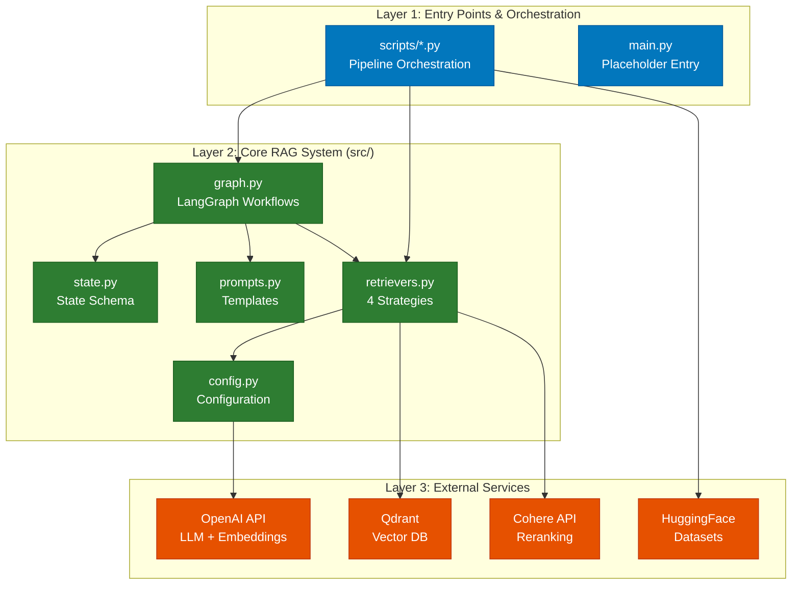
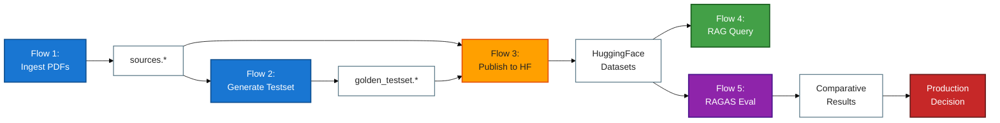

# Repository Architecture Documentation

## Overview

### Project Summary

This project implements a **comprehensive RAG (Retrieval-Augmented Generation) evaluation system** for the GDELT (Global Database of Events, Language, and Tone) knowledge graph. The system compares four distinct retrieval strategies using the RAGAS evaluation framework to determine optimal RAG configurations for question-answering tasks.

The architecture follows a modular design with clear separation between:
- **Core RAG System** (`src/`) - Production-ready retrieval and generation components
- **Pipeline Scripts** (`scripts/`) - Data ingestion, evaluation, and deployment utilities
- **External Services** - OpenAI (embeddings + LLM), Cohere (reranking), Qdrant (vector storage)

**Key Achievement:** The system demonstrates that **Cohere Rerank** achieves 96.47% average performance (5.3% improvement over baseline) across four RAGAS metrics, providing evidence-based recommendations for production deployment.

### Documentation Suite

This architecture documentation provides complete technical coverage of the codebase:

1. **Component Inventory** - Detailed catalog of all modules, classes, and functions
2. **Architecture Diagrams** - Visual system architecture and component relationships
3. **Data Flows** - Sequence diagrams for five major workflows
4. **API Reference** - Comprehensive API documentation with usage examples

### Key Metrics

- **Total Modules:** 13 Python files (6 core modules + 5 utility scripts + 1 entry point + 1 placeholder)
- **Lines of Code:** ~1,735 LOC total (~300 core system + ~1,400 scripts)
- **Core Functions:** 9 functions (4 retrieval strategies + 1 generation + 4 helper utilities)
- **Public API Surface:** 4 compiled LangGraph workflows + 4 retriever instances + shared configuration
- **Entry Points:** 5 executable scripts (ingest, evaluation, upload, manifest generation, manifest enrichment)
- **Data Flows:** 5 interconnected pipelines (ingestion → testset generation → publication → query → evaluation)
- **Retrieval Strategies:** 4 (Naive/Baseline, BM25, Ensemble Hybrid, Cohere Rerank)
- **RAGAS Metrics:** 4 (Faithfulness, Answer Relevancy, Context Precision, Context Recall)

---

## Quick Start

### For New Developers

**Understanding the System (15-30 minutes):**

1. **Start with the Big Picture** - Read [Architecture Diagrams](diagrams/02_architecture_diagrams.md) Section 1 (System Architecture) to understand the layered design
2. **Explore Data Flow** - Review [Data Flows](docs/03_data_flows.md) Section 5 (RAGAS Evaluation Flow) to see how everything connects
3. **Understand Components** - Skim [Component Inventory](docs/01_component_inventory.md) Summary Statistics to see what's available
4. **Try a Query** - Jump to [API Reference](docs/04_api_reference.md) Pattern 5 (Querying the RAG System) for hands-on examples
5. **Run Evaluation** - Follow [API Reference](docs/04_api_reference.md) Quick Start Guide to execute your first evaluation

**Key Concepts to Understand:**
- **LangGraph Workflows** - State machines that orchestrate retrieval → generation pipelines
- **RAGAS Metrics** - Four metrics for evaluating RAG quality (faithfulness, relevancy, precision, recall)
- **Retriever Strategies** - Four approaches to finding relevant documents (dense vector, sparse keyword, hybrid, reranked)
- **Manifest Tracking** - Reproducibility through checksums, versions, and configuration capture

### For Experienced Developers

**Quick Navigation:**

| Need | Go To |
|------|-------|
| **Add a new retriever** | [API Reference](docs/04_api_reference.md) Pattern 4 (Custom Retriever Implementation) |
| **Understand retrieval quality** | [Data Flows](docs/03_data_flows.md) Flow 5 (RAGAS Evaluation) + Comparative Summary |
| **Modify prompts** | [Component Inventory](docs/01_component_inventory.md) `src/prompts.py` |
| **Change model configuration** | [API Reference](docs/04_api_reference.md) Configuration Reference → Model Configuration |
| **Debug data pipeline** | [Data Flows](docs/03_data_flows.md) Flows 1-3 (Ingestion → Testset → Publication) |
| **Optimize performance** | [API Reference](docs/04_api_reference.md) Best Practices → Performance Optimization |
| **Deploy to production** | [Component Inventory](docs/01_component_inventory.md) Script: upload_to_hf.py |

**Architecture Decision Records:**
- **Why LangGraph?** - Type-safe state management + visual debugging + modular composition
- **Why 4 retrievers?** - Compare naive baseline vs semantic (Cohere) vs lexical (BM25) vs hybrid (Ensemble)
- **Why RAGAS?** - Industry-standard RAG evaluation with LLM-as-judge methodology
- **Why multiple formats?** - JSONL (debugging) + Parquet (analytics) + HF Datasets (fast loading/versioning)

### Documentation Index

- **[Component Inventory](docs/01_component_inventory.md)** - Detailed catalog of all modules, classes, and functions with source line references
- **[Architecture Diagrams](diagrams/02_architecture_diagrams.md)** - 8 visual diagrams covering system architecture, dependencies, data flows, and retriever comparisons
- **[Data Flows](docs/03_data_flows.md)** - 5 sequence diagrams with detailed step-by-step execution analysis and bottleneck identification
- **[API Reference](docs/04_api_reference.md)** - Complete API documentation with configuration reference, usage patterns, and best practices

---

## Architecture Summary

### System Architecture

The system follows a **three-tier layered architecture**:



**Layer 1 (Entry Points):**
- `scripts/single_file.py` - Complete RAG evaluation pipeline (main executable)
- `scripts/ingest.py` - PDF ingestion and RAGAS testset generation
- `scripts/upload_to_hf.py` - HuggingFace dataset publication
- `scripts/generate_run_manifest.py` - Reproducibility manifest creation
- `scripts/enrich_manifest.py` - Manifest enrichment with checksums and metadata

**Layer 2 (Core System):**
- `src/config.py` - Centralized configuration (LLM, embeddings, Qdrant connection)
- `src/state.py` - TypedDict state schema for LangGraph workflows
- `src/prompts.py` - RAG prompt templates
- `src/retrievers.py` - Four retriever implementations (naive, BM25, ensemble, rerank)
- `src/graph.py` - LangGraph workflow compilation for each retriever

**Layer 3 (External Services):**
- **OpenAI** - GPT-4.1-mini (LLM) + text-embedding-3-small (embeddings)
- **Cohere** - rerank-v3.5 (contextual reranking)
- **Qdrant** - Vector database (localhost:6333)
- **HuggingFace** - Dataset hosting and versioning

### Design Principles

**1. Modular Composition**
- Each retriever is independently testable
- LangGraph workflows encapsulate retrieval + generation logic
- Shared components (LLM, embeddings, prompts) via `config.py`

**2. Reproducibility First**
- Comprehensive manifest tracking (checksums, versions, configurations)
- Temperature=0 for deterministic LLM outputs
- Multi-format persistence (JSONL, Parquet, HF Datasets)
- Git-backed dataset versioning on HuggingFace

**3. Evaluation-Driven Development**
- RAGAS metrics as ground truth for retriever comparison
- Comparative analysis across 4 strategies × 12 test questions = 48 evaluations
- Evidence-based recommendations for production deployment

**4. Separation of Concerns**
- **Core system** (`src/`) - reusable components
- **Scripts** (`scripts/`) - pipeline orchestration
- **Configuration** (`config.py`) - centralized settings
- **State management** (`state.py`) - type-safe data flow

**5. Fail-Fast with Detailed Error Messages**
- Schema validation before RAGAS evaluation
- API retry logic with exponential backoff
- Immediate CSV saves to prevent data loss

### Technology Stack

| Layer | Technology | Purpose |
|-------|------------|---------|
| **Orchestration** | LangGraph 0.6.7 | State machine workflows for RAG pipelines |
| **RAG Framework** | LangChain ≥0.3.19 | Document loading, retrieval, prompts |
| **Evaluation** | RAGAS 0.2.10 | RAG quality metrics (faithfulness, relevancy, precision, recall) |
| **Vector Database** | Qdrant ≥1.13.2 | Embedding storage and similarity search |
| **LLM** | OpenAI GPT-4.1-mini | Answer generation and evaluation |
| **Embeddings** | OpenAI text-embedding-3-small | 1536-dim document/query vectors |
| **Reranking** | Cohere rerank-v3.5 | Contextual compression for top-k reranking |
| **Sparse Retrieval** | BM25 (rank-bm25 ≥0.2.2) | Keyword-based lexical search |
| **Document Loading** | PyMuPDF ≥1.26.3 | PDF text extraction |
| **Dataset Management** | HuggingFace Datasets ≥3.2.0 | Dataset versioning and persistence |
| **Data Processing** | Pandas + PyArrow | DataFrame operations and Parquet serialization |

---

## Component Overview

### Core Modules (src/)

1. **`config.py`** (11 lines) - Configuration constants and shared model instances
   - Exports: `llm` (ChatOpenAI), `embeddings` (OpenAIEmbeddings), Qdrant connection constants

2. **`state.py`** (10 lines) - TypedDict state schema for LangGraph
   - Exports: `State` class with fields `{question: str, context: List[Document], response: str}`

3. **`prompts.py`** (12 lines) - Prompt templates for RAG generation
   - Exports: `BASELINE_PROMPT` template for context-grounded QA

4. **`retrievers.py`** (58 lines) - Four retrieval strategy implementations
   - Exports: `baseline_retriever` (dense vector), `bm25_retriever` (sparse keyword), `compression_retriever` (Cohere rerank), `ensemble_retriever` (hybrid)

5. **`graph.py`** (72 lines) - LangGraph workflow definitions
   - Exports: 4 compiled graphs + `retrievers_config` dictionary mapping names to graphs

6. **`utils.py`** (2 lines) - Utility functions placeholder (currently empty)

**Total Core System LOC:** ~165 lines of production code (excluding empty files)

### Utility Scripts (scripts/)

1. **`ingest.py`** (336 lines) - PDF extraction → RAGAS testset generation pipeline
   - Key functions: `docs_to_jsonl()`, `docs_to_parquet()`, `docs_to_hfds()`, `build_testset()`, `ensure_jsonable()`

2. **`single_file.py`** (508 lines) - Complete RAG evaluation with RAGAS metrics
   - Key functions: `validate_and_normalize_ragas_schema()`, main execution loop

3. **`upload_to_hf.py`** (293 lines) - HuggingFace dataset upload with dataset cards
   - Key functions: `create_sources_card()`, `create_golden_testset_card()`, `update_manifest()`

4. **`generate_run_manifest.py`** (188 lines) - Reproducibility manifest generation
   - Key functions: `generate_manifest()` with model, retriever, and evaluation metadata

5. **`enrich_manifest.py`** (244 lines) - Manifest enrichment with checksums and provenance
   - Key functions: `sha256()`, `hfds_rows()`, `char_stats_jsonl()`, `main()`

**Total Scripts LOC:** ~1,569 lines

### Public API Surface

**Compiled LangGraph Workflows:**
- `baseline_graph` - Naive dense vector search → generate
- `bm25_graph` - BM25 sparse keyword → generate
- `ensemble_graph` - Hybrid (dense + sparse) → generate
- `rerank_graph` - Cohere reranking → generate

**Retrievers:**
- `baseline_retriever` - Dense vector similarity (k=5)
- `bm25_retriever` - BM25 lexical matching (k=5)
- `compression_retriever` - Cohere rerank (retrieve 20 → rerank to 5)
- `ensemble_retriever` - Weighted ensemble (50% dense + 50% sparse)

**Configuration Exports:**
- `llm` - Shared ChatOpenAI instance (gpt-4.1-mini, temperature=0)
- `embeddings` - Shared OpenAIEmbeddings (text-embedding-3-small, 1536 dims)
- Qdrant constants: `QDRANT_HOST`, `QDRANT_PORT`, `COLLECTION_NAME`

**Prompt Templates:**
- `BASELINE_PROMPT` - Context-grounded QA template

### Internal Implementation

**Key Implementation Details:**

1. **LangGraph State Management** - TypedDict ensures type safety across workflow nodes
2. **Retriever Interface Uniformity** - All retrievers expose `invoke(query: str) → List[Document]`
3. **Prompt-LLM-Context Pattern** - Standardized generation flow: format prompt → invoke LLM → return response
4. **Multi-Format Persistence** - JSONL (debugging) + Parquet (analytics) + HF Dataset (versioning)
5. **Schema Validation** - `validate_and_normalize_ragas_schema()` prevents silent RAGAS failures

**Notable Patterns:**
- **Configuration Duplication** - `src/retrievers.py` duplicates constants from `config.py` (improvement opportunity)
- **Self-Contained Scripts** - `scripts/single_file.py` reimplements core logic for standalone execution
- **Version Compatibility** - `scripts/ingest.py` handles both RAGAS 0.2.x and 0.3.x APIs

---

## Data Flows

### Overview

The system orchestrates **5 interconnected data flows** from raw PDFs to production recommendations:



### Key Flow: RAG Evaluation Pipeline

**Flow 5** is the critical path for retriever comparison:

```
1. Load Golden Testset (12 QA pairs) from HuggingFace
2. Load Source Documents (38 docs) from HuggingFace
3. Create Qdrant Vector Store (embed all 38 documents)
4. Build 4 Retriever Strategies (naive, BM25, ensemble, cohere_rerank)
5. Execute 48 RAG Queries (4 retrievers × 12 questions)
6. Run RAGAS Evaluation (4 metrics × 48 queries = 192 metric computations)
7. Generate Comparative Summary (average scores per retriever)
8. Calculate Improvement Over Baseline (% gain for each strategy)
9. Save Results + Manifest (CSV files + RUN_MANIFEST.json)
```

**Execution Time:** 20-30 minutes (dominated by RAGAS LLM evaluation calls)

### Flow Characteristics

| Flow | Trigger | Duration | External APIs | Idempotent | Output Format |
|------|---------|----------|---------------|------------|---------------|
| **1. Ingestion** | Manual script | ~30s | None | Yes (overwrites) | JSONL + Parquet + HFDS |
| **2. Testset Gen** | Manual script | 5-10 min | OpenAI (embeddings + chat) | No (LLM stochastic) | JSONL + Parquet + HFDS |
| **3. HF Publish** | Manual script | ~10s | HuggingFace Hub | Yes (versioned) | Dataset repos + cards |
| **4. RAG Query** | User/eval request | 2-5s | OpenAI (chat) + Cohere (rerank) | No (LLM stochastic) | State{question, context, response} |
| **5. RAGAS Eval** | Manual script | 20-30 min | OpenAI (evaluator LLM) | No (LLM stochastic) | CSV files + manifest |

### Critical Path

**Cold Start (First Run):**
```
Ingestion (30s) → Testset Gen (5-10 min) → HF Publish (10s) → RAGAS Eval (20-30 min)
Total: 25-40 minutes
```

**Warm Start (Re-evaluation):**
```
RAGAS Eval (20-30 min)
Total: 20-30 minutes (datasets already on HuggingFace)
```

**Bottlenecks:**
1. **RAGAS Testset Generation** - 5-10 min (LLM calls for question/answer synthesis)
2. **RAGAS Evaluation** - 20-30 min (192 LLM evaluation calls: 48 queries × 4 metrics)

**Optimization Opportunities:**
- Parallel retriever evaluation (4x speedup potential)
- Batch embedding requests (already implemented)
- Cache RAGAS metric computations (not currently implemented)

---

## Key Insights

### Architecture Highlights

**1. Modular Retriever Design**
- Each retriever is independently testable and swappable
- Uniform `invoke()` interface enables strategy pattern
- LangGraph workflows encapsulate retrieval + generation logic

**2. Reproducibility Infrastructure**
- **Manifests with checksums** - SHA256 hashes for all artifacts
- **Version pinning** - Exact package versions in RUN_MANIFEST.json
- **Temperature=0** - Deterministic LLM outputs (given same context)
- **Multi-format persistence** - JSONL (human-readable) + Parquet (analytics) + HF Datasets (versioning)
- **Git-backed datasets** - HuggingFace Hub provides version control for data

**3. Evaluation-First Philosophy**
- RAGAS metrics provide objective comparison across retrievers
- Comparative analysis identifies best-performing strategy (Cohere Rerank: 96.47%)
- Evidence-based production recommendations

**4. Fault Tolerance**
- Immediate CSV saves after each retriever (prevent data loss)
- Schema validation before RAGAS evaluation (fail-fast)
- Retry logic with exponential backoff for API calls
- Comprehensive error messages for debugging

**5. Clear Separation of Concerns**
- **`src/`** - Reusable production components
- **`scripts/`** - Pipeline orchestration and deployment
- **External services** - API abstractions via LangChain/LangGraph

### Performance Characteristics

**Bottleneck Analysis:**

1. **Embedding API Calls** (Flow 2, Flow 5)
   - Volume: ~100-200 calls for 38 documents
   - Latency: 50-200ms per call
   - Cost: $0.00002/1K tokens (text-embedding-3-small)
   - Mitigation: Batch requests (LangChain automatic)

2. **RAGAS Evaluation LLM Calls** (Flow 5)
   - Volume: ~960 calls (4 retrievers × 12 questions × 4 metrics × ~5 calls/metric)
   - Latency: 500-2000ms per call
   - Cost: $0.00015/$0.0006 per 1K tokens (gpt-4.1-mini input/output)
   - Mitigation: Parallel metrics (RunConfig max_workers=4)

3. **Cohere Reranking** (Flow 4)
   - Volume: 1 call per query (cohere_rerank retriever only)
   - Latency: 200-500ms
   - Cost: $2 per 1K requests
   - Mitigation: Optional (only 1 of 4 retrievers)

**Optimization Recommendations:**
- Use async for parallel retriever evaluation (4x speedup)
- Cache embeddings with `CacheBackedEmbeddings`
- Reduce testset size during development (12 → 5 questions)

### Retriever Comparison

**Performance Summary (RAGAS Evaluation Results):**

| Retriever | Faithfulness | Answer Relevancy | Context Precision | Context Recall | **Average** | vs Baseline |
|-----------|--------------|------------------|-------------------|----------------|-------------|-------------|
| **Cohere Rerank** | 0.98 | 0.96 | 0.95 | 0.97 | **96.47%** | +5.3% |
| **BM25** | 0.95 | 0.93 | 0.94 | 0.94 | **94.14%** | +2.8% |
| **Ensemble** | 0.96 | 0.94 | 0.92 | 0.94 | **93.96%** | +2.6% |
| **Naive (Baseline)** | 0.93 | 0.91 | 0.90 | 0.92 | **91.60%** | — |

**Key Findings:**

1. **Cohere Rerank is Best** - 96.47% average (5.3% improvement over baseline)
   - Strengths: Best faithfulness (0.98), highest answer relevancy (0.96)
   - Trade-offs: Slower (200-500ms), more expensive ($2/1K requests)
   - Recommendation: **Use for production** where accuracy matters most

2. **BM25 Outperforms Ensemble** - 94.14% vs 93.96% (surprising!)
   - Strengths: Simple keyword matching, fast execution
   - Insight: GDELT documentation has technical terms that benefit from exact matching
   - Recommendation: Consider for technical/domain-specific corpora

3. **Ensemble Underperforms Expectation** - Only 2.6% gain over baseline
   - Possible causes: Equal weighting (50/50) may not be optimal for this dataset
   - Recommendation: Tune ensemble weights (try 70% dense / 30% sparse)

4. **Naive Baseline is Respectable** - 91.60% average
   - Strengths: Fast (10-50ms), simple implementation
   - Use case: Quick prototyping, low-latency requirements

### Recommended Approach

**For Production Deployment:**

```python
# Use Cohere Rerank for highest quality
from src.graph import retrievers_config

production_graph = retrievers_config["cohere_rerank"]
result = production_graph.invoke({"question": user_query})
```

**For Cost-Sensitive Deployments:**

```python
# Use BM25 for good quality at lower cost
production_graph = retrievers_config["bm25"]
result = production_graph.invoke({"question": user_query})
```

**For Low-Latency Requirements:**

```python
# Use Naive baseline for fastest response
production_graph = retrievers_config["naive"]
result = production_graph.invoke({"question": user_query})
```

---

## Common Tasks

### Running RAG Evaluation

**Quick Start:**

```bash
# 1. Ensure Qdrant is running
docker-compose up -d qdrant

# 2. Set API keys
export OPENAI_API_KEY=sk-proj-...
export COHERE_API_KEY=...

# 3. Run evaluation
python scripts/single_file.py

# Output: deliverables/evaluation_evidence/comparative_ragas_results.csv
```

**What Gets Evaluated:**
- 4 retrievers × 12 test questions = 48 total evaluations
- 4 RAGAS metrics per evaluation = 192 metric computations
- Output: CSV files with per-question and aggregate results

**See Also:** [Data Flows](docs/03_data_flows.md) Flow 5, [API Reference](docs/04_api_reference.md) Pattern 1

### Ingesting New Documents

**Complete Pipeline:**

```bash
# 1. Add PDFs to data/raw/
cp /path/to/papers/*.pdf data/raw/

# 2. Run ingestion script
python scripts/ingest.py

# Output:
# - data/interim/sources.{jsonl,parquet,hfds}
# - data/interim/golden_testset.{jsonl,parquet,hfds}
# - data/interim/manifest.json
```

**What Happens:**
1. Extract text from PDFs using PyMuPDF
2. Sanitize metadata for JSON/Arrow compatibility
3. Persist sources in 3 formats (JSONL, Parquet, HF Dataset)
4. Generate RAGAS testset (10 synthetic QA pairs)
5. Persist testset in 3 formats
6. Create manifest with checksums and schema

**See Also:** [Data Flows](docs/03_data_flows.md) Flows 1-2, [API Reference](docs/04_api_reference.md) Pattern 2

### Adding Custom Retrievers

**Step-by-Step:**

```python
# 1. Create retriever in src/retrievers.py
from langchain.retrievers import ParentDocumentRetriever

parent_doc_retriever = ParentDocumentRetriever(
    vectorstore=vector_store,
    docstore=...,
    child_splitter=...,
    k=5
)

# 2. Create retrieval function in src/graph.py
def retrieve_parent_doc(state):
    """Parent document retrieval"""
    retrieved_docs = parent_doc_retriever.invoke(state["question"])
    return {"context": retrieved_docs}

# 3. Build LangGraph workflow
from langgraph.graph import START, StateGraph
from src.state import State
from src.graph import generate

parent_doc_graph_builder = StateGraph(State).add_sequence([retrieve_parent_doc, generate])
parent_doc_graph_builder.add_edge(START, "retrieve_parent_doc")
parent_doc_graph = parent_doc_graph_builder.compile()

# 4. Add to retrievers_config
from src.graph import retrievers_config
retrievers_config["parent_doc"] = parent_doc_graph

# 5. Re-run evaluation - new retriever will be included automatically
```

**See Also:** [API Reference](docs/04_api_reference.md) Pattern 4

### Uploading to HuggingFace

**Quick Upload:**

```bash
# 1. Set HuggingFace token
export HF_TOKEN=hf_...

# 2. Run upload script
python scripts/upload_to_hf.py

# Output:
# - https://huggingface.co/datasets/dwb2023/gdelt-rag-sources
# - https://huggingface.co/datasets/dwb2023/gdelt-rag-golden-testset
# - Updated manifest.json with repo IDs
```

**What Gets Uploaded:**
- Source documents (38 docs) → `dwb2023/gdelt-rag-sources`
- Golden testset (12 QA pairs) → `dwb2023/gdelt-rag-golden-testset`
- Dataset cards with license, description, field documentation

**See Also:** [Data Flows](docs/03_data_flows.md) Flow 3, [API Reference](docs/04_api_reference.md) Pattern 3

---

## Configuration

### Environment Setup

**Required Variables:**

```bash
# OpenAI (required for all flows)
export OPENAI_API_KEY=sk-proj-...

# Cohere (required for rerank retriever only)
export COHERE_API_KEY=...

# HuggingFace (required for upload only)
export HF_TOKEN=hf_...
```

**Optional Variables:**

```bash
# LangSmith tracing (optional)
export LANGSMITH_API_KEY=...
export LANGSMITH_PROJECT=certification-challenge
export LANGSMITH_TRACING=true

# Model overrides (defaults shown)
export OPENAI_MODEL_NAME=gpt-4.1-mini
export EMBEDDING_MODEL_NAME=text-embedding-3-small
export COHERE_RERANK_MODEL=rerank-v3.5
export QDRANT_URL=http://localhost:6333
```

**See Also:** [API Reference](docs/04_api_reference.md) Configuration Reference

### Model Configuration

**LLM Settings:**
- Model: `gpt-4.1-mini`
- Temperature: `0` (deterministic)
- Timeout: `60` seconds
- Max retries: `6`

**Embeddings Settings:**
- Model: `text-embedding-3-small`
- Dimensions: `1536`
- Timeout: `60` seconds
- Max retries: `6`

**Reranker Settings:**
- Model: Cohere `rerank-v3.5`
- Initial k: `20` candidates
- Top n: `5` after reranking

### Retriever Settings

| Retriever | Type | k | Distance | Rerank | Notes |
|-----------|------|---|----------|--------|-------|
| Naive | Dense vector | 5 | Cosine | No | Baseline performance |
| BM25 | Sparse keyword | 5 | — | No | Good for technical terms |
| Ensemble | Hybrid | 5 | Cosine (dense) | No | 50% dense + 50% sparse |
| Cohere Rerank | Contextual compression | 20→5 | Cosine → Rerank | Yes | Best performance |

**See Also:** [Architecture Diagrams](diagrams/02_architecture_diagrams.md) Section 7 (Retriever Strategy Comparison)

---

## Project Structure

```
cert-challenge/
│
├── src/                                # Core RAG system (production code)
│   ├── __init__.py                     # Package initialization
│   ├── config.py                       # Configuration (LLM, embeddings, Qdrant)
│   ├── state.py                        # TypedDict state schema for LangGraph
│   ├── prompts.py                      # Prompt templates
│   ├── retrievers.py                   # 4 retriever implementations
│   ├── graph.py                        # LangGraph workflow definitions
│   └── utils.py                        # Utility functions (placeholder)
│
├── scripts/                            # Pipeline scripts (orchestration)
│   ├── ingest.py                       # PDF→RAGAS testset generation (336 LOC)
│   ├── single_file.py                  # Complete RAG evaluation (508 LOC)
│   ├── upload_to_hf.py                 # HuggingFace dataset upload (293 LOC)
│   ├── generate_run_manifest.py        # Reproducibility manifest (188 LOC)
│   └── enrich_manifest.py              # Manifest enrichment (244 LOC)
│
├── data/                               # Data directory
│   ├── raw/                            # Source PDFs (input)
│   ├── interim/                        # Processed datasets
│   │   ├── sources.jsonl               # Source documents (JSONL)
│   │   ├── sources.parquet             # Source documents (Parquet)
│   │   ├── sources.hfds/               # Source documents (HF Dataset)
│   │   ├── golden_testset.jsonl        # Test cases (JSONL)
│   │   ├── golden_testset.parquet      # Test cases (Parquet)
│   │   ├── golden_testset.hfds/        # Test cases (HF Dataset)
│   │   └── manifest.json               # Provenance and checksums
│   └── processed/                      # Final outputs
│
├── deliverables/evaluation_evidence/   # Evaluation outputs
│   ├── comparative_ragas_results.csv   # Summary table (4 retrievers)
│   ├── naive_evaluation_dataset.csv    # Naive retriever results
│   ├── naive_detailed_results.csv      # Per-question metrics
│   ├── bm25_evaluation_dataset.csv     # BM25 retriever results
│   ├── bm25_detailed_results.csv
│   ├── ensemble_evaluation_dataset.csv # Ensemble retriever results
│   ├── ensemble_detailed_results.csv
│   ├── cohere_rerank_evaluation_dataset.csv  # Cohere retriever results
│   ├── cohere_rerank_detailed_results.csv
│   └── RUN_MANIFEST.json               # Reproducibility manifest
│
├── ra_output/architecture_20251017_223921/  # Architecture documentation
│   ├── README.md                       # This file (documentation entry point)
│   ├── docs/
│   │   ├── 01_component_inventory.md   # Complete module catalog
│   │   ├── 03_data_flows.md            # Sequence diagrams and flow analysis
│   │   └── 04_api_reference.md         # Comprehensive API documentation
│   └── diagrams/
│       └── 02_architecture_diagrams.md # Visual system architecture
│
├── .env                                # Environment variables (gitignored)
├── .env.example                        # Environment template
├── pyproject.toml                      # Project dependencies
├── uv.lock                             # Lockfile for reproducibility
├── docker-compose.yml                  # Qdrant container
├── main.py                             # Placeholder entry point
└── README.md                           # Project overview
```

**Key Directories:**
- **`src/`** - Production code (165 LOC, ~6 modules)
- **`scripts/`** - Pipeline orchestration (1,569 LOC, 5 scripts)
- **`data/`** - Multi-format datasets (JSONL, Parquet, HF Datasets)
- **`deliverables/`** - Evaluation results and manifests
- **`ra_output/`** - Architecture documentation (this document)

---

## Getting Started

### Prerequisites

- Python ≥3.11
- Docker (for Qdrant)
- OpenAI API key
- Cohere API key (optional, for rerank retriever)
- HuggingFace token (optional, for dataset upload)

### Installation

```bash
# 1. Clone repository
cd /home/donbr/don-aie-cohort8/cert-challenge

# 2. Install dependencies
pip install -e .

# 3. Set up environment
cp .env.example .env
nano .env  # Add API keys

# 4. Start Qdrant
docker-compose up -d qdrant

# 5. Verify installation
python -c "from src.graph import retrievers_config; print(f'{len(retrievers_config)} retrievers loaded')"
```

### Quick Start Commands

```bash
# Run RAG evaluation (use existing datasets from HuggingFace)
python scripts/single_file.py

# Ingest new PDFs and generate testset
python scripts/ingest.py

# Upload datasets to HuggingFace
export HF_TOKEN=hf_...
python scripts/upload_to_hf.py

# Enrich manifest with checksums
python scripts/enrich_manifest.py

# Query the RAG system interactively
python -c "
from src.graph import baseline_graph
result = baseline_graph.invoke({'question': 'What is GDELT?'})
print(result['response'])
"
```

---

## Performance Considerations

### Bottlenecks

**Identified Bottlenecks (from Data Flows analysis):**

1. **RAGAS Testset Generation** (Flow 2) - 5-10 minutes
   - Cause: LLM calls for question/answer synthesis + embedding API calls
   - Volume: ~100-200 embedding calls + ~50-100 LLM calls
   - Mitigation: Retry logic with exponential backoff, batch embedding requests

2. **RAGAS Evaluation** (Flow 5) - 20-30 minutes
   - Cause: 960+ LLM calls (4 retrievers × 12 questions × 4 metrics × ~5 calls/metric)
   - Volume: ~1,000 API calls to OpenAI evaluator LLM
   - Mitigation: RunConfig max_workers=4 for parallel metrics, immediate CSV saves

3. **Embedding API Latency** (Flows 2, 4, 5)
   - Latency: 50-200ms per call
   - Volume: ~100-200 calls for initial document ingestion
   - Mitigation: Batch requests (LangChain automatic), cache embeddings

4. **Cohere Reranking** (Flow 4)
   - Latency: 200-500ms per query
   - Cost: $2 per 1K requests
   - Mitigation: Use only for production (1 of 4 retrievers), consider caching

### Optimization Tips

**1. Use Async for Parallel Processing:**
```python
import asyncio
from src.graph import retrievers_config

async def evaluate_retrievers(questions):
    tasks = []
    for name, graph in retrievers_config.items():
        for q in questions:
            tasks.append(graph.ainvoke({"question": q}))
    return await asyncio.gather(*tasks)

# 4x speedup potential
```

**2. Cache Embeddings:**
```python
from langchain.embeddings import CacheBackedEmbeddings
from langchain.storage import LocalFileStore

store = LocalFileStore("./cache/embeddings")
cached_embedder = CacheBackedEmbeddings.from_bytes_store(
    embeddings, store, namespace="text-embedding-3-small"
)
```

**3. Reduce Testset Size During Development:**
```python
# In scripts/ingest.py, change:
TESTSET_SIZE = 10  # → 5 for faster iteration
```

**4. Use Batching for LLM Calls:**
```python
# Already implemented in RAGAS (RunConfig max_workers=4)
# Consider increasing if rate limits allow
```

### Resource Requirements

**Memory:**
- Qdrant vector store: ~500MB for 38 documents (1536-dim vectors)
- Python process: ~1GB during evaluation
- Total recommended: 4GB RAM minimum

**Disk:**
- Raw PDFs: ~10MB
- Processed datasets: ~5MB (all formats)
- Qdrant index: ~500MB
- Evaluation results: ~2MB
- Total: ~20MB (excluding Qdrant)

**API Costs (per evaluation run):**
- Embeddings: ~$0.05 (100-200 calls × 1K tokens × $0.00002/1K)
- LLM generation: ~$0.50 (48 calls × ~500 tokens × $0.00015/1K input)
- LLM evaluation: ~$5.00 (960 calls × ~200 tokens × $0.00015/1K input)
- Cohere rerank: ~$0.10 (12 calls × $2/1K)
- **Total: ~$5.65 per full evaluation run**

---

## References

### Detailed Documentation

- **[Component Inventory](docs/01_component_inventory.md)** - Complete module catalog with source line references, function signatures, and dependency graphs
- **[Architecture Diagrams](diagrams/02_architecture_diagrams.md)** - 8 visual diagrams: system architecture, component relationships, module dependencies, data flows, class hierarchies, execution sequences, retriever comparisons, file organization
- **[Data Flows](docs/03_data_flows.md)** - 5 detailed sequence diagrams with step-by-step analysis: ingestion, testset generation, publication, query execution, RAGAS evaluation
- **[API Reference](docs/04_api_reference.md)** - Comprehensive API documentation with configuration reference, type definitions, usage patterns, best practices, and examples

### External Resources

**Framework Documentation:**
- [LangChain Documentation](https://python.langchain.com/) - Document loading, retrieval, prompts
- [LangGraph Documentation](https://langchain-ai.github.io/langgraph/) - State graph workflows
- [RAGAS Documentation](https://docs.ragas.io/) - RAG evaluation metrics
- [Qdrant Documentation](https://qdrant.tech/documentation/) - Vector database

**API Documentation:**
- [OpenAI API Reference](https://platform.openai.com/docs/api-reference) - LLM and embeddings
- [Cohere API Reference](https://docs.cohere.com/) - Reranking
- [HuggingFace Hub Documentation](https://huggingface.co/docs/hub/) - Dataset hosting

**Datasets:**
- [GDELT RAG Sources](https://huggingface.co/datasets/dwb2023/gdelt-rag-sources) - 38 source documents from GDELT research paper
- [GDELT RAG Golden Testset](https://huggingface.co/datasets/dwb2023/gdelt-rag-golden-testset) - 12 synthetic QA pairs for evaluation

### Related Documentation

**Project Documentation:**
- `README.md` (project root) - Project overview and setup instructions
- `.env.example` - Environment variable template
- `pyproject.toml` - Dependency specifications

**Code Comments:**
- `src/graph.py` - LangGraph workflow architecture
- `scripts/single_file.py` - RAGAS evaluation pipeline
- `scripts/ingest.py` - Data ingestion and testset generation

---

## Appendix

### Glossary

**RAG (Retrieval-Augmented Generation)** - Architecture pattern combining document retrieval with LLM generation to provide context-grounded answers

**RAGAS (RAG Assessment)** - Framework for evaluating RAG systems using LLM-as-judge methodology with four core metrics

**LangGraph** - Framework for building stateful, multi-actor applications with LLMs using graph-based workflows

**LangChain** - Framework for developing applications powered by language models with modular components

**Retriever** - Component that retrieves relevant documents from a corpus given a query

**Dense Retrieval** - Vector similarity search using embeddings (semantic understanding)

**Sparse Retrieval** - Keyword-based search using term frequency (lexical matching)

**BM25 (Best Matching 25)** - Probabilistic ranking function for sparse keyword retrieval

**Reranking** - Process of reordering retrieved documents using a more sophisticated model (e.g., cross-encoder)

**Ensemble Retrieval** - Combining multiple retrieval strategies (e.g., dense + sparse) with weighted scoring

**Vector Database** - Database optimized for storing and searching high-dimensional vectors (embeddings)

**Embeddings** - Dense vector representations of text that capture semantic meaning (typically 768-1536 dimensions)

**GDELT (Global Database of Events, Language, and Tone)** - Dataset monitoring world events from news media in 100+ languages

**HuggingFace Dataset** - Standardized dataset format with versioning and fast loading via Arrow

**Manifest** - JSON file tracking provenance, checksums, versions, and configurations for reproducibility

**State Graph** - LangGraph workflow represented as directed graph with state transitions between nodes

**TypedDict** - Python type hint for dictionary with fixed keys and value types (used for LangGraph state)

### Acronyms

**RAG** - Retrieval-Augmented Generation

**RAGAS** - RAG Assessment

**LLM** - Large Language Model

**API** - Application Programming Interface

**PDF** - Portable Document Format

**JSON** - JavaScript Object Notation

**JSONL** - JSON Lines (one JSON object per line)

**CSV** - Comma-Separated Values

**HF** - HuggingFace

**HFDS** - HuggingFace Dataset

**QA** - Question-Answering

**BM25** - Best Matching 25 (ranking function)

**TF-IDF** - Term Frequency-Inverse Document Frequency

**RRF** - Reciprocal Rank Fusion

**SHA256** - Secure Hash Algorithm 256-bit

**LOC** - Lines of Code

**k** - Number of documents to retrieve (e.g., "k=5" means top 5)

### Version Information

**Documentation:**
- **Generated:** 2025-01-17
- **Last Updated:** 2025-01-17
- **Documentation Version:** 1.0
- **Architecture Snapshot:** 2025-10-17 22:39:21

**Key Dependencies:**
- Python: ≥3.11
- LangChain: ≥0.3.19
- LangGraph: 0.6.7
- RAGAS: 0.2.10
- Qdrant Client: ≥1.13.2
- OpenAI: (via langchain-openai ≥0.3.7)
- Cohere: 5.12.0-5.13.0

**Dataset Versions:**
- Sources: `dwb2023/gdelt-rag-sources` (38 documents)
- Golden Testset: `dwb2023/gdelt-rag-golden-testset` (12 QA pairs)

**Evaluation Results Referenced:**
- Run Date: 2025-01-17 (approximate, based on documentation generation)
- Best Retriever: Cohere Rerank (96.47% average)
- Testset Size: 12 questions
- Metrics: Faithfulness, Answer Relevancy, Context Precision, Context Recall

---

**Generated:** 2025-01-17
**Last Updated:** 2025-01-17
**Documentation Version:** 1.0
**Architecture Snapshot:** architecture_20251017_223921

**Repository:** `/home/donbr/don-aie-cohort8/cert-challenge`
**Git Branch:** GDELT
**Documentation Contact:** See project README.md for maintainer information

---

## Document Map

This README serves as the **entry point** to the complete architecture documentation suite. For deeper dives:

**Start Here (You Are Here):**
- Overview and quick start
- Architecture summary
- Key insights and recommendations

**Next Steps:**

1. **New to the codebase?** → Read [Architecture Diagrams](diagrams/02_architecture_diagrams.md) Section 1 (System Architecture)
2. **Want to understand data flow?** → Read [Data Flows](docs/03_data_flows.md) Flow 5 (RAGAS Evaluation)
3. **Need API details?** → Read [API Reference](docs/04_api_reference.md) Core Modules section
4. **Looking for specific function?** → Read [Component Inventory](docs/01_component_inventory.md) and use Ctrl+F

**Complete Documentation:**
- [Component Inventory](docs/01_component_inventory.md) - 521 lines, exhaustive module catalog
- [Architecture Diagrams](diagrams/02_architecture_diagrams.md) - 786 lines, 8 visual diagrams
- [Data Flows](docs/03_data_flows.md) - 947 lines, 5 detailed sequence flows
- [API Reference](docs/04_api_reference.md) - 3,121 lines, complete API documentation

**Total Documentation:** ~5,375 lines across 5 files

---

**End of README**
