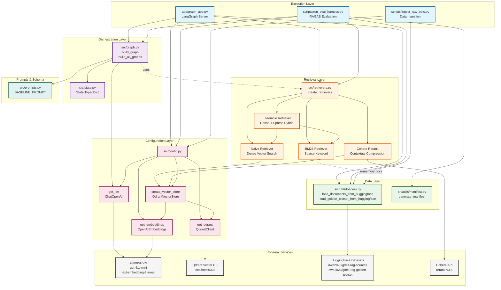
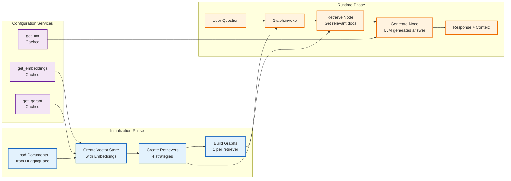
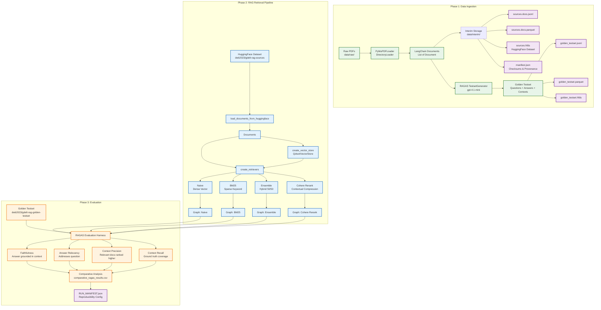
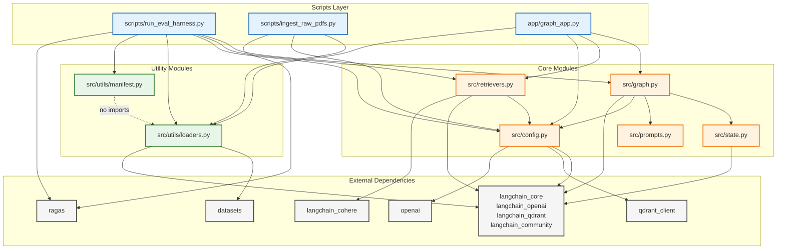
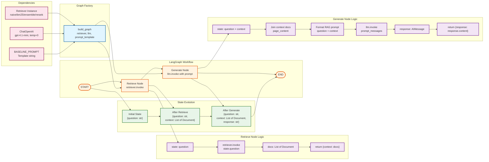
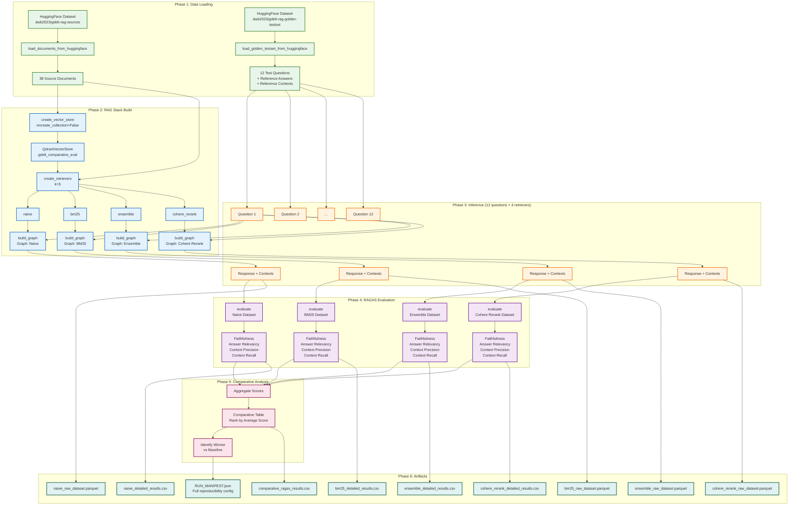

# Architecture Diagrams

## Overview

This document presents comprehensive architecture diagrams for the GDELT RAG (Retrieval-Augmented Generation) system. The system implements a production-grade question-answering pipeline that retrieves relevant GDELT documents and generates grounded responses using multiple retrieval strategies.

The architecture follows a clean, layered design with clear separation of concerns:
- **Configuration Layer**: Manages external service connections (LLM, embeddings, vector store)
- **Data Layer**: Handles document loading and persistence
- **Retrieval Layer**: Implements multiple retrieval strategies (naive, BM25, ensemble, reranking)
- **Orchestration Layer**: LangGraph workflows coordinate retrieval and generation
- **Execution Layer**: Scripts and applications that orchestrate the entire pipeline

## System Architecture

The GDELT RAG system follows a modular, factory-pattern architecture with four primary layers. Each layer has specific responsibilities and dependencies flow downward through the stack.

**Key architectural decisions:**
1. **Factory Pattern**: Retrievers and graphs are created via factory functions, not instantiated at module level
2. **Lazy Initialization**: LRU-cached getters prevent premature instantiation
3. **Dependency Injection**: Graphs accept retrievers and LLMs as parameters
4. **State Management**: TypedDict-based state flows through LangGraph nodes
5. **Configuration Centralization**: All external dependencies configured in `config.py`



## Component Relationships

This diagram shows how the core components interact at runtime. The system follows a clear initialization-then-execution pattern where components are bootstrapped in dependency order.

**Key interaction patterns:**
1. **Bootstrap Sequence**: Documents → Vector Store → Retrievers → Graphs
2. **Runtime Execution**: Question → Graph → Retriever → Documents → LLM → Response
3. **Caching Strategy**: LLM, embeddings, and Qdrant clients are cached via `@lru_cache`
4. **State Flow**: State objects flow through graph nodes, accumulating context and responses



## Data Flow Architecture

This diagram illustrates the complete data pipeline from raw PDFs through evaluation. The system implements a three-phase workflow: ingestion, retrieval, and evaluation.

**Pipeline stages:**
1. **Ingestion**: PDFs → Documents → Vector Store + HuggingFace datasets
2. **Retrieval**: Questions → Retrievers → Relevant Documents → Responses
3. **Evaluation**: Test Questions → 4 Retrievers → RAGAS Metrics → Comparative Analysis



## Class Hierarchies

This diagram shows the key class structures and their relationships. The system uses composition over inheritance, with factory functions producing configured instances.

**Design patterns:**
1. **TypedDict State**: Immutable state schema with type hints
2. **Strategy Pattern**: Multiple retriever implementations with common interface
3. **Composition**: Retrievers composed into graphs, not inherited
4. **Factory Methods**: `create_retrievers()`, `build_graph()`, `create_vector_store()`

```mermaid
classDiagram
    class State {
        <<TypedDict>>
        +str question
        +List~Document~ context
        +str response
    }

    class Document {
        <<LangChain>>
        +str page_content
        +dict metadata
    }

    class BaseRetriever {
        <<Abstract Interface>>
        +invoke(query) List~Document~
    }

    class VectorStoreRetriever {
        +QdrantVectorStore vector_store
        +int k
        +invoke(query) List~Document~
    }

    class BM25Retriever {
        +List~Document~ documents
        +int k
        +invoke(query) List~Document~
    }

    class EnsembleRetriever {
        +List~BaseRetriever~ retrievers
        +List~float~ weights
        +invoke(query) List~Document~
    }

    class ContextualCompressionRetriever {
        +BaseRetriever base_retriever
        +CohereRerank compressor
        +invoke(query) List~Document~
    }

    class QdrantVectorStore {
        +QdrantClient client
        +str collection_name
        +Embeddings embedding
        +add_documents(docs)
        +as_retriever(search_kwargs) Retriever
    }

    class ChatOpenAI {
        <<LangChain LLM>>
        +str model
        +int temperature
        +invoke(messages) AIMessage
    }

    class OpenAIEmbeddings {
        <<LangChain Embeddings>>
        +str model
        +embed_query(text) List~float~
        +embed_documents(texts) List~List~float~~
    }

    class CompiledGraph {
        <<LangGraph>>
        +StateGraph graph
        +invoke(state) State
    }

    class TestsetGenerator {
        <<RAGAS>>
        +LLM llm
        +EmbeddingModel embedding_model
        +generate_with_langchain_docs(docs, testset_size)
    }

    State ..> Document : contains

    BaseRetriever <|-- VectorStoreRetriever : implements
    BaseRetriever <|-- BM25Retriever : implements
    BaseRetriever <|-- EnsembleRetriever : implements
    BaseRetriever <|-- ContextualCompressionRetriever : implements

    VectorStoreRetriever --> QdrantVectorStore : uses
    EnsembleRetriever --> VectorStoreRetriever : composes
    EnsembleRetriever --> BM25Retriever : composes
    ContextualCompressionRetriever --> VectorStoreRetriever : wraps

    QdrantVectorStore --> OpenAIEmbeddings : uses
    CompiledGraph --> BaseRetriever : uses
    CompiledGraph --> ChatOpenAI : uses
    CompiledGraph --> State : manages

    TestsetGenerator --> ChatOpenAI : uses
    TestsetGenerator --> OpenAIEmbeddings : uses
    TestsetGenerator --> Document : generates from

    classDef schema fill:#e0f2f1,stroke:#004d40,stroke-width:2px
    classDef retriever fill:#fff3e0,stroke:#e65100,stroke-width:2px
    classDef vectorstore fill:#f3e5f5,stroke:#4a148c,stroke-width:2px
    classDef llm fill:#e1f5ff,stroke:#01579b,stroke-width:2px
    classDef graph fill:#fce4ec,stroke:#880e4f,stroke-width:2px

    class State,Document schema
    class BaseRetriever,VectorStoreRetriever,BM25Retriever,EnsembleRetriever,ContextualCompressionRetriever retriever
    class QdrantVectorStore vectorstore
    class ChatOpenAI,OpenAIEmbeddings,TestsetGenerator llm
    class CompiledGraph graph
```

## Module Dependencies

This diagram shows the import relationships between modules. The dependency graph is acyclic and follows clear layering principles.

**Dependency rules:**
1. **No Circular Imports**: All imports flow downward/outward
2. **External at Edges**: LangChain, OpenAI, Qdrant, RAGAS at boundaries
3. **Utils as Foundation**: Lowest-level module with no internal dependencies
4. **Config as Service Layer**: Provides cached instances to all layers
5. **Scripts Depend on Everything**: Orchestration scripts import from all modules



## Retriever Strategy Pattern

This diagram shows the retriever factory pattern and how different retrieval strategies are instantiated and used. The factory function `create_retrievers()` returns a dictionary of retriever instances, each implementing a different strategy.

**Retriever strategies:**
1. **Naive (Dense)**: Baseline semantic search using OpenAI embeddings (k=5)
2. **BM25 (Sparse)**: Lexical keyword matching over in-memory documents (k=5)
3. **Ensemble (Hybrid)**: 50/50 weighted combination of dense + sparse (k=5 each)
4. **Cohere Rerank**: Dense retrieval (k=20) → Contextual reranking → Top 3-5

**Key design decisions:**
- Factory returns dict of retrievers for easy iteration and comparison
- All strategies share common `invoke(query)` interface
- BM25 operates on in-memory docs (fast but memory-intensive)
- Reranker retrieves wide (20 docs) then compresses to top results
- Each retriever gets its own compiled graph in `build_all_graphs()`

```mermaid
graph TB
    subgraph "Factory Function"
        CREATE[create_retrievers<br/>documents, vector_store, k=5]
    end

    subgraph "Input Dependencies"
        DOCS[List of Documents<br/>from HuggingFace]
        VS[QdrantVectorStore<br/>Populated collection]
    end

    subgraph "Retriever Strategies"
        NAIVE_RET[Naive Retriever<br/>Dense Vector Search]
        BM25_RET[BM25 Retriever<br/>Sparse Keyword Match]
        ENS_RET[Ensemble Retriever<br/>Hybrid Dense + Sparse]
        RERANK_RET[Cohere Rerank<br/>Contextual Compression]
    end

    subgraph "Naive Strategy Details"
        NAIVE_IMPL[vector_store.as_retriever<br/>search_kwargs: k=5]
        NAIVE_EMB[OpenAI Embeddings<br/>text-embedding-3-small]
        NAIVE_SEARCH[Cosine Similarity<br/>in Qdrant]
    end

    subgraph "BM25 Strategy Details"
        BM25_IMPL[BM25Retriever.from_documents<br/>documents, k=5]
        BM25_INDEX[In-Memory BM25 Index<br/>TF-IDF scoring]
        BM25_KEYWORD[Keyword Matching<br/>Lexical search]
    end

    subgraph "Ensemble Strategy Details"
        ENS_IMPL[EnsembleRetriever<br/>retrievers=[naive, bm25]<br/>weights=[0.5, 0.5]]
        ENS_MERGE[Result Merging<br/>Weighted reciprocal rank fusion]
    end

    subgraph "Rerank Strategy Details"
        RERANK_WIDE[Wide Retriever<br/>k=20 docs from vector_store]
        RERANK_MODEL[CohereRerank<br/>model=rerank-v3.5]
        RERANK_COMPRESS[ContextualCompressionRetriever<br/>Rerank to top k results]
    end

    subgraph "Output Dictionary"
        OUTPUT["{\n  'naive': naive_retriever,\n  'bm25': bm25_retriever,\n  'ensemble': ensemble_retriever,\n  'cohere_rerank': compression_retriever\n}"]
    end

    subgraph "Usage in Graphs"
        BUILD_GRAPHS[build_all_graphs<br/>retrievers dict]
        GRAPH_NAIVE[Graph: Naive]
        GRAPH_BM25[Graph: BM25]
        GRAPH_ENS[Graph: Ensemble]
        GRAPH_RERANK[Graph: Cohere Rerank]
    end

    %% Factory inputs
    DOCS --> CREATE
    VS --> CREATE

    %% Factory produces strategies
    CREATE --> NAIVE_RET
    CREATE --> BM25_RET
    CREATE --> ENS_RET
    CREATE --> RERANK_RET

    %% Strategy implementations
    NAIVE_RET --> NAIVE_IMPL
    NAIVE_IMPL --> NAIVE_EMB
    NAIVE_IMPL --> NAIVE_SEARCH
    NAIVE_SEARCH --> VS

    BM25_RET --> BM25_IMPL
    BM25_IMPL --> BM25_INDEX
    BM25_INDEX --> BM25_KEYWORD
    BM25_KEYWORD --> DOCS

    ENS_RET --> ENS_IMPL
    ENS_IMPL --> NAIVE_RET
    ENS_IMPL --> BM25_RET
    ENS_IMPL --> ENS_MERGE

    RERANK_RET --> RERANK_COMPRESS
    RERANK_COMPRESS --> RERANK_WIDE
    RERANK_COMPRESS --> RERANK_MODEL
    RERANK_WIDE --> VS

    %% Output to graphs
    NAIVE_RET --> OUTPUT
    BM25_RET --> OUTPUT
    ENS_RET --> OUTPUT
    RERANK_RET --> OUTPUT

    OUTPUT --> BUILD_GRAPHS
    BUILD_GRAPHS --> GRAPH_NAIVE
    BUILD_GRAPHS --> GRAPH_BM25
    BUILD_GRAPHS --> GRAPH_ENS
    BUILD_GRAPHS --> GRAPH_RERANK

    classDef factory fill:#e1f5ff,stroke:#01579b,stroke-width:2px
    classDef input fill:#e8f5e9,stroke:#2e7d32,stroke-width:2px
    classDef strategy fill:#fff3e0,stroke:#e65100,stroke-width:2px
    classDef impl fill:#f3e5f5,stroke:#6a1b9a,stroke-width:2px
    classDef output fill:#fce4ec,stroke:#880e4f,stroke-width:2px
    classDef graph fill:#e0f2f1,stroke:#004d40,stroke-width:2px

    class CREATE factory
    class DOCS,VS input
    class NAIVE_RET,BM25_RET,ENS_RET,RERANK_RET strategy
    class NAIVE_IMPL,NAIVE_EMB,NAIVE_SEARCH,BM25_IMPL,BM25_INDEX,BM25_KEYWORD,ENS_IMPL,ENS_MERGE,RERANK_WIDE,RERANK_MODEL,RERANK_COMPRESS impl
    class OUTPUT output
    class BUILD_GRAPHS,GRAPH_NAIVE,GRAPH_BM25,GRAPH_ENS,GRAPH_RERANK graph
```

## LangGraph Workflow Architecture

This diagram shows the internal structure of the LangGraph workflow that orchestrates retrieval and generation. Each compiled graph follows the same two-node pattern.

**Workflow structure:**
1. **START**: Initial state with question
2. **Retrieve Node**: Invokes retriever, returns context (List[Document])
3. **Generate Node**: Formats prompt with context, invokes LLM, returns response
4. **END**: Final state with question, context, and response

**State management:**
- Nodes return partial state dicts (e.g., `{"context": docs}`)
- LangGraph automatically merges updates into state
- State accumulates: question → question+context → question+context+response
- Final state contains full provenance chain



## Evaluation Pipeline Architecture

This diagram shows the complete RAGAS evaluation pipeline implemented in `run_eval_harness.py`. The pipeline evaluates all four retriever strategies against a golden testset using four RAGAS metrics.

**Evaluation workflow:**
1. **Data Loading**: Load source documents + golden testset from HuggingFace
2. **RAG Stack Setup**: Build vector store → retrievers → graphs
3. **Inference**: Run 12 questions × 4 retrievers = 48 Q&A pairs
4. **RAGAS Evaluation**: Compute 4 metrics per retriever (48 total metric scores)
5. **Comparative Analysis**: Aggregate scores, rank retrievers, identify winner

**RAGAS metrics:**
- **Faithfulness**: Answer grounded in retrieved context (hallucination detection)
- **Answer Relevancy**: Answer addresses the question asked
- **Context Precision**: Relevant contexts ranked higher than irrelevant
- **Context Recall**: Retrieved contexts cover ground truth reference contexts



---

## Summary

These diagrams comprehensively document the GDELT RAG system architecture:

1. **System Architecture**: Shows the 5-layer stack from execution down to external services
2. **Component Relationships**: Illustrates initialization vs runtime phases and component interactions
3. **Data Flow Architecture**: Traces the complete pipeline from PDFs to evaluation results
4. **Class Hierarchies**: Documents the object model and design patterns
5. **Module Dependencies**: Maps import relationships and dependency flow
6. **Retriever Strategy Pattern**: Details the factory pattern and retriever implementations
7. **LangGraph Workflow**: Shows the internal graph structure and state management
8. **Evaluation Pipeline**: Documents the RAGAS evaluation workflow end-to-end

Key architectural principles:
- **Factory Pattern**: Deferred instantiation via factory functions
- **Dependency Injection**: Components accept dependencies as parameters
- **Caching**: LRU-cached singletons for expensive resources
- **Separation of Concerns**: Clear boundaries between layers
- **Reproducibility**: Manifest generation for full provenance tracking
