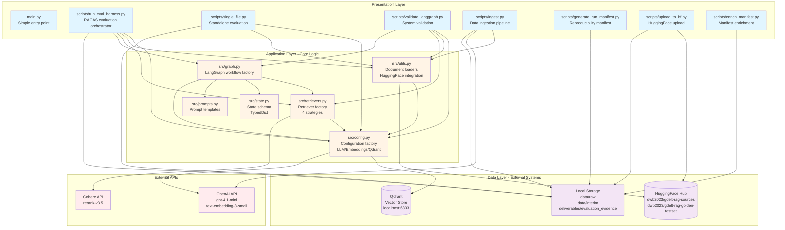
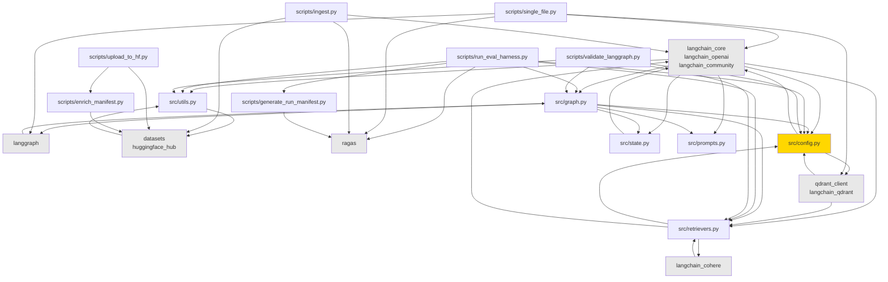
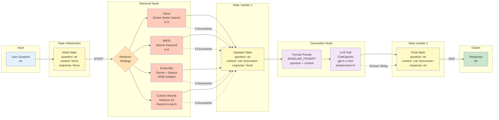

```mermaid
classDiagram
    class State {
        <<TypedDict>>
        +str question
        +List~Document~ context
        +str response
    }

    class Document {
        <<LangChain>>
        +str page_content
        +dict metadata
    }

    class ChatOpenAI {
        <<LangChain>>
        +str model
        +int temperature
        +invoke(messages) str
    }

    class OpenAIEmbeddings {
        <<LangChain>>
        +str model
        +embed_documents(texts) List~float~
        +embed_query(text) List~float~
    }

    class QdrantClient {
        <<Qdrant>>
        +str host
        +int port
        +get_collections()
        +create_collection(name, vectors_config)
        +delete_collection(name)
    }

    class QdrantVectorStore {
        <<LangChain>>
        +QdrantClient client
        +OpenAIEmbeddings embedding
        +str collection_name
        +add_documents(documents)
        +as_retriever(search_kwargs) Retriever
    }

    class VectorStoreRetriever {
        <<LangChain>>
        +invoke(query) List~Document~
    }

    class BM25Retriever {
        <<LangChain>>
        +from_documents(docs, k) BM25Retriever
        +invoke(query) List~Document~
    }

    class EnsembleRetriever {
        <<LangChain>>
        +List~Retriever~ retrievers
        +List~float~ weights
        +invoke(query) List~Document~
    }

    class ContextualCompressionRetriever {
        <<LangChain>>
        +CohereRerank base_compressor
        +Retriever base_retriever
        +invoke(query) List~Document~
    }

    class CohereRerank {
        <<LangChain>>
        +str model
        +compress_documents(documents, query) List~Document~
    }

    class CompiledGraph {
        <<LangGraph>>
        +invoke(input) State
        +stream(input) Iterator~State~
    }

    class ChatPromptTemplate {
        <<LangChain>>
        +from_template(template) ChatPromptTemplate
        +format_messages(kwargs) List~Message~
    }

    %% Relationships
    State *-- Document : contains
    QdrantVectorStore --> QdrantClient : uses
    QdrantVectorStore --> OpenAIEmbeddings : uses
    QdrantVectorStore --> VectorStoreRetriever : creates
    EnsembleRetriever o-- VectorStoreRetriever : combines
    EnsembleRetriever o-- BM25Retriever : combines
    ContextualCompressionRetriever --> VectorStoreRetriever : wraps
    ContextualCompressionRetriever --> CohereRerank : uses
    CompiledGraph --> VectorStoreRetriever : uses
    CompiledGraph --> BM25Retriever : uses
    CompiledGraph --> EnsembleRetriever : uses
    CompiledGraph --> ContextualCompressionRetriever : uses
    CompiledGraph --> ChatOpenAI : uses
    CompiledGraph --> ChatPromptTemplate : uses
    CompiledGraph --> State : manages
```

# Architecture Diagrams

## Overview

This GDELT RAG (Retrieval-Augmented Generation) system is built on a **layered architecture** with clear separation of concerns:

- **Presentation Layer**: Scripts and command-line tools for different workflows (ingestion, evaluation, validation)
- **Application Layer**: Core RAG logic using LangGraph for workflow orchestration, with multiple retrieval strategies
- **Data Layer**: Document management, vector storage (Qdrant), and dataset utilities (HuggingFace)

The system follows the **Factory Pattern** throughout, where configuration and component creation are separated from usage. This enables testing, reusability, and clean dependency management.

**Key Design Principles**:
- Factory functions over module-level instantiation
- Immutable state management (TypedDict)
- Cached configuration with `@lru_cache`
- Dependency injection for LLM/embeddings/retrievers
- Separation of concerns (config, data, logic, presentation)

---

## 1. System Architecture (Layered View)

### Diagram



### Explanation

**Presentation Layer** (Blue - Scripts/Entry Points):
- Multiple specialized scripts for different workflows
- `run_eval_harness.py` and `single_file.py`: Main evaluation orchestrators
- `validate_langgraph.py`: System health checks and validation
- `ingest.py`: Data ingestion from PDFs to HuggingFace
- Utility scripts for manifest generation, enrichment, and uploads

**Application Layer** (Yellow - Core Logic):
- `config.py`: Centralized configuration with cached factory functions for LLM, embeddings, Qdrant
- `utils.py`: Document loading from HuggingFace with reproducibility (revision pinning)
- `retrievers.py`: Factory function creating 4 retrieval strategies (naive, BM25, ensemble, cohere_rerank)
- `graph.py`: LangGraph workflow factory building retrieve->generate pipelines
- `state.py`: TypedDict schema for state management
- `prompts.py`: Shared prompt templates

**Data Layer** (Purple - Storage & External Systems):
- Qdrant vector database (Docker, localhost:6333)
- HuggingFace Hub datasets (sources + golden testset)
- Local filesystem (raw PDFs, interim data, evaluation results)

**External APIs** (Red):
- OpenAI (LLM + embeddings)
- Cohere (reranking)

---

## 2. Component Relationships

### Diagram

```mermaid
graph LR
    subgraph "Configuration Hub"
        CONFIG[src/config.py<br/>@lru_cache factories]
    end

    subgraph "Data Loading"
        UTILS[src/utils.py<br/>load_documents_from_huggingface<br/>load_golden_testset_from_huggingface]
    end

    subgraph "RAG Components"
        RETRIEVERS[src/retrievers.py<br/>create_retrievers<br/>4 strategies]
        GRAPH[src/graph.py<br/>build_graph<br/>build_all_graphs]
        STATE[src/state.py<br/>State TypedDict]
        PROMPTS[src/prompts.py<br/>BASELINE_PROMPT]
    end

    subgraph "Orchestration Scripts"
        EVAL[scripts/run_eval_harness.py]
        SINGLE[scripts/single_file.py]
        VALIDATE[scripts/validate_langgraph.py]
    end

    subgraph "Data Pipeline Scripts"
        INGEST[scripts/ingest.py]
        MANIFEST[scripts/generate_run_manifest.py]
        UPLOAD[scripts/upload_to_hf.py]
        ENRICH[scripts/enrich_manifest.py]
    end

    %% Core dependencies
    UTILS --> CONFIG
    RETRIEVERS --> CONFIG
    GRAPH --> RETRIEVERS
    GRAPH --> CONFIG
    GRAPH --> STATE
    GRAPH --> PROMPTS

    %% Orchestration dependencies
    EVAL --> UTILS
    EVAL --> CONFIG
    EVAL --> RETRIEVERS
    EVAL --> GRAPH
    EVAL --> MANIFEST

    SINGLE --> CONFIG
    SINGLE --> UTILS

    VALIDATE --> UTILS
    VALIDATE --> CONFIG
    VALIDATE --> RETRIEVERS
    VALIDATE --> GRAPH

    %% Data pipeline dependencies
    INGEST --> UTILS
    INGEST --> CONFIG
    UPLOAD --> ENRICH

    style CONFIG fill:#ffd700,stroke:#333,stroke-width:3px
    style RETRIEVERS fill:#ffb366
    style GRAPH fill:#ffb366
    style EVAL fill:#66b3ff
    style SINGLE fill:#66b3ff
```

### Explanation

**Dependency Flow**:

1. **Configuration Hub** (`src/config.py`):
   - Central dependency for all components
   - Provides cached instances: `get_llm()`, `get_embeddings()`, `get_qdrant()`
   - Factory function: `create_vector_store(documents, collection_name, recreate_collection)`

2. **Data Loading** (`src/utils.py`):
   - Depends on `config` for environment settings
   - Loads documents from HuggingFace with revision pinning
   - Used by all orchestration scripts

3. **RAG Components**:
   - `retrievers.py` depends on `config` (for embeddings/Qdrant)
   - `graph.py` depends on `retrievers`, `config`, `state`, `prompts`
   - `state.py` and `prompts.py` are independent (pure data/schemas)

4. **Orchestration Scripts**:
   - `run_eval_harness.py`: Main evaluation entry point, uses all core modules
   - `single_file.py`: Standalone version with inline implementations
   - `validate_langgraph.py`: Tests all core modules for correctness

5. **Data Pipeline Scripts**:
   - Independent workflows for data preparation and publishing
   - `ingest.py` uses core utilities for RAGAS testset generation

**Key Design Patterns**:
- **Factory Pattern**: All component creation through functions, not module-level variables
- **Dependency Injection**: LLM, embeddings, retrievers passed as arguments
- **Caching**: `@lru_cache` for expensive objects (LLM, embeddings, Qdrant client)
- **Immutability**: State is TypedDict, updated through return values (not mutation)

---

## 3. Class Hierarchies

### Diagram



### Explanation

**State Management**:
- `State` (TypedDict): Immutable state schema with three fields (question, context, response)
- LangGraph nodes return partial state updates (dicts) that are automatically merged

**LLM & Embeddings**:
- `ChatOpenAI`: OpenAI LLM wrapper (gpt-4.1-mini, temperature=0 for determinism)
- `OpenAIEmbeddings`: OpenAI embeddings (text-embedding-3-small, 1536 dimensions)

**Vector Store**:
- `QdrantClient`: Low-level Qdrant client (host:port, collection management)
- `QdrantVectorStore`: LangChain wrapper providing high-level interface
- Creates `VectorStoreRetriever` instances via `as_retriever()`

**Retriever Strategies** (4 types):
1. `VectorStoreRetriever`: Dense vector search (naive baseline)
2. `BM25Retriever`: Sparse keyword matching (lexical)
3. `EnsembleRetriever`: Hybrid combining dense + sparse (50/50 weights)
4. `ContextualCompressionRetriever`: Dense retrieval + Cohere reranking

**Workflow Orchestration**:
- `CompiledGraph`: LangGraph compiled state machine
- Executes retrieve -> generate pipeline
- Uses `ChatPromptTemplate` for prompt formatting

**Design Patterns**:
- **Composition over Inheritance**: Retrievers composed (EnsembleRetriever, ContextualCompressionRetriever)
- **Strategy Pattern**: 4 interchangeable retrieval strategies
- **Template Method**: Shared prompt templates
- **Dependency Injection**: All components passed to graph factory

---

## 4. Module Dependencies

### Diagram



### Explanation

**External Dependencies** (Gray boxes):
- `langchain_core`, `langchain_openai`, `langchain_community`: LangChain framework
- `langgraph`: State machine workflow orchestration
- `qdrant_client`, `langchain_qdrant`: Vector database integration
- `datasets`, `huggingface_hub`: Dataset management and hub integration
- `ragas`: RAG evaluation framework
- `langchain_cohere`: Cohere reranking integration

**Core Module Dependencies** (`src/`):

1. **`config.py`** (Gold - Central Hub):
   - Depends on: `langchain_openai`, `langchain_qdrant`, `qdrant_client`
   - Provides: Cached LLM, embeddings, Qdrant client, vector store factory
   - No internal dependencies

2. **`utils.py`**:
   - Depends on: `datasets` (HuggingFace), `langchain_core.documents`
   - Provides: Document loading with revision pinning
   - No internal dependencies

3. **`state.py`**:
   - Depends on: `typing_extensions.TypedDict`, `langchain_core.documents`
   - Pure schema definition
   - No internal dependencies

4. **`prompts.py`**:
   - No dependencies
   - Pure constants (prompt templates)

5. **`retrievers.py`**:
   - Depends on: `config`, `langchain_community`, `langchain_cohere`, `langchain_qdrant`
   - Factory function creating 4 retrieval strategies

6. **`graph.py`**:
   - Depends on: `retrievers`, `config`, `state`, `prompts`, `langgraph`
   - Factory functions building LangGraph workflows

**Script Dependencies** (`scripts/`):

1. **`run_eval_harness.py`** (Main Evaluation):
   - Uses ALL core modules (`config`, `utils`, `retrievers`, `graph`)
   - Depends on `ragas` for evaluation
   - Calls `generate_run_manifest.py`

2. **`single_file.py`** (Standalone):
   - Direct external dependencies (no `src/` imports)
   - Inline implementations of retriever/graph logic

3. **`validate_langgraph.py`**:
   - Tests all core modules
   - Validates factory patterns

4. **`ingest.py`** (Data Pipeline):
   - Uses external APIs directly
   - Generates RAGAS testsets

5. **Utility Scripts**:
   - `generate_run_manifest.py`: Reproducibility metadata
   - `upload_to_hf.py`: HuggingFace upload workflow
   - `enrich_manifest.py`: Manifest enrichment

**Dependency Principles**:
- **Acyclic**: No circular dependencies
- **Layered**: Scripts depend on `src/`, `src/` depends on externals
- **Minimal Coupling**: Each module has focused responsibilities
- **Factory Pattern**: Configuration separated from instantiation

---

## 5. Data Flow (LangGraph Workflow)

### Diagram



### Explanation

**LangGraph State Machine Flow**:

1. **Input**: User provides a question (string)

2. **State Initialization**:
   - Creates initial State with: `{question: str, context: None, response: None}`

3. **Retrieval Node** (retrieve function):
   - Input: State with question
   - Processing: One of 4 retrieval strategies:
     - **Naive**: QdrantVectorStore dense search (cosine similarity, k=5)
     - **BM25**: Sparse keyword matching (TF-IDF, k=5)
     - **Ensemble**: Hybrid combining naive + BM25 (50/50 weighted)
     - **Cohere Rerank**: Dense search (k=20) → Cohere rerank (top-5)
   - Output: Returns `{context: List[Document]}` (partial state update)
   - LangGraph merges: State now has question + context

4. **State Update 1**:
   - State: `{question: str, context: List[Document], response: None}`

5. **Generation Node** (generate function):
   - Input: State with question + context
   - Processing:
     - Formats prompt using `BASELINE_PROMPT` template
     - Concatenates document page_content from context
     - Invokes ChatOpenAI (gpt-4.1-mini, temperature=0)
   - Output: Returns `{response: str}` (partial state update)
   - LangGraph merges: State now has question + context + response

6. **State Update 2**:
   - Final State: `{question: str, context: List[Document], response: str}`

7. **Output**: Returns complete state (or just response, depending on usage)

**Key Characteristics**:

- **Immutable State**: Nodes never mutate state directly, only return updates
- **Automatic Merging**: LangGraph handles state merging between nodes
- **Deterministic**: temperature=0 for reproducible outputs
- **Modular**: Same graph structure works with any retriever (Strategy Pattern)
- **Type Safety**: State schema enforced via TypedDict

**Retrieval Strategy Details**:

| Strategy | Method | Initial K | Final K | Reranking |
|----------|--------|-----------|---------|-----------|
| Naive | Dense vector (cosine) | 5 | 5 | No |
| BM25 | Sparse keyword (TF-IDF) | 5 | 5 | No |
| Ensemble | Dense + Sparse (50/50) | 5+5 | 5 | No |
| Cohere Rerank | Dense → Rerank | 20 | 5 | Yes (rerank-v3.5) |

**RAGAS Evaluation Flow** (Extended):

When using the evaluation harness (`run_eval_harness.py`):
1. Load 12 test questions from golden testset
2. Run each question through all 4 retriever graphs
3. Collect: question, retrieved_contexts, response, reference (ground truth)
4. Evaluate with RAGAS metrics:
   - **Faithfulness**: Answer grounded in retrieved context?
   - **Answer Relevancy**: Answer addresses question?
   - **Context Precision**: Relevant contexts ranked higher?
   - **Context Recall**: Ground truth covered by contexts?
5. Generate comparative results table

---

## Architecture Patterns

### 1. Factory Pattern

**Used throughout the codebase for component creation:**

```python
# src/config.py
def create_vector_store(documents, collection_name=None, recreate_collection=False):
    client = get_qdrant()
    embeddings = get_embeddings()
    # ... create and return vector store

# src/retrievers.py
def create_retrievers(documents, vector_store, k=5):
    naive_retriever = vector_store.as_retriever(search_kwargs={"k": k})
    bm25_retriever = BM25Retriever.from_documents(documents, k=k)
    # ... return dict of retrievers

# src/graph.py
def build_graph(retriever, llm=None, prompt_template=None):
    # ... build and return compiled graph

def build_all_graphs(retrievers, llm=None):
    return {name: build_graph(ret, llm) for name, ret in retrievers.items()}
```

**Benefits**:
- Separation of configuration from instantiation
- Testability (mock dependencies)
- Reusability across different scripts
- Clear dependency injection points

### 2. Strategy Pattern

**4 interchangeable retrieval strategies:**

```python
retrievers = {
    "naive": VectorStoreRetriever,           # Dense vector search
    "bm25": BM25Retriever,                   # Sparse keyword
    "ensemble": EnsembleRetriever,           # Hybrid
    "cohere_rerank": ContextualCompressionRetriever  # Reranking
}

# All implement same interface: invoke(query) -> List[Document]
# Can swap retriever without changing graph logic
graph = build_graph(retrievers['naive'])
```

### 3. Singleton Pattern (via @lru_cache)

**Cached expensive objects:**

```python
@lru_cache(maxsize=1)
def get_llm():
    return ChatOpenAI(model=OPENAI_MODEL, temperature=0)

@lru_cache(maxsize=1)
def get_embeddings():
    return OpenAIEmbeddings(model=OPENAI_EMBED_MODEL)

@lru_cache(maxsize=1)
def get_qdrant():
    return QdrantClient(host=QDRANT_HOST, port=QDRANT_PORT)
```

**Benefits**:
- Single instance shared across application
- Lazy initialization
- Thread-safe (functools.lru_cache)

### 4. Template Method Pattern

**Shared prompt templates:**

```python
# src/prompts.py
BASELINE_PROMPT = """
You are a helpful assistant who answers questions based on provided context.
You must only use the provided context, and cannot use your own knowledge.

### Question
{question}

### Context
{context}
"""

# Used consistently across all retrievers
rag_prompt = ChatPromptTemplate.from_template(BASELINE_PROMPT)
```

### 5. Composition over Inheritance

**Retrievers composed, not inherited:**

```python
# EnsembleRetriever composes two retrievers
ensemble_retriever = EnsembleRetriever(
    retrievers=[naive_retriever, bm25_retriever],
    weights=[0.5, 0.5]
)

# ContextualCompressionRetriever wraps a retriever
compression_retriever = ContextualCompressionRetriever(
    base_compressor=reranker,
    base_retriever=wide_retriever
)
```

### 6. Immutable State Management

**LangGraph state updates via return values:**

```python
def retrieve(state: State) -> dict:
    docs = retriever.invoke(state["question"])
    return {"context": docs}  # Partial update, not mutation

def generate(state: State) -> dict:
    response = llm.invoke(messages)
    return {"response": response.content}  # Partial update
```

**Benefits**:
- No side effects
- Easy to reason about
- Thread-safe
- Testable

---

## Design Principles

### 1. Separation of Concerns

**Clear module responsibilities:**

| Module | Responsibility | Dependencies |
|--------|---------------|--------------|
| `config.py` | Configuration, caching, factories | External APIs only |
| `utils.py` | Data loading, HuggingFace integration | `datasets`, `config` |
| `state.py` | State schema definition | None |
| `prompts.py` | Prompt templates | None |
| `retrievers.py` | Retriever creation | `config` |
| `graph.py` | Workflow orchestration | All core modules |

### 2. Dependency Injection

**All dependencies passed explicitly:**

```python
# Bad: Module-level instantiation
llm = ChatOpenAI(...)  # Hard to test, hard to configure

# Good: Factory with dependency injection
def build_graph(retriever, llm=None, prompt_template=None):
    if llm is None:
        llm = get_llm()  # Default but overridable
    # ...
```

### 3. Configuration Management

**Centralized, environment-driven configuration:**

```python
# Environment variables with sensible defaults
QDRANT_HOST = os.getenv("QDRANT_HOST", "localhost")
QDRANT_PORT = int(os.getenv("QDRANT_PORT", "6333"))
COLLECTION_NAME = os.getenv("QDRANT_COLLECTION", "gdelt_comparative_eval")
OPENAI_MODEL = os.getenv("OPENAI_MODEL", "gpt-4.1-mini")
OPENAI_EMBED_MODEL = os.getenv("OPENAI_EMBED_MODEL", "text-embedding-3-small")
```

### 4. Reproducibility

**Multiple mechanisms for reproducible results:**

1. **Deterministic LLM**: `temperature=0` for all LLM calls
2. **Dataset Pinning**: HuggingFace revision parameter for version control
3. **Run Manifests**: `generate_run_manifest.py` captures exact configuration
4. **Version Tracking**: All dependencies, models, parameters recorded

```python
def load_documents_from_huggingface(dataset_name, split="train", revision=None):
    effective_revision = revision or os.getenv("HF_SOURCES_REV")
    sources_dataset = load_dataset(dataset_name, split=split, revision=effective_revision)
    # ...
```

### 5. Fail-Fast Error Handling

**Pre-flight checks in scripts:**

```python
# Check for required API keys
if not os.getenv("OPENAI_API_KEY"):
    raise ValueError("OPENAI_API_KEY environment variable must be set")

# Check for Qdrant connectivity
try:
    qdrant_client = QdrantClient(host=QDRANT_HOST, port=QDRANT_PORT)
    collections = qdrant_client.get_collections()
except Exception as e:
    raise RuntimeError(f"Failed to connect to Qdrant: {e}")
```

### 6. Immediate Persistence

**Save results incrementally to prevent data loss:**

```python
for retriever_name, graph in retrievers_config.items():
    # Process questions
    for idx, row in datasets[retriever_name].iterrows():
        result = graph.invoke({"question": question})
        # ... update dataset

    # Save immediately after each retriever (not at end)
    raw_file = output_dir / f"{retriever_name}_raw_dataset.parquet"
    datasets[retriever_name].to_parquet(raw_file, index=False)
    print(f"💾 Saved: {raw_file.name}")
```

### 7. Validation and Testing

**Dedicated validation script for system health:**

- `validate_langgraph.py`: Validates environment, imports, factory patterns, graph compilation, functional execution
- Provides diagnostic reports and actionable fixes
- Demonstrates correct initialization patterns

### 8. Documentation as Code

**Comprehensive docstrings with examples:**

```python
def create_vector_store(documents, collection_name=None, recreate_collection=False):
    """
    Create and populate Qdrant vector store.

    This factory function handles:
    - Creating Qdrant collection if it doesn't exist
    - Optionally recreating collection if it does exist
    - Populating vector store with documents

    Args:
        documents: List of Document objects to add to vector store
        collection_name: Override default collection name (optional)
        recreate_collection: If True, delete existing collection first (default: False)

    Returns:
        Populated QdrantVectorStore instance

    Example:
        >>> from src.utils import load_documents_from_huggingface
        >>> from src.config import create_vector_store
        >>> documents = load_documents_from_huggingface()
        >>> vector_store = create_vector_store(documents, recreate_collection=True)
    """
    # ...
```

---

## Summary

This GDELT RAG system demonstrates production-grade architecture with:

**Strengths**:
- Clean layered architecture with separation of concerns
- Factory pattern enabling testability and reusability
- Multiple retrieval strategies (Strategy Pattern)
- Immutable state management (LangGraph)
- Comprehensive reproducibility mechanisms
- Clear documentation and validation tools

**File Organization**:
- `/home/donbr/don-aie-cohort8/cert-challenge/src/`: Core application logic (6 modules)
- `/home/donbr/don-aie-cohort8/cert-challenge/scripts/`: Entry points and workflows (8 scripts)
- `/home/donbr/don-aie-cohort8/cert-challenge/deliverables/evaluation_evidence/`: Evaluation results
- `/home/donbr/don-aie-cohort8/cert-challenge/data/`: Raw, interim, processed data

**Key Workflows**:
1. **Data Ingestion**: `scripts/ingest.py` → PDF to HuggingFace
2. **Evaluation**: `scripts/run_eval_harness.py` → RAGAS metrics
3. **Validation**: `scripts/validate_langgraph.py` → System health checks
4. **Publishing**: `scripts/upload_to_hf.py` → HuggingFace Hub

**Technology Stack**:
- **Orchestration**: LangGraph (state machine workflows)
- **LLM**: OpenAI GPT-4.1-mini (temperature=0)
- **Embeddings**: OpenAI text-embedding-3-small (1536d)
- **Vector Store**: Qdrant (Docker, cosine similarity)
- **Evaluation**: RAGAS (4 metrics)
- **Data**: HuggingFace Hub (datasets)

This architecture provides a solid foundation for RAG system development, evaluation, and deployment.
