# Architecture Diagrams

## Overview

This document provides comprehensive architectural diagrams for the GDELT RAG Evaluation system. The project is a RAG (Retrieval-Augmented Generation) evaluation framework that compares multiple retrieval strategies using the RAGAS evaluation methodology. The architecture follows a layered design with clear separation between the core RAG system (src/), utility scripts (scripts/), and the main entry point.

The system is built on LangChain, LangGraph, and RAGAS frameworks, integrating with external services (OpenAI, Cohere, Qdrant) to provide a comprehensive RAG evaluation pipeline.

---

## 1. System Architecture (Layered View)

This diagram shows the high-level layered architecture of the system, from the entry point through the core modules to external dependencies.


**Key Observations:**
- **Entry Point**: `single_file.py` is the main executable that orchestrates the complete RAG evaluation
- **Core System**: Modular design with clear separation (config, state, prompts, retrievers, graphs)
- **Scripts**: Supporting utilities for data processing and reproducibility
- **External Services**: Heavy reliance on LangChain ecosystem and external APIs

---

## 2. Component Relationships

This diagram shows how the core modules in the `src/` directory interact with each other and their responsibilities.


**Key Relationships:**
- **CONFIG** is the central configuration point, providing LLM and embeddings to other modules
- **STATE** defines the data schema used throughout the workflow
- **RETRIEVERS** is a collection module that exports 4 different retriever instances
- **GRAPH** orchestrates everything, creating 4 separate LangGraph workflows (one per retriever)
- **PROMPTS** provides reusable prompt templates

---

## 3. Module Dependencies (Import Graph)

This diagram shows the import relationships between project modules, highlighting the dependency hierarchy.


**Dependency Analysis:**
- **Zero Internal Dependencies**: STATE, PROMPTS, UTILS (leaf nodes)
- **Low Dependencies**: CONFIG (only external packages)
- **Medium Dependencies**: RETRIEVERS (depends on CONFIG concepts)
- **High Dependencies**: GRAPH (depends on STATE, PROMPTS, RETRIEVERS)
- **Self-Contained**: single_file.py embeds all core logic (doesn't import from src/)
- **Clean Separation**: Scripts don't pollute src/ modules

---

## 4. Data Flow (RAG Evaluation Pipeline)

This diagram illustrates how data flows through the system during a complete RAG evaluation run.

```mermaid
flowchart TD
    START([Start: Run single_file.py])

    subgraph "1. Data Loading"
        LOAD_GOLDEN[Load Golden Testset<br/>from HuggingFace<br/>dwb2023/gdelt-rag-golden-testset]
        LOAD_SOURCES[Load Source Documents<br/>from HuggingFace<br/>dwb2023/gdelt-rag-sources]
        CONVERT[Convert to<br/>LangChain Documents]
    end

    subgraph "2. Vector Store Setup"
        QDRANT_INIT[Initialize Qdrant Client<br/>localhost:6333]
        CREATE_COLL[Create Collection<br/>gdelt_comparative_eval]
        ADD_DOCS[Add Documents<br/>with Embeddings]
    end

    subgraph "3. Retriever Creation"
        CREATE_BASELINE[Baseline Retriever<br/>Dense Vector k=5]
        CREATE_BM25[BM25 Retriever<br/>Sparse Keyword k=5]
        CREATE_RERANK[Cohere Rerank<br/>k=20 -> rerank to 5]
        CREATE_ENSEMBLE[Ensemble Retriever<br/>Dense + Sparse 50/50]
    end

    subgraph "4. LangGraph Workflows"
        BUILD_GRAPHS[Build 4 LangGraphs<br/>retrieve -> generate]
        RETRIEVERS_CONFIG[retrievers_config dict<br/>naive, bm25, ensemble, cohere_rerank]
    end

    subgraph "5. Question Processing Loop"
        direction TB
        LOOP_START{For each<br/>retriever}
        LOOP_Q{For each<br/>question}
        INVOKE[Invoke LangGraph<br/>question -> response]
        COLLECT[Collect:<br/>- response<br/>- retrieved_contexts]
        LOOP_Q_END{More<br/>questions?}
        LOOP_END{More<br/>retrievers?}
    end

    subgraph "6. RAGAS Evaluation"
        VALIDATE[Validate Schema<br/>normalize columns]
        CREATE_EVAL[Create EvaluationDatasets]
        RUN_RAGAS[Run RAGAS evaluate()<br/>Faithfulness, Answer Relevancy<br/>Context Precision, Context Recall]
        SAVE_RESULTS[Save Individual Results<br/>CSV files]
    end

    subgraph "7. Comparison & Output"
        COMPARE[Generate Comparison Table<br/>Average scores]
        CALC_IMPROVE[Calculate Improvement<br/>over baseline]
        SAVE_SUMMARY[Save Summary CSV]
        GEN_MANIFEST[Generate RUN_MANIFEST.json]
    end

    END([End: Results in deliverables/])

    START --> LOAD_GOLDEN
    LOAD_GOLDEN --> LOAD_SOURCES
    LOAD_SOURCES --> CONVERT

    CONVERT --> QDRANT_INIT
    QDRANT_INIT --> CREATE_COLL
    CREATE_COLL --> ADD_DOCS

    ADD_DOCS --> CREATE_BASELINE
    ADD_DOCS --> CREATE_BM25
    ADD_DOCS --> CREATE_RERANK
    ADD_DOCS --> CREATE_ENSEMBLE

    CREATE_BASELINE --> BUILD_GRAPHS
    CREATE_BM25 --> BUILD_GRAPHS
    CREATE_RERANK --> BUILD_GRAPHS
    CREATE_ENSEMBLE --> BUILD_GRAPHS
    BUILD_GRAPHS --> RETRIEVERS_CONFIG

    RETRIEVERS_CONFIG --> LOOP_START
    LOOP_START --> LOOP_Q
    LOOP_Q --> INVOKE
    INVOKE --> COLLECT
    COLLECT --> LOOP_Q_END
    LOOP_Q_END -->|Yes| LOOP_Q
    LOOP_Q_END -->|No| LOOP_END
    LOOP_END -->|Yes| LOOP_START
    LOOP_END -->|No| VALIDATE

    VALIDATE --> CREATE_EVAL
    CREATE_EVAL --> RUN_RAGAS
    RUN_RAGAS --> SAVE_RESULTS

    SAVE_RESULTS --> COMPARE
    COMPARE --> CALC_IMPROVE
    CALC_IMPROVE --> SAVE_SUMMARY
    SAVE_SUMMARY --> GEN_MANIFEST

    GEN_MANIFEST --> END

    %% High contrast WCAG AA compliant colors with white text
    classDef loading fill:#1565C0,stroke:#0D47A1,stroke-width:3px,color:#FFFFFF
    classDef setup fill:#6A1B9A,stroke:#4A148C,stroke-width:3px,color:#FFFFFF
    classDef creation fill:#2E7D32,stroke:#1B5E20,stroke-width:3px,color:#FFFFFF
    classDef workflow fill:#EF6C00,stroke:#E65100,stroke-width:3px,color:#FFFFFF
    classDef processing fill:#C2185B,stroke:#880E4F,stroke-width:3px,color:#FFFFFF
    classDef evaluation fill:#00838F,stroke:#006064,stroke-width:3px,color:#FFFFFF
    classDef output fill:#F57F17,stroke:#F57C00,stroke-width:3px,color:#FFFFFF
    classDef terminal fill:#455A64,stroke:#263238,stroke-width:4px,color:#FFFFFF

    class LOAD_GOLDEN,LOAD_SOURCES,CONVERT loading
    class QDRANT_INIT,CREATE_COLL,ADD_DOCS setup
    class CREATE_BASELINE,CREATE_BM25,CREATE_RERANK,CREATE_ENSEMBLE creation
    class BUILD_GRAPHS,RETRIEVERS_CONFIG workflow
    class LOOP_START,LOOP_Q,INVOKE,COLLECT,LOOP_Q_END,LOOP_END processing
    class VALIDATE,CREATE_EVAL,RUN_RAGAS,SAVE_RESULTS evaluation
    class COMPARE,CALC_IMPROVE,SAVE_SUMMARY,GEN_MANIFEST output
    class START,END terminal
```

**Data Flow Highlights:**
1. **Data Loading**: Pull datasets from HuggingFace Hub
2. **Vector Store Setup**: Initialize Qdrant and embed all documents
3. **Retriever Creation**: Build 4 different retrieval strategies
4. **Workflow Creation**: Wrap each retriever in a LangGraph state machine
5. **Question Processing**: Run all questions through all retrievers (4×12=48 total invocations)
6. **RAGAS Evaluation**: Compute metrics for each retriever
7. **Comparison**: Generate comparative analysis and manifest

---

## 5. Class Hierarchies

This diagram shows the class structures and their relationships. The system uses primarily TypedDict classes for state management rather than traditional OOP hierarchies.


**Class Design Observations:**
- **Minimal Custom Classes**: Project uses TypedDict (State) instead of custom classes
- **Composition over Inheritance**: Uses LangChain's retriever abstractions
- **Interface Uniformity**: All retrievers expose the same `invoke()` interface
- **Framework Integration**: Heavy reliance on LangChain/LangGraph abstractions

---

## 6. Execution Flow (Sequence Diagram)

This sequence diagram shows the detailed execution flow for a single question through a single retriever.

```mermaid
%%{init: {'theme':'base', 'themeVariables': { 'primaryColor':'#0277BD', 'primaryTextColor':'#FFF', 'primaryBorderColor':'#01579B', 'lineColor':'#455A64', 'secondaryColor':'#E65100', 'tertiaryColor':'#2E7D32', 'fontSize':'14px'}}}%%
sequenceDiagram
    autonumber

    actor U as 👤 User
    participant SC as 📄 single_file.py
    participant GR as 🔄 LangGraph<br/>Workflow
    participant RT as 🔍 Retriever<br/>Module
    participant QD as 📊 Qdrant<br/>Vector DB
    participant LLM as 🤖 GPT-4.1-mini
    participant CO as ⚡ Cohere<br/>Rerank
    participant RG as 📈 RAGAS<br/>Evaluator

    U->>+SC: python scripts/single_file.py

    rect rgb(230, 240, 255)
        Note over SC: Phase 1: Initialization
        SC->>SC: Load golden testset from HF
        SC->>SC: Load source documents from HF
        SC->>+QD: Initialize client (localhost:6333)
        SC->>QD: Create collection<br/>"gdelt_comparative_eval"
        SC->>QD: Add 38 documents<br/>with embeddings
        deactivate QD
        SC->>SC: Create 4 retrievers
        SC->>GR: Build 4 LangGraph workflows
    end

    rect rgb(240, 255, 240)
        Note over SC,LLM: Phase 2: Question Processing (4×12=48 runs)
        loop For each retriever (4x)
            loop For each question (12x)
                SC->>+GR: invoke({"question": question})

                alt Baseline Retriever
                    GR->>+RT: retrieve_baseline(state)
                    RT->>+QD: similarity_search(query, k=5)
                    QD-->>-RT: 5 documents
                    RT-->>-GR: context=[doc1..doc5]
                else BM25 Retriever
                    GR->>+RT: retrieve_bm25(state)
                    RT->>RT: BM25 keyword matching (local)
                    RT-->>-GR: context=[doc1..doc5]
                else Cohere Rerank
                    GR->>+RT: retrieve_reranked(state)
                    RT->>+QD: similarity_search(query, k=20)
                    QD-->>-RT: 20 candidate documents
                    RT->>+CO: rerank(docs, query, top_n=5)
                    CO-->>-RT: Top 5 reranked documents
                    RT-->>-GR: context=[doc1..doc5]
                else Ensemble Retriever
                    GR->>+RT: retrieve_ensemble(state)
                    par Dense + Sparse in parallel
                        RT->>QD: similarity_search(query, k=5)
                        RT->>RT: BM25 search (k=5)
                    end
                    RT->>RT: Merge with weights [0.5, 0.5]
                    RT-->>-GR: context=[merged docs]
                end

                GR->>GR: generate(state)
                GR->>GR: Format prompt with context
                GR->>+LLM: invoke(prompt)
                LLM-->>-GR: Generated response text
                GR-->>-SC: {"response": answer,<br/>"context": docs}

                SC->>SC: Store response & contexts
            end
        end
    end

    rect rgb(255, 245, 230)
        Note over SC,RG: Phase 3: RAGAS Evaluation (4 metrics × 12 questions)
        loop For each retriever (4x)
            SC->>SC: Validate schema
            SC->>SC: Create EvaluationDataset
            SC->>+RG: evaluate(dataset, metrics, llm)

            loop For each question (12x)
                RG->>+LLM: Calculate Faithfulness
                LLM-->>-RG: Faithfulness score
                RG->>+LLM: Calculate Answer Relevancy
                LLM-->>-RG: Relevancy score
                RG->>+LLM: Calculate Context Precision
                LLM-->>-RG: Precision score
                RG->>+LLM: Calculate Context Recall
                LLM-->>-RG: Recall score
            end

            RG-->>-SC: EvaluationResult<br/>(DataFrame with metrics)
            SC->>SC: Save individual results CSV
        end
    end

    rect rgb(255, 250, 205)
        Note over SC: Phase 4: Final Output & Manifest
        SC->>SC: Generate comparison table
        SC->>SC: Calculate % improvements<br/>over baseline
        SC->>SC: Save comparative_ragas_results.csv
        SC->>SC: Generate RUN_MANIFEST.json<br/>(reproducibility metadata)
        SC-->>-U: ✅ Print results & file paths
    end
```



**Execution Highlights:**
- **Sequential Processing**: Questions processed one at a time per retriever
- **Parallel Retrieval**: Ensemble retriever runs dense + sparse in parallel
- **External API Calls**: Multiple calls to OpenAI (embeddings, LLM) and Cohere (reranking)
- **Immediate Persistence**: Results saved after each retriever to prevent data loss
- **Total LLM Calls**: ~240+ calls (48 for generation + ~192 for RAGAS metrics)

---

## 7. Retriever Strategy Comparison

This diagram compares the different retrieval strategies implemented in the system.


**Strategy Characteristics:**

| Strategy | Type | Strengths | Weaknesses | Complexity |
|----------|------|-----------|------------|------------|
| **Naive** | Dense Vector | Fast, semantic understanding | Miss exact keywords | Low |
| **BM25** | Sparse Keyword | Exact term matching | No semantic understanding | Low |
| **Cohere Rerank** | Contextual Compression | Best of both worlds | Slower, API cost | High |
| **Ensemble** | Hybrid | Balanced approach | Tuning weights needed | Medium |

---

## 8. File Organization Map

This diagram shows the physical file structure of the project (main code only, excluding framework directories).


**Code Metrics:**
- **Total Project LOC**: ~1,700 lines (excluding framework directories)
- **Core System (src/)**: ~300 lines
- **Scripts**: ~1,400 lines
- **Largest Module**: single_file.py (508 lines) - complete evaluation pipeline
- **Most Complex**: ingest.py (336 lines) - RAGAS testset generation
- **Smallest**: utils.py (2 lines, empty placeholder)

---

## Summary

This RAG evaluation system demonstrates a well-architected approach to comparing retrieval strategies:

### Strengths
- **Modular Design**: Clear separation between configuration, state, retrievers, and workflows
- **Framework Integration**: Leverages LangChain/LangGraph abstractions effectively
- **Reproducibility**: Comprehensive manifest tracking and versioning
- **Evaluation Rigor**: RAGAS metrics with proper schema validation
- **Data Pipeline**: Complete flow from PDFs to HuggingFace datasets to evaluation results

### Architecture Patterns
- **State Machine Pattern**: LangGraph workflows for retrieval pipelines
- **Strategy Pattern**: Multiple retriever implementations with uniform interface
- **Repository Pattern**: Qdrant as vector store abstraction
- **Configuration as Code**: Centralized config.py for all settings

### Evaluation Approach
- **4 Retrieval Strategies**: Baseline, BM25, Cohere Rerank, Ensemble
- **4 RAGAS Metrics**: Faithfulness, Answer Relevancy, Context Precision, Context Recall
- **12 Test Questions**: Synthetic testset from research paper
- **48 Total Evaluations**: 4 retrievers × 12 questions

The architecture prioritizes clarity, reproducibility, and extensibility - making it easy to add new retrieval strategies or evaluation metrics.
