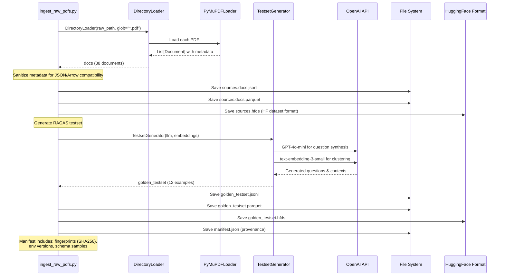
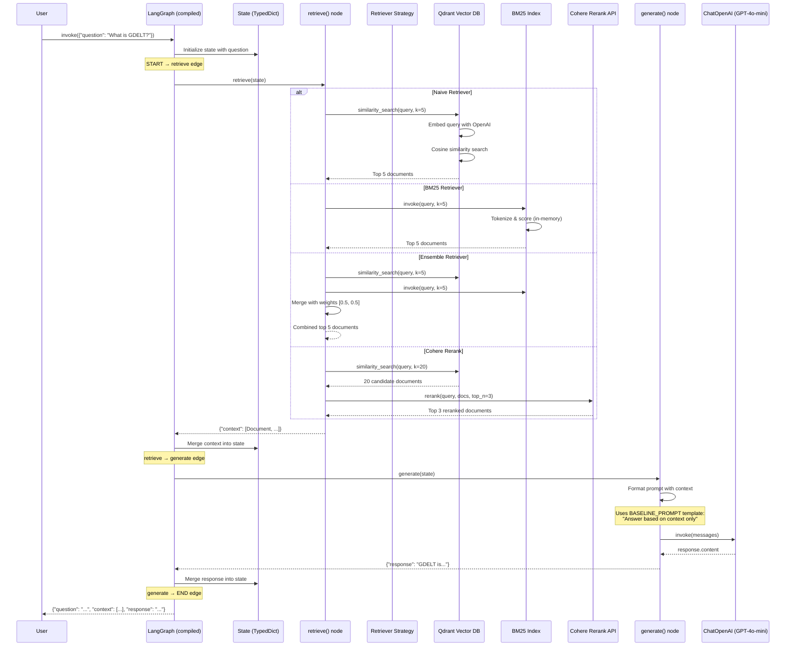
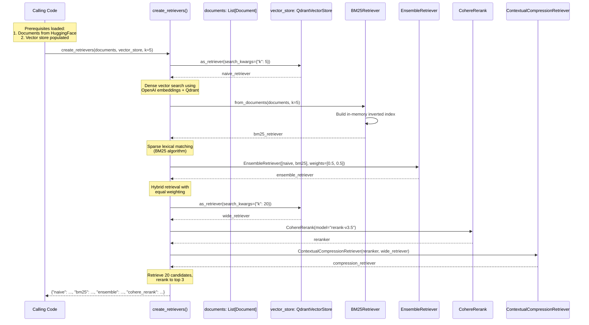
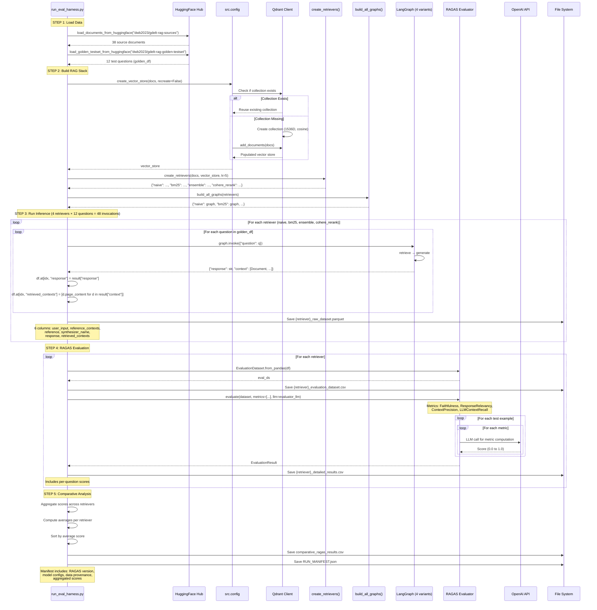
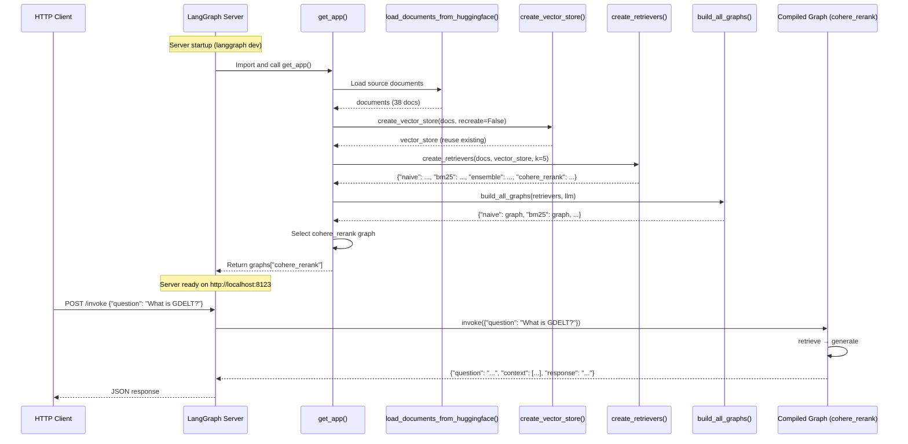

# Data Flow Analysis

## Overview

This GDELT RAG (Retrieval-Augmented Generation) system implements a complete pipeline from PDF document ingestion to evaluated question-answering. The system consists of five major data flows:

1. **Document Ingestion Flow**: PDF extraction, testset generation, and persistence
2. **RAG Query Flow**: User query processing through retrieval and generation
3. **Retriever Initialization Flow**: Factory-based creation of retrieval strategies
4. **Evaluation Pipeline Flow**: RAGAS-based evaluation across multiple retrievers
5. **LangGraph Server Flow**: Production serving via LangGraph Server

The architecture emphasizes:
- Factory pattern for deferred initialization of stateful components
- Separation of data loading, processing, and evaluation
- Multiple retrieval strategies (dense, sparse, hybrid, reranked)
- Reproducibility through manifest tracking and version pinning

---

## Document Ingestion Flow

This flow processes raw PDFs into vector-embedded documents and generates synthetic test questions using RAGAS.

**Entry Point**: `/home/donbr/don-aie-cohort8/cert-challenge/scripts/ingest_raw_pdfs.py`



### Key Steps

1. **PDF Loading** (`ingest_raw_pdfs.py:153-158`)
   - Uses `DirectoryLoader` with `PyMuPDFLoader` to extract text from PDFs
   - Loads all `*.pdf` files from `data/raw/` directory
   - Each page becomes a separate `Document` object with metadata (source, page number)
   - Metadata is sanitized via `ensure_jsonable()` to prevent Arrow/JSON serialization errors

2. **Source Document Persistence** (`ingest_raw_pdfs.py:163-169`)
   - Three output formats for maximum compatibility:
     - **JSONL**: `sources.docs.jsonl` - Human-readable, streaming-friendly
     - **Parquet**: `sources.docs.parquet` - Columnar format for analytics
     - **HuggingFace Dataset**: `sources.hfds/` - Native HF ecosystem format
   - All formats contain identical data (page_content + metadata)

3. **RAGAS Testset Generation** (`ingest_raw_pdfs.py:186-201`)
   - Uses `TestsetGenerator` from RAGAS 0.2.10
   - LLM: `gpt-4o-mini` (wrapped in `LangchainLLMWrapper`)
   - Embeddings: `text-embedding-3-small` (wrapped in `LangchainEmbeddingsWrapper`)
   - Generates synthetic questions, reference answers, and ground-truth contexts
   - Retry logic handles transient API errors (rate limits, timeouts)
   - Output: `EvaluationDataset` with 12 test examples

4. **Golden Testset Persistence** (`ingest_raw_pdfs.py:207-226`)
   - Same three-format approach as source documents
   - Columns: `user_input`, `reference_contexts`, `reference`, `synthesizer_name`
   - Enables reproducible evaluation across environments

5. **Manifest Generation** (`ingest_raw_pdfs.py:238-296`)
   - Captures complete provenance:
     - Execution ID (UUID), timestamp
     - Environment versions (Python, LangChain, RAGAS, datasets, PyArrow)
     - Model configuration (GPT-4o-mini, text-embedding-3-small)
     - File fingerprints (SHA256 checksums)
     - Schema samples (first 5 records from each dataset)
   - Enables data lineage and reproducibility auditing

---

## RAG Query Flow

This flow processes a user question through retrieval and generation to produce a grounded answer.

**Entry Point**: LangGraph compiled from `/home/donbr/don-aie-cohort8/cert-challenge/src/graph.py`



### Key Steps

1. **State Initialization** (`graph.py:67-78`)
   - Input: `{"question": str}`
   - State schema: `State(TypedDict)` with fields: `question`, `context`, `response`
   - LangGraph automatically manages state updates via partial dict returns

2. **Retrieve Node** (`graph.py:67-78`)
   - Invokes configured retriever with `state["question"]`
   - Retriever returns `List[Document]` (typically k=5, except Cohere which returns 3)
   - Returns partial state: `{"context": docs}`
   - Each retriever strategy handles its own complexity:
     - **Naive**: Single Qdrant vector search
     - **BM25**: In-memory sparse retrieval over full document set
     - **Ensemble**: Parallel execution of Naive + BM25, weighted merge
     - **Cohere Rerank**: Wide retrieval (k=20) followed by neural reranking

3. **Generate Node** (`graph.py:80-96`)
   - Extracts `page_content` from all context documents
   - Formats with `BASELINE_PROMPT` template (from `prompts.py:4-12`)
   - Template enforces: "Answer only from context, no external knowledge"
   - Invokes LLM: `ChatOpenAI(model="gpt-4o-mini", temperature=0)`
   - Returns partial state: `{"response": str}`

4. **Graph Compilation** (`graph.py:99-106`)
   - Linear flow: `START → retrieve → generate → END`
   - No conditional edges or cycles
   - Compiled graph is stateless and reusable
   - Each invocation creates a fresh state instance

---

## Retriever Initialization Flow

This flow demonstrates the factory pattern used to defer retriever creation until dependencies are available.

**Entry Point**: `/home/donbr/don-aie-cohort8/cert-challenge/src/retrievers.py`



### Key Steps

1. **Factory Function Signature** (`retrievers.py:20-24`)
   - **Input**:
     - `documents`: List of LangChain `Document` objects (required for BM25)
     - `vector_store`: Populated `QdrantVectorStore` instance
     - `k`: Number of documents to retrieve (default: 5)
   - **Returns**: Dictionary mapping strategy names to retriever instances
   - **Why factory?**: Retrievers depend on runtime-loaded data (documents, vector store)

2. **Naive Retriever Creation** (`retrievers.py:63`)
   - Wraps `QdrantVectorStore` as a LangChain retriever
   - Uses OpenAI embeddings (`text-embedding-3-small`, 1536 dimensions)
   - Cosine similarity search in Qdrant collection
   - Search parameters: `{"k": 5}` (top 5 results)

3. **BM25 Retriever Creation** (`retrievers.py:66`)
   - Builds in-memory inverted index from full document set
   - Classic information retrieval algorithm (lexical matching)
   - No external dependencies (vector DB, API calls)
   - Fast for small-to-medium document collections

4. **Ensemble Retriever Creation** (`retrievers.py:69-72`)
   - Combines `naive_retriever` and `bm25_retriever`
   - Weights: `[0.5, 0.5]` (equal contribution)
   - Executes both retrievers in parallel
   - Merges results using Reciprocal Rank Fusion (RRF)

5. **Cohere Rerank Retriever Creation** (`retrievers.py:76-82`)
   - Two-stage retrieval:
     1. Wide retrieval: Fetch 20 candidates from Qdrant
     2. Reranking: Use Cohere's `rerank-v3.5` to score and select top 3
   - Model: `rerank-v3.5` (neural cross-encoder)
   - Returns compressed context (fewer, higher-quality documents)

---

## Evaluation Pipeline Flow

This flow runs the RAGAS evaluation harness to compare retriever performance.

**Entry Point**: `/home/donbr/don-aie-cohort8/cert-challenge/scripts/run_eval_harness.py`



### Key Steps

1. **Data Loading** (`run_eval_harness.py:131-139`)
   - Loads source documents from HuggingFace: `dwb2023/gdelt-rag-sources`
   - Loads golden testset from HuggingFace: `dwb2023/gdelt-rag-golden-testset`
   - Uses `load_documents_from_huggingface()` and `load_golden_testset_from_huggingface()`
   - Supports revision pinning via `HF_SOURCES_REV` and `HF_GOLDEN_REV` env vars
   - Golden testset: 12 examples with columns: `user_input`, `reference_contexts`, `reference`, `synthesizer_name`

2. **RAG Stack Initialization** (`run_eval_harness.py:150-163`)
   - Creates Qdrant vector store (reuses existing collection if `--recreate=false`)
   - Creates 4 retriever instances via `create_retrievers(docs, vector_store, k=5)`
   - Builds 4 compiled LangGraphs via `build_all_graphs(retrievers)`
   - All retrievers share same LLM instance: `ChatOpenAI(model="gpt-4o-mini", temperature=0)`

3. **Inference Loop** (`run_eval_harness.py:176-203`)
   - Nested iteration: 4 retrievers × 12 questions = 48 graph invocations
   - For each (retriever, question) pair:
     - Invoke graph: `graph.invoke({"question": q})`
     - Extract response: `result["response"]`
     - Extract retrieved contexts: `[d.page_content for d in result["context"]]`
     - Store in DataFrame row
   - Immediately saves raw dataset after each retriever: `{retriever}_raw_dataset.parquet`
   - Output schema: 6 columns matching RAGAS requirements

4. **RAGAS Evaluation** (`run_eval_harness.py:219-250`)
   - For each retriever's dataset:
     - Convert to RAGAS format: `EvaluationDataset.from_pandas(df)`
     - Save evaluation dataset: `{retriever}_evaluation_dataset.csv`
     - Run evaluation with 4 metrics:
       - **Faithfulness**: Is answer grounded in retrieved context?
       - **ResponseRelevancy**: Does answer address the question?
       - **ContextPrecision**: Are relevant contexts ranked higher?
       - **LLMContextRecall**: Does context cover ground truth?
     - Each metric makes LLM calls to `gpt-4o-mini` for scoring
     - Timeout: 360 seconds per evaluation run
     - Save detailed results: `{retriever}_detailed_results.csv` (includes per-question scores)

5. **Comparative Analysis** (`run_eval_harness.py:261-303`)
   - Aggregate scores across retrievers
   - Compute average score per metric per retriever
   - Compute overall average (mean of 4 metrics)
   - Sort retrievers by overall average (descending)
   - Identify winner and compute improvement vs baseline (naive)
   - Save: `comparative_ragas_results.csv`

6. **Reproducibility Manifest** (`run_eval_harness.py:351-367`)
   - Generates `RUN_MANIFEST.json` using `generate_run_manifest()`
   - Captures:
     - RAGAS and Python versions
     - Model configurations (LLM, embeddings, reranker)
     - Retriever configurations (k values, weights, models)
     - Evaluation settings (metrics, timeout)
     - Data provenance (links to ingestion manifest)
     - Aggregated results summary
   - Enables exact reproduction of evaluation run

---

## LangGraph Server Flow

This flow serves a single graph (Cohere Rerank) via LangGraph Server for production use.

**Entry Point**: `/home/donbr/don-aie-cohort8/cert-challenge/app/graph_app.py`



### Key Steps

1. **Application Factory** (`graph_app.py:7-17`)
   - Entry point: `get_app()` function
   - Called once by LangGraph Server on startup
   - Returns a single compiled graph (not a dictionary)
   - Default: `graphs["cohere_rerank"]` (best-performing retriever)

2. **Initialization Sequence** (`graph_app.py:12-16`)
   - Load documents: `load_documents_from_huggingface()`
   - Create vector store: `create_vector_store(docs, recreate_collection=False)`
     - **Critical**: `recreate_collection=False` to reuse existing Qdrant collection
     - Avoids re-embedding all documents on every server restart
   - Create retrievers: `create_retrievers(docs, vector_store, k=5)`
   - Build graphs: `build_all_graphs(retrievers, llm=get_llm())`

3. **Graph Selection** (`graph_app.py:17`)
   - Returns `graphs["cohere_rerank"]` by default
   - This is the best-performing retriever based on evaluation results
   - Could be made configurable via environment variable

4. **Runtime Invocation** (not shown in code, handled by LangGraph Server)
   - Client sends HTTP POST to `/invoke`
   - Request body: `{"question": str}`
   - Server routes to graph's `invoke()` method
   - Graph executes: `retrieve → generate` workflow
   - Server returns JSON: `{"question": str, "context": List[Document], "response": str}`

---

## Error Handling and Edge Cases

### Document Ingestion Flow

1. **PDF Loading Failures** (`ingest_raw_pdfs.py:153-158`)
   - Missing raw directory: Auto-created via `raw_path.mkdir(parents=True, exist_ok=True)` (line 60-61)
   - Corrupted PDFs: `PyMuPDFLoader` raises exception, entire script fails
   - **Edge case**: No error handling for individual PDF failures (all-or-nothing approach)

2. **RAGAS API Failures** (`ingest_raw_pdfs.py:180-198`)
   - Retry logic with exponential backoff:
     - Max 3 attempts
     - Waits: 1s, 2s, 4s (exponential with multiplier=1, max=20s)
     - Retries on: `RateLimitError`, `APITimeoutError`, `APIStatusError`, `APIConnectionError`
   - **Not retried**: Validation errors, authentication failures
   - **Edge case**: If all retries fail, script terminates without partial output

3. **Serialization Failures** (`ingest_raw_pdfs.py:89-101`)
   - `ensure_jsonable()` recursively converts non-JSON types to strings
   - Handles: `Path`, `UUID`, `datetime`, custom classes
   - Prevents Arrow/Parquet schema errors from metadata variations

### RAG Query Flow

1. **Empty Retrieval Results** (`graph.py:90`)
   - If retriever returns empty list, context becomes empty string: `"".join([])`
   - LLM receives prompt with empty context section
   - **Behavior**: LLM may refuse to answer or hallucinate (depends on prompt enforcement)

2. **LLM API Failures** (`graph.py:95`)
   - No retry logic in graph nodes
   - Exception propagates to caller
   - **Mitigation**: LangGraph Server handles retries at HTTP layer

3. **Retriever-Specific Failures**
   - **Qdrant connection loss**: Exception raised, query fails
   - **Cohere API failure**: Exception raised during reranking
   - **BM25 OOM**: In-memory index could fail on very large document sets (not an issue with 38 docs)

### Evaluation Pipeline Flow

1. **Missing Dependencies** (`run_eval_harness.py:88-102`)
   - Pre-flight checks for `OPENAI_API_KEY` and `COHERE_API_KEY`
   - Missing OpenAI key: Script exits with error
   - Missing Cohere key: Warning only (cohere_rerank will fail later)

2. **Qdrant Connection Failures** (`run_eval_harness.py:150-155`)
   - If Qdrant is down, `create_vector_store()` raises exception
   - Script terminates before inference begins
   - **Mitigation**: Docker Compose ensures Qdrant is running

3. **RAGAS Evaluation Timeouts** (`run_eval_harness.py:216`)
   - Timeout: 360 seconds per evaluation run
   - If exceeded, RAGAS raises timeout exception
   - **Edge case**: No partial results saved if timeout occurs

4. **Data Provenance Missing** (`run_eval_harness.py:105-120`)
   - If `data/interim/manifest.json` doesn't exist, warning is logged
   - Evaluation continues without data lineage link
   - **Impact**: Harder to trace which ingestion run produced the data

### LangGraph Server Flow

1. **Startup Failures** (`graph_app.py:12-16`)
   - Missing HuggingFace datasets: Exception during `load_documents_from_huggingface()`
   - Qdrant unavailable: Exception during `create_vector_store()`
   - Missing API keys: Exception during LLM/embeddings initialization
   - **Behavior**: Server fails to start (no partial availability)

2. **Runtime Failures**
   - Graph invocation errors propagate as HTTP 500 responses
   - LangGraph Server provides basic retry and error logging
   - **Edge case**: No circuit breaker for downstream service failures (Qdrant, Cohere, OpenAI)

---

## Performance Considerations

### Document Ingestion Flow

1. **RAGAS Testset Generation**
   - **Bottleneck**: OpenAI API calls (LLM + embeddings)
   - **Cost**: ~$0.50-$1.00 for 12 test examples (depends on document size)
   - **Time**: 2-5 minutes for full testset generation
   - **Optimization**: Could cache testset and reuse across runs (currently regenerated each time)

2. **File I/O**
   - **Multiple formats**: Writing JSONL, Parquet, and HuggingFace datasets adds overhead
   - **Benefit**: Maximizes compatibility with different tools/workflows
   - **Optimization**: Could parallelize writes (currently sequential)

### RAG Query Flow

1. **Retrieval Performance**
   - **Naive (Qdrant)**: ~50-100ms for similarity search on 38 documents
   - **BM25**: ~10-20ms (in-memory, very fast)
   - **Ensemble**: ~60-120ms (parallel execution of Naive + BM25, then merge)
   - **Cohere Rerank**: ~200-500ms (20 docs to Qdrant + reranking API call)
   - **Bottleneck**: Cohere API latency for reranking

2. **LLM Generation**
   - **Latency**: 1-3 seconds for GPT-4o-mini response
   - **Token usage**: ~500-1000 tokens per query (context + question + answer)
   - **Cost**: ~$0.001-$0.003 per query
   - **Optimization**: Streaming responses (not implemented) could improve perceived latency

3. **Qdrant Vector Store**
   - **Collection size**: 38 documents × 1536 dimensions = minimal overhead
   - **Search complexity**: O(n) for small collections (no HNSW index benefit)
   - **Scaling**: Would require HNSW parameters tuning for 10K+ documents

### Evaluation Pipeline Flow

1. **Inference Time**
   - **Total invocations**: 4 retrievers × 12 questions = 48 graph calls
   - **Sequential execution**: Each question blocks on LLM response (~2s each)
   - **Total time**: 48 × 2s = ~2-3 minutes
   - **Optimization**: Could parallelize retriever evaluations (currently sequential)

2. **RAGAS Evaluation Time**
   - **Metrics**: 4 metrics × 12 examples = 48 metric computations
   - **Each metric**: 1-3 LLM calls (depends on metric complexity)
   - **Total LLM calls**: ~100-150 calls to GPT-4o-mini
   - **Total time**: 15-25 minutes
   - **Cost**: ~$5-$6 per full evaluation run
   - **Bottleneck**: LLM API latency (no batching in RAGAS 0.2.10)

3. **Storage Overhead**
   - **Raw datasets**: 4 retrievers × ~50KB = 200KB total
   - **Detailed results**: 4 retrievers × ~20KB = 80KB total
   - **Comparative results**: ~5KB
   - **Total**: <1MB per evaluation run
   - **Negligible**: No storage optimization needed

### LangGraph Server Flow

1. **Cold Start Time**
   - **Document loading**: ~2-5 seconds (from HuggingFace cache or remote)
   - **Vector store connection**: ~1 second (no re-embedding needed)
   - **Retriever initialization**: ~1 second (BM25 index build)
   - **Graph compilation**: <1 second
   - **Total**: ~5-10 seconds from server start to ready
   - **Optimization**: Could pre-load documents into volume/cache

2. **Request Latency**
   - **Graph invocation**: Same as RAG Query Flow (~2-5 seconds end-to-end)
   - **No caching**: Every request hits Qdrant + Cohere + OpenAI
   - **Optimization opportunities**:
     - Cache retrieval results for repeated queries
     - Batch multiple user queries
     - Use faster embedding models for retrieval

3. **Concurrency**
   - **LangGraph Server**: Supports concurrent requests (async execution)
   - **Bottlenecks**:
     - Qdrant (single container, no replication)
     - OpenAI rate limits (tier-dependent)
     - Cohere rate limits (free tier: 10 req/min)
   - **Scaling**: Would require connection pooling and rate limit handling

---

## Data Flow Dependencies

### Dependency Graph

```
ingest_raw_pdfs.py
    ↓ produces
data/interim/sources.* + golden_testset.*
    ↓ publishes to
HuggingFace Hub (dwb2023/gdelt-rag-sources, dwb2023/gdelt-rag-golden-testset)
    ↓ consumed by
run_eval_harness.py, graph_app.py
    ↓ uses
src/config.py → create_vector_store() → Qdrant
src/retrievers.py → create_retrievers() → {naive, bm25, ensemble, cohere_rerank}
src/graph.py → build_all_graphs() → Compiled LangGraphs
    ↓ produces
deliverables/evaluation_evidence/*.csv (evaluation results)
deliverables/evaluation_evidence/RUN_MANIFEST.json (reproducibility)
```

### Critical Path

1. **Data Pipeline**: Raw PDFs → Ingestion → HuggingFace → Qdrant vector store
2. **Evaluation Pipeline**: HuggingFace datasets → Retrievers → Graphs → Inference → RAGAS → Results
3. **Serving Pipeline**: HuggingFace datasets → Vector store → Retrievers → Graph → LangGraph Server

### Version Pinning

- **Source documents**: Pinnable via `HF_SOURCES_REV` env var (SHA commit hash)
- **Golden testset**: Pinnable via `HF_GOLDEN_REV` env var (SHA commit hash)
- **Python dependencies**: Locked in `uv.lock` (exact versions)
- **Model versions**: Hard-coded in `config.py` (gpt-4o-mini, text-embedding-3-small, rerank-v3.5)

### Reproducibility Guarantees

- **Ingestion**: Deterministic with fixed random seed (RANDOM_SEED=42) and RAGAS LLM temperature=0
- **Retrieval**: Deterministic for Naive, BM25, Ensemble (no randomness)
- **Reranking**: Deterministic (Cohere rerank-v3.5 is deterministic)
- **Generation**: Deterministic with temperature=0
- **Evaluation**: Deterministic with temperature=0 and pinned datasets

---

## Summary of Key Insights

1. **Factory Pattern is Essential**: All stateful components (retrievers, graphs) use factory functions to defer initialization until runtime data is available. Module-level instantiation would fail.

2. **Multiple Data Formats**: Source documents and testsets are persisted in JSONL, Parquet, and HuggingFace dataset formats for maximum tool compatibility.

3. **Retrieval Strategy Diversity**: Four distinct strategies (dense, sparse, hybrid, reranked) allow comparative evaluation of retrieval quality vs latency tradeoffs.

4. **End-to-End Reproducibility**: Manifest files capture complete provenance (data fingerprints, model versions, environment) enabling exact reproduction of results.

5. **RAGAS Integration**: Testset generation and evaluation are tightly integrated with the ingestion and evaluation pipelines, avoiding manual test creation.

6. **Production-Ready Serving**: LangGraph Server provides HTTP API for the best-performing retriever (Cohere Rerank) with minimal code.

7. **Performance Bottlenecks**: LLM API latency dominates end-to-end time; retrieval is fast (<500ms) even with reranking.

8. **Cost Tracking**: RAGAS evaluation is the most expensive operation (~$5-6 per run); individual queries are cheap (~$0.002).

---

**File References**:
- Ingestion: `/home/donbr/don-aie-cohort8/cert-challenge/scripts/ingest_raw_pdfs.py`
- RAG Graph: `/home/donbr/don-aie-cohort8/cert-challenge/src/graph.py`
- Retrievers: `/home/donbr/don-aie-cohort8/cert-challenge/src/retrievers.py`
- Config: `/home/donbr/don-aie-cohort8/cert-challenge/src/config.py`
- Evaluation: `/home/donbr/don-aie-cohort8/cert-challenge/scripts/run_eval_harness.py`
- Server: `/home/donbr/don-aie-cohort8/cert-challenge/app/graph_app.py`
- State: `/home/donbr/don-aie-cohort8/cert-challenge/src/state.py`
- Prompts: `/home/donbr/don-aie-cohort8/cert-challenge/src/prompts.py`
- Loaders: `/home/donbr/don-aie-cohort8/cert-challenge/src/utils/loaders.py`
- Manifest: `/home/donbr/don-aie-cohort8/cert-challenge/src/utils/manifest.py`
