```mermaid
%%{init: {'theme':'base', 'themeVariables': { 'primaryColor':'#0277BD', 'primaryTextColor':'#FFF', 'primaryBorderColor':'#01579B', 'lineColor':'#455A64', 'secondaryColor':'#E65100', 'tertiaryColor':'#2E7D32', 'fontSize':'14px'}}}%%
sequenceDiagram
    autonumber

    participant SC as 📄 ingest.py
    participant LD as 📂 DirectoryLoader
    participant PDF as 📕 PyMuPDFLoader
    participant DOC as 📑 Document[]
    participant FS as 💾 File System
    participant HF as 🤗 HF Dataset
    participant MF as 📋 manifest.json

    rect rgb(230, 247, 255)
        Note over SC: Phase 1: Initialization
        Note right of SC: scripts/ingest.py:56-63
        SC->>SC: find_repo_root()
        SC->>+FS: mkdir data/raw,<br/>data/interim,<br/>data/processed
        deactivate FS
    end

    rect rgb(255, 243, 224)
        Note over SC,DOC: Phase 2: PDF Loading & Extraction
        Note right of SC: scripts/ingest.py:157-160
        SC->>+LD: DirectoryLoader(data/raw,<br/>glob="*.pdf")
        LD->>+PDF: load all PDFs
        PDF-->>-LD: LangChain Documents<br/>with metadata
        LD-->>-SC: docs: List[Document]
    end

    rect rgb(232, 245, 233)
        Note over SC: Phase 3: Metadata Sanitization
        Note right of SC: scripts/ingest.py:92-104
        SC->>SC: ensure_jsonable(metadata)
        Note right of SC: Sanitize:<br/>Path→str<br/>UUID→str<br/>datetime→str
    end

    rect rgb(252, 228, 236)
        Note over SC,HF: Phase 4: Multi-Format Persistence
        Note right of SC: scripts/ingest.py:106-113
        SC->>+FS: write sources.docs.jsonl
        loop Each document (38 docs)
            SC->>FS: {"page_content": str,<br/>"metadata": dict}
        end
        deactivate FS

        Note right of SC: scripts/ingest.py:115-119
        SC->>+FS: write sources.docs.parquet
        Note right of FS: Flatten metadata<br/>into columns
        deactivate FS

        Note right of SC: scripts/ingest.py:121-126
        SC->>+HF: Dataset.from_list(rows)
        HF->>FS: save_to_disk(sources.hfds/)
        deactivate HF
    end

    rect rgb(241, 248, 233)
        Note over SC,MF: Phase 5: Manifest Generation
        Note right of SC: scripts/ingest.py:135-136
        SC->>SC: write_manifest()
        SC->>+MF: write data/interim/<br/>manifest.json
        Note right of MF: SHA256 checksums<br/>schema<br/>metadata
        deactivate MF
    end
```

```mermaid
%%{init: {'theme':'base', 'themeVariables': { 'primaryColor':'#0277BD', 'primaryTextColor':'#FFF', 'primaryBorderColor':'#01579B', 'lineColor':'#455A64', 'secondaryColor':'#E65100', 'tertiaryColor':'#2E7D32', 'fontSize':'14px'}}}%%
sequenceDiagram
    autonumber

    participant U as 👤 User/Evaluator
    participant GR as 🔄 LangGraph<br/>StateGraph
    participant RT as 🔍 Retriever<br/>Node
    participant QD as 📊 Qdrant<br/>Vector DB
    participant CO as ⚡ Cohere API
    participant GN as ✍️ Generate<br/>Node
    participant LLM as 🤖 ChatOpenAI
    participant ST as 📝 State Object

    rect rgb(230, 247, 255)
        Note over U,ST: Phase 1: Query Initialization
        Note right of U: scripts/single_file.py:316-322
        U->>+GR: invoke({"question":<br/>"What is GDELT?"})
        GR->>+ST: Initialize State{<br/>question, context, response}
        deactivate ST
    end

    rect rgb(255, 243, 224)
        Note over GR,RT: Phase 2: Retrieval Strategy Selection
        Note right of GR: src/graph.py:50-64
        GR->>+RT: START → retrieve_[strategy]
    end

    rect rgb(232, 245, 233)
        Note over RT,CO: Phase 3: Document Retrieval (Strategy-Specific)
        alt Strategy: Naive (Baseline)
            Note right of RT: src/graph.py:20-23
            RT->>+QD: similarity_search(question, k=5)
            QD->>QD: Cosine similarity<br/>on embeddings[1536]
            QD-->>-RT: List[Document] (top 5)
        else Strategy: BM25
            Note right of RT: src/graph.py:25-28
            RT->>RT: BM25.invoke(question)
            Note right of RT: Lexical matching:<br/>TF-IDF + IDF
            RT-->>RT: List[Document] (top 5)
        else Strategy: Ensemble
            Note right of RT: src/graph.py:35-38
            RT->>+QD: Naive retriever (weight=0.5)
            QD-->>-RT: docs_dense[5]
            RT->>RT: BM25 retriever (weight=0.5)
            RT-->>RT: docs_sparse[5]
            RT->>RT: Reciprocal Rank Fusion
            Note right of RT: RRF score = Σ 1/(rank + 60)
        else Strategy: Cohere Rerank
            Note right of RT: src/graph.py:30-33
            RT->>+QD: similarity_search(question, k=20)
            QD-->>-RT: List[Document] (top 20)
            RT->>+CO: rerank(query, documents,<br/>top_n=5)
            CO->>CO: Cross-encoder<br/>relevance scoring
            CO-->>-RT: Reranked List[Document]<br/>(top 5)
        end

        RT->>+ST: Update state["context"]<br/>= retrieved_docs
        deactivate ST
        RT-->>-GR: Retrieved contexts
        GR->>+GN: context → generate
    end

    rect rgb(252, 228, 236)
        Note over GN,LLM: Phase 4: Answer Generation
        Note right of GN: src/graph.py:41-46
        GN->>GN: Join contexts:<br/>"\n\n".join(doc.page_content)
        GN->>GN: Format prompt with<br/>question + context
        Note right of GN: src/prompts.py:4-11<br/>(BASELINE_PROMPT)

        GN->>+LLM: ChatOpenAI.invoke(messages)
        LLM->>LLM: POST /v1/chat/completions
        Note right of LLM: model="gpt-4.1-mini"<br/>temp=0
        LLM-->>-GN: response.content

        GN->>+ST: Update state["response"]<br/>= answer
        deactivate ST
        GN-->>-GR: Generated response
    end

    rect rgb(241, 248, 233)
        Note over GR,U: Phase 5: Response Return
        GR-->>-U: {"context": docs,<br/>"response": str}
    end
```

```mermaid
%%{init: {'theme':'base', 'themeVariables': { 'primaryColor':'#0277BD', 'primaryTextColor':'#FFF', 'primaryBorderColor':'#01579B', 'lineColor':'#455A64', 'secondaryColor':'#E65100', 'tertiaryColor':'#2E7D32', 'fontSize':'14px'}}}%%
sequenceDiagram
    autonumber

    participant SC as 📄 single_file.py
    participant HF as 🤗 HuggingFace<br/>Hub
    participant QD as 📊 Qdrant<br/>Client
    participant GR as 🔄 LangGraph
    participant RG as 📈 RAGAS<br/>Evaluator
    participant LLM as 🤖 ChatOpenAI<br/>(Evaluator)
    participant FS as 💾 File System

    rect rgb(230, 247, 255)
        Note over SC,HF: Phase 1: Dataset Loading
        Note right of SC: scripts/single_file.py:148-154
        SC->>+HF: load_dataset(<br/>"dwb2023/gdelt-rag-golden-testset")
        HF-->>-SC: golden_df<br/>(12 QA pairs)

        SC->>+HF: load_dataset(<br/>"dwb2023/gdelt-rag-sources")
        HF-->>-SC: sources_dataset<br/>(38 documents)
    end

    rect rgb(255, 243, 224)
        Note over SC: Phase 2: Document Conversion
        Note right of SC: scripts/single_file.py:161-173
        SC->>SC: Convert HF items to<br/>LangChain Documents
        loop 38 documents
            SC->>SC: Document(page_content,<br/>metadata)
        end
    end

    rect rgb(232, 245, 233)
        Note over SC,QD: Phase 3: Vector Store Setup
        Note right of SC: scripts/single_file.py:177-208
        SC->>+QD: QdrantClient(host="localhost",<br/>port=6333)
        SC->>QD: create_collection(<br/>"gdelt_comparative_eval")
        Note right of QD: VectorParams(size=1536,<br/>distance=COSINE)
        SC->>QD: vector_store.add_documents(<br/>documents)
        QD->>QD: Embed and index<br/>38 documents
        deactivate QD
    end

    rect rgb(252, 228, 236)
        Note over SC,GR: Phase 4: Retriever & Graph Creation
        Note right of SC: scripts/single_file.py:212-236
        SC->>SC: Create 4 retrievers<br/>(naive, BM25, ensemble,<br/>cohere_rerank)
        SC->>+GR: Create 4 LangGraphs<br/>(baseline_graph, bm25_graph, etc.)
        deactivate GR
    end

    rect rgb(255, 245, 230)
        Note over SC,GR: Phase 5: RAG Execution (4×12=48 queries)
        Note right of SC: scripts/single_file.py:324-348
        loop 4 retrievers
            loop 12 questions
                SC->>+GR: graph.invoke({"question": question})
                GR->>GR: retrieve → generate<br/>(Flow 4)
                GR-->>-SC: {"response": str,<br/>"context": List[Document]}
                SC->>SC: Store response +<br/>retrieved_contexts
            end
            SC->>SC: datasets[retriever_name]<br/>= DataFrame
        end
    end

    rect rgb(241, 248, 233)
        Note over SC: Phase 6: Schema Validation
        Note right of SC: scripts/single_file.py:351-359
        loop 4 retrievers
            SC->>SC: validate_and_normalize_ragas_schema()
            Note right of SC: Rename:<br/>question→user_input<br/>answer→response
            SC->>SC: EvaluationDataset.from_pandas(<br/>validated_df)
        end
    end

    rect rgb(230, 240, 255)
        Note over SC,RG: Phase 7: RAGAS Evaluation (4 retrievers × 4 metrics)
        Note right of SC: scripts/single_file.py:362-402
        loop 4 retrievers
            SC->>+RG: evaluate(dataset, metrics,<br/>llm, run_config)

            loop 4 metrics × 12 questions
                alt Faithfulness
                    RG->>+LLM: Extract claims from answer
                    RG->>LLM: Verify claims against context
                    LLM-->>-RG: faithfulness_score
                else Answer Relevancy
                    RG->>+LLM: Generate questions from answer
                    RG->>LLM: Compare to original question
                    LLM-->>-RG: answer_relevancy_score
                else Context Precision
                    RG->>+LLM: Check if context supports reference
                    RG->>RG: Rank-weighted scoring
                    LLM-->>-RG: context_precision_score
                else Context Recall
                    RG->>+LLM: Check reference coverage in context
                    LLM-->>-RG: context_recall_score
                end
            end

            RG-->>-SC: evaluation_result<br/>(DataFrame with metrics)
            SC->>+FS: Save {retriever}_evaluation_dataset.csv
            SC->>FS: Save {retriever}_detailed_results.csv
            deactivate FS
        end
    end

    rect rgb(240, 255, 240)
        Note over SC,FS: Phase 8: Comparative Analysis
        Note right of SC: scripts/single_file.py:405-441
        SC->>SC: Aggregate results into<br/>comparison_df
        loop 4 retrievers
            SC->>SC: Calculate mean for<br/>each metric
            SC->>SC: Calculate average<br/>across metrics
        end
        SC->>SC: Sort by average (descending)
        SC->>+FS: Save comparative_ragas_results.csv
        deactivate FS
    end

    rect rgb(255, 250, 205)
        Note over SC: Phase 9: Improvement Calculation
        Note right of SC: scripts/single_file.py:458-466
        SC->>SC: Calculate improvement<br/>over baseline
        loop Non-baseline retrievers (3x)
            SC->>SC: improvement =<br/>(score - baseline) / baseline * 100
            SC->>SC: Print improvement<br/>percentage
        end
    end

    rect rgb(241, 248, 233)
        Note over SC,FS: Phase 10: Manifest Generation
        Note right of SC: scripts/single_file.py:499-507
        SC->>SC: generate_run_manifest()
        SC->>+FS: Save RUN_MANIFEST.json
        Note right of FS: Contains:<br/>- Models<br/>- Retrievers<br/>- Metrics<br/>- Results
        deactivate FS
    end
```

# Data Flow Analysis

## Overview

This project is a **RAG (Retrieval-Augmented Generation) Evaluation System** for GDELT knowledge graph documentation. The system implements five distinct data flows:

1. **Document Ingestion Flow** - PDF extraction and dataset preparation
2. **Golden Testset Generation Flow** - RAGAS synthetic test data creation
3. **Dataset Publication Flow** - HuggingFace Hub upload and versioning
4. **RAG Query Execution Flow** - Multi-strategy retrieval and generation
5. **RAGAS Evaluation Flow** - Comparative performance analysis

Each flow is orchestrated through Python scripts and involves multiple external services (OpenAI, Cohere, Qdrant, HuggingFace). The flows are designed to be reproducible, with comprehensive manifest tracking at each stage.

---

## Flow 1: Document Ingestion and Dataset Preparation

### Description
Extracts text from PDF research papers, normalizes metadata for Arrow/JSON serialization, and persists source documents in multiple formats (JSONL, Parquet, HuggingFace Dataset) for downstream RAG processing.

### Participants
- **DirectoryLoader** (LangChain) - PDF discovery
- **PyMuPDFLoader** (LangChain Community) - Text extraction
- **Document** (LangChain Core) - Standard document format
- **Dataset** (HuggingFace) - Dataset serialization
- **Pandas** - Parquet conversion
- **File System** - Local storage at `data/interim/`

### Sequence Diagram



### Key Steps

1. **Repo Root Detection** (`scripts/ingest.py:47-54`) - Climb directory tree to find `pyproject.toml` or `.git`
2. **Directory Initialization** (`scripts/ingest.py:59-63`) - Create `data/raw`, `data/interim`, `data/processed`
3. **PDF Loading** (`scripts/ingest.py:157-160`) - DirectoryLoader with PyMuPDFLoader
   - Pattern: `data/raw/*.pdf`
   - Output: `List[Document]` with `page_content` and `metadata`
4. **Metadata Sanitization** (`scripts/ingest.py:92-104`) - `ensure_jsonable()` converts:
   - `Path` → `str`
   - `UUID` → `str`
   - `datetime` → `str`
   - Nested dicts/lists preserved
5. **JSONL Persistence** (`scripts/ingest.py:106-113`) - One JSON object per line
6. **Parquet Persistence** (`scripts/ingest.py:115-119`) - Flattened metadata as columns
7. **HF Dataset Persistence** (`scripts/ingest.py:121-126`) - Arrow format for fast rehydration
8. **Manifest Generation** (`scripts/ingest.py:135-136`) - Write checksums, schema, file paths

### Data Transformations

```
PDF Files (data/raw/*.pdf)
    ↓ [PyMuPDFLoader]
LangChain Documents (page_content + metadata)
    ↓ [ensure_jsonable]
Sanitized Documents (JSON-safe metadata)
    ↓ [Parallel write]
    ├─→ JSONL (data/interim/sources.docs.jsonl)
    ├─→ Parquet (data/interim/sources.docs.parquet)
    └─→ HF Dataset (data/interim/sources.hfds/)
```

**Key Transformation**: Metadata flattening for Parquet vs nested preservation for JSONL/HF Dataset

---

## Flow 2: Golden Testset Generation with RAGAS

### Description
Generates synthetic question-answering pairs from source documents using RAGAS framework. Handles both RAGAS 0.2.x (TestsetGenerator) and 0.3.x (generate function) APIs with automatic fallback and retry logic for OpenAI rate limits.

### Participants
- **TestsetGenerator** (RAGAS 0.2.x) - Synthetic QA generation
- **ChatOpenAI** (LangChain) - LLM for question/answer synthesis
- **OpenAIEmbeddings** (LangChain) - Document embedding
- **LangchainLLMWrapper** (RAGAS) - LLM adapter
- **LangchainEmbeddingsWrapper** (RAGAS) - Embeddings adapter
- **tenacity** - Exponential backoff retry decorator
- **File System** - Testset persistence

### Sequence Diagram

```mermaid
%%{init: {'theme':'base', 'themeVariables': { 'primaryColor':'#0277BD', 'primaryTextColor':'#FFF', 'primaryBorderColor':'#01579B', 'lineColor':'#455A64', 'secondaryColor':'#E65100', 'tertiaryColor':'#2E7D32', 'fontSize':'14px'}}}%%
sequenceDiagram
    autonumber

    participant SC as 📄 ingest.py
    participant RT as 🔄 @retry decorator
    participant RG as 🧪 TestsetGenerator
    participant LLM as 🤖 ChatOpenAI
    participant EMB as 🔢 OpenAIEmbeddings
    participant API as ☁️ OpenAI API
    participant FS as 💾 File System

    rect rgb(230, 247, 255)
        Note over SC: Phase 1: API Version Detection
        Note right of SC: scripts/ingest.py:186-192
        SC->>SC: Check if ragas.generate<br/>exists (0.3.x)
        alt RAGAS 0.3.x Available
            Note over SC: ✅ Prefer new API
        else RAGAS 0.2.x Fallback
            Note over SC: ⚠️ Use TestsetGenerator
        end
    end

    rect rgb(255, 243, 224)
        Note over SC,RG: Phase 2: LLM & Embeddings Setup
        Note right of SC: scripts/ingest.py:222-228
        SC->>+LLM: ChatOpenAI(<br/>model="gpt-4.1-mini"<br/>temp=0, timeout=60)
        deactivate LLM
        SC->>+EMB: OpenAIEmbeddings(<br/>model="text-embedding-3-small")
        deactivate EMB
        SC->>+RG: TestsetGenerator(<br/>llm=wrapper,<br/>embedding=wrapper)
        deactivate RG
    end

    rect rgb(232, 245, 233)
        Note over SC,RT: Phase 3: Retry Decorator Configuration
        Note right of SC: scripts/ingest.py:196-202
        RT->>RT: @retry(<br/>stop_after_attempt=3,<br/>exponential_backoff)
        SC->>+RT: build_testset(docs,<br/>TESTSET_SIZE=10)

        RT->>+RG: generate_with_langchain_docs(<br/>docs, testset_size=10)
    end

    rect rgb(252, 228, 236)
        Note over RG,API: Phase 4: Knowledge Graph Construction
        loop For each document chunk
            RG->>+EMB: embed_documents(chunks)
            EMB->>+API: POST /v1/embeddings
            API-->>-EMB: vectors[1536]
            EMB-->>-RG: Embeddings
            RG->>RG: Build semantic graph
        end
    end

    rect rgb(255, 245, 230)
        Note over RG,API: Phase 5: Question & Answer Generation (12 QA pairs)
        loop For each QA pair
            RG->>+LLM: Generate question<br/>from context
            LLM->>+API: POST /v1/chat/completions
            alt 429 Rate Limit Error
                API-->>-LLM: ❌ RateLimitError
                LLM-->>-RT: Raise RateLimitError
                RT->>RT: Wait 2^attempt seconds<br/>(1s, 2s, 4s...)
                RT->>RG: 🔄 Retry request
            else Success
                API-->>-LLM: ✅ Generated question
                RG->>+LLM: Generate reference answer
                LLM->>+API: POST /v1/chat/completions
                API-->>-LLM: ✅ Generated answer
                deactivate LLM
            end
        end

        RG-->>-RT: EvaluationDataset<br/>(12 QA pairs)
        RT-->>-SC: EvaluationDataset
    end

    rect rgb(241, 248, 233)
        Note over SC,FS: Phase 6: Multi-Format Persistence
        Note right of SC: scripts/ingest.py:239-258
        SC->>+FS: golden_testset.to_jsonl<br/>(GT_JSONL)
        SC->>FS: golden_testset.to_parquet<br/>(GT_PARQUET)
        SC->>FS: golden_testset.save_to_disk<br/>(GT_HF_DISK)
        deactivate FS
    end
```

### Key Steps

1. **API Version Detection** (`scripts/ingest.py:186-192`) - Check for `ragas.generate` (0.3.x) vs fallback to `TestsetGenerator` (0.2.x)
2. **LLM Wrapper Configuration** (`scripts/ingest.py:222-227`)
   - Model: `gpt-4.1-mini` (cost-effective)
   - Temperature: 0 (deterministic)
   - Timeout: 60 seconds
   - Max retries: 6
3. **Retry Decorator Setup** (`scripts/ingest.py:196-202`)
   - Stop after 3 attempts
   - Exponential backoff: `wait = 2^attempt` seconds
   - Retry on: `RateLimitError`, `APITimeoutError`, `APIStatusError`, `APIConnectionError`
4. **Testset Generation** (`scripts/ingest.py:229`) - `generate_with_langchain_docs(docs, testset_size=10)`
   - Creates knowledge graph from embeddings
   - Generates single-hop and multi-hop queries
   - Synthesizes reference answers
5. **Multi-format Persistence** (`scripts/ingest.py:239-258`)
   - JSONL: Native RAGAS format
   - Parquet: Analytics/quick ingestion
   - HF Dataset: Versioned, reproducible

### Data Transformations

```
LangChain Documents (38 pages)
    ↓ [RAGAS Knowledge Graph]
Embedded Document Chunks (vectors[1536])
    ↓ [RAGAS Synthesizers]
    ├─→ single_hop_specific_query_synthesizer (6 QA pairs)
    └─→ multi_hop_abstract_query_synthesizer (6 QA pairs)
    ↓ [Schema normalization]
EvaluationDataset
    {
      user_input: str,
      reference_contexts: List[str],
      reference: str,
      synthesizer_name: str
    }
    ↓ [Parallel write]
    ├─→ JSONL (golden_testset.jsonl)
    ├─→ Parquet (golden_testset.parquet)
    └─→ HF Dataset (golden_testset.hfds/)
```

**Key Transformation**: Unstructured documents → Semantic graph → Synthetic QA pairs with ground truth

---

## Flow 3: Dataset Publication to HuggingFace Hub

### Description
Uploads source documents and golden testset to HuggingFace Hub with auto-generated dataset cards, then updates local manifest with repository metadata for reproducibility tracking.

### Participants
- **HfApi** (HuggingFace Hub) - Repository management
- **Dataset** (HuggingFace) - Dataset upload
- **load_from_disk** (HuggingFace) - Local dataset loader
- **manifest.json** - Lineage tracking
- **File System** - Local dataset storage

### Sequence Diagram

```mermaid
%%{init: {'theme':'base', 'themeVariables': { 'primaryColor':'#0277BD', 'primaryTextColor':'#FFF', 'primaryBorderColor':'#01579B', 'lineColor':'#455A64', 'secondaryColor':'#E65100', 'tertiaryColor':'#2E7D32', 'fontSize':'14px'}}}%%
sequenceDiagram
    autonumber

    participant SC as 📄 upload_to_hf.py
    participant HF as 🤗 HuggingFace Hub
    participant API as 🔑 HfApi
    participant FS as 💾 File System
    participant MF as 📋 manifest.json

    rect rgb(230, 247, 255)
        Note over SC,API: Phase 1: Authentication
        Note right of SC: scripts/upload_to_hf.py:220-228
        SC->>SC: Check HF_TOKEN env var
        SC->>+HF: login(token=hf_token)
        HF-->>-SC: ✅ Authenticated
        SC->>+API: HfApi()
        deactivate API
    end

    rect rgb(255, 243, 224)
        Note over SC,FS: Phase 2: Dataset Loading
        Note right of SC: scripts/upload_to_hf.py:234-239
        SC->>+FS: load_from_disk(<br/>"data/interim/sources.hfds")
        FS-->>-SC: sources_dataset<br/>(38 docs)
        SC->>+FS: load_from_disk(<br/>"data/interim/golden_testset.hfds")
        FS-->>-SC: golden_testset_dataset<br/>(12 QA pairs)
    end

    rect rgb(232, 245, 233)
        Note over SC,HF: Phase 3: Sources Dataset Upload
        Note right of SC: scripts/upload_to_hf.py:242-247
        SC->>+HF: sources_dataset.push_to_hub(<br/>"dwb2023/gdelt-rag-sources")
        HF->>HF: Create repository
        HF->>HF: Upload Arrow files
        HF-->>-SC: ✅ Upload complete
    end

    rect rgb(252, 228, 236)
        Note over SC,HF: Phase 4: Dataset Card Generation
        Note right of SC: scripts/upload_to_hf.py:250-257
        SC->>SC: create_sources_card()
        Note right of SC: Markdown with:<br/>- License<br/>- Tags<br/>- Citation
        SC->>+API: upload_file(README.md,<br/>repo_id,<br/>repo_type="dataset")
        API->>HF: Upload dataset card
        HF-->>-API: ✅ Card uploaded
        API-->>SC: Success
    end

    rect rgb(255, 245, 230)
        Note over SC,HF: Phase 5: Golden Testset Upload
        Note right of SC: scripts/upload_to_hf.py:261-279
        SC->>+HF: golden_testset_dataset.push_to_hub(<br/>"dwb2023/gdelt-rag-golden-testset")
        HF-->>-SC: ✅ Upload complete
        SC->>+API: upload_file(README.md, ...)
        API-->>-SC: ✅ Card uploaded
    end

    rect rgb(241, 248, 233)
        Note over SC,MF: Phase 6: Manifest Update (Lineage Tracking)
        Note right of SC: scripts/upload_to_hf.py:282-283
        SC->>SC: update_manifest()
        SC->>+FS: Read manifest.json
        FS-->>-SC: manifest dict

        Note right of SC: scripts/upload_to_hf.py:205-214
        SC->>SC: Add lineage.hf.dataset_repo_id
        SC->>SC: Add lineage.hf.uploaded_at<br/>(ISO 8601)
        SC->>SC: Set lineage.hf.pending_upload<br/>= false
        SC->>+FS: Write updated manifest.json
        deactivate FS
    end
```

### Key Steps

1. **Authentication** (`scripts/upload_to_hf.py:220-228`)
   - Check `HF_TOKEN` environment variable
   - Call `login(token=hf_token)`
   - Initialize `HfApi()` client
2. **Dataset Loading** (`scripts/upload_to_hf.py:234-239`)
   - `load_from_disk("data/interim/sources.hfds")` → 38 documents
   - `load_from_disk("data/interim/golden_testset.hfds")` → 12 QA pairs
3. **Sources Upload** (`scripts/upload_to_hf.py:242-247`)
   - `push_to_hub("dwb2023/gdelt-rag-sources", private=False)`
   - Creates Arrow files on HuggingFace infrastructure
4. **Dataset Card Generation** (`scripts/upload_to_hf.py:34-110`, `113-191`)
   - Markdown frontmatter: license, tags, task categories
   - Dataset description, fields, citation
   - Example: `license: apache-2.0`, `task_categories: [question-answering]`
5. **Card Upload** (`scripts/upload_to_hf.py:250-257`)
   - `upload_file(path_or_fileobj=card.encode(), path_in_repo="README.md")`
6. **Manifest Update** (`scripts/upload_to_hf.py:200-216`)
   - Add `lineage.hf.dataset_repo_id.sources` = "dwb2023/gdelt-rag-sources"
   - Add `lineage.hf.uploaded_at` = ISO 8601 timestamp
   - Set `lineage.hf.pending_upload` = `false`

### Data Transformations

```
Local HF Datasets (data/interim/*.hfds/)
    ↓ [HfApi upload]
HuggingFace Hub Repositories
    ├─→ dwb2023/gdelt-rag-sources (38 docs)
    └─→ dwb2023/gdelt-rag-golden-testset (12 QA pairs)
    ↓ [Manifest update]
manifest.json lineage tracking
    {
      "lineage": {
        "hf": {
          "dataset_repo_id": {
            "sources": "dwb2023/gdelt-rag-sources",
            "golden_testset": "dwb2023/gdelt-rag-golden-testset"
          },
          "uploaded_at": "2025-01-15T10:23:45Z",
          "pending_upload": false
        }
      }
    }
```

**Key Transformation**: Local datasets → Versioned cloud repositories with dataset cards

---

## Flow 4: RAG Query Execution (Multi-Strategy)

### Description
Executes a question-answering query through a LangGraph-orchestrated pipeline with pluggable retrieval strategies (naive, BM25, ensemble, Cohere rerank). Each strategy follows a retrieve → generate pattern with shared prompt and LLM.

### Participants
- **StateGraph** (LangGraph) - Workflow orchestration
- **Retriever** (LangChain) - Document retrieval (4 strategies)
- **Qdrant** - Vector database
- **ChatOpenAI** - Answer generation
- **Cohere API** - Reranking (cohere_rerank only)
- **BM25Retriever** - Lexical search
- **EnsembleRetriever** - Hybrid search

### Sequence Diagram



### Key Steps

1. **Graph Initialization** (`src/graph.py:50-64`)
   - Create `StateGraph(State)` with typed state: `{question: str, context: List[Document], response: str}`
   - Add sequence: `[retrieve_[strategy], generate]`
   - Add edge: `START → retrieve_[strategy]`
   - Compile graph
2. **Retrieval Strategy Dispatch** (Based on graph selection)
   - **Naive** (`src/graph.py:20-23`): `baseline_retriever.invoke(question)` → Qdrant cosine similarity
   - **BM25** (`src/graph.py:25-28`): `bm25_retriever.invoke(question)` → Lexical TF-IDF scoring
   - **Ensemble** (`src/graph.py:35-38`): `ensemble_retriever.invoke(question)` → RRF(dense, sparse)
   - **Cohere Rerank** (`src/graph.py:30-33`): `compression_retriever.invoke(question)` → 20 docs → Cohere rerank → top 5
3. **Context Aggregation** (`src/graph.py:43`)
   - `"\n\n".join(doc.page_content for doc in state["context"])`
4. **Prompt Formatting** (`src/graph.py:44`)
   - Template: `src/prompts.py:4-11` (BASELINE_PROMPT)
   - Variables: `{question}`, `{context}`
5. **LLM Generation** (`src/graph.py:45`)
   - `ChatOpenAI(model="gpt-4.1-mini", temperature=0).invoke(messages)`
6. **Response Return** (`src/graph.py:46`)
   - State updated: `{"response": response.content}`

### Data Transformations

```
User Question (str)
    ↓ [Retrieval Strategy]
    ├─ Naive: Vector similarity → top 5 docs
    ├─ BM25: Lexical matching → top 5 docs
    ├─ Ensemble: RRF(dense, sparse) → top 5 docs
    └─ Cohere Rerank: Vector → 20 docs → Cross-encoder → top 5 docs
    ↓ [Context Aggregation]
Concatenated Context (str)
    ↓ [Prompt Template]
Formatted Messages (ChatPromptTemplate)
    ↓ [ChatOpenAI]
Generated Answer (str)
    ↓ [State Return]
State{question: str, context: List[Document], response: str}
```

**Key Transformation**: Question → Retrieved Documents → Contextual Answer

---

## Flow 5: RAGAS Evaluation (Comparative Analysis)

### Description
Runs all test questions through all retrieval strategies, then evaluates each using RAGAS metrics (Faithfulness, Answer Relevancy, Context Precision, Context Recall). Generates comparative summary table with improvement calculations.

### Participants
- **load_dataset** (HuggingFace) - Golden testset loader
- **StateGraph** (LangGraph) - RAG execution
- **EvaluationDataset** (RAGAS) - Evaluation data structure
- **evaluate** (RAGAS) - Metrics computation
- **Qdrant** - Vector storage
- **ChatOpenAI** - LLM for evaluation
- **Pandas** - Results aggregation

### Sequence Diagram



### Key Steps

1. **Dataset Loading** (`scripts/single_file.py:148-174`)
   - Load `dwb2023/gdelt-rag-golden-testset` → 12 QA pairs
   - Load `dwb2023/gdelt-rag-sources` → 38 documents
   - Convert HF format → LangChain Documents
2. **Vector Store Setup** (`scripts/single_file.py:177-208`)
   - Create/recreate Qdrant collection `gdelt_comparative_eval`
   - Embed and index all 38 documents
3. **Retriever Initialization** (`scripts/single_file.py:212-312`)
   - Baseline: Dense vector search (k=5)
   - BM25: `BM25Retriever.from_documents(documents, k=5)`
   - Ensemble: `EnsembleRetriever([baseline, bm25], weights=[0.5, 0.5])`
   - Cohere Rerank: `ContextualCompressionRetriever(CohereRerank, base_retriever_20)`
4. **RAG Execution Loop** (`scripts/single_file.py:324-348`)
   - For each retriever (4):
     - For each question (12):
       - Execute graph: `graph.invoke({"question": question})`
       - Store response and retrieved contexts
     - Build DataFrame with RAGAS schema
5. **Schema Validation** (`scripts/single_file.py:66-125`, `351-359`)
   - `validate_and_normalize_ragas_schema()`:
     - Rename `question` → `user_input`
     - Rename `answer` → `response`
     - Rename `contexts` → `retrieved_contexts`
     - Validate required columns: `{user_input, response, retrieved_contexts, reference}`
6. **RAGAS Evaluation** (`scripts/single_file.py:362-402`)
   - For each retriever (4):
     - Create `EvaluationDataset.from_pandas()`
     - Call `evaluate(dataset, metrics=[Faithfulness, ResponseRelevancy, ContextPrecision, LLMContextRecall])`
     - Metrics use evaluator LLM to judge:
       - **Faithfulness**: Claims extracted from answer verified against context
       - **Answer Relevancy**: Questions generated from answer compared to original
       - **Context Precision**: Context relevance to reference, rank-weighted
       - **Context Recall**: Reference sentence coverage in retrieved context
     - Save results immediately: `{retriever}_evaluation_dataset.csv`, `{retriever}_detailed_results.csv`
7. **Comparative Analysis** (`scripts/single_file.py:405-441`)
   - Calculate mean for each metric per retriever
   - Calculate average across 4 metrics
   - Sort by average score (descending)
   - Save `comparative_ragas_results.csv`
8. **Improvement Calculation** (`scripts/single_file.py:458-466`)
   - Extract baseline (naive) average score
   - For each non-baseline retriever: `improvement = (score - baseline) / baseline * 100`
9. **Manifest Generation** (`scripts/single_file.py:499-507`)
   - Call `generate_run_manifest(output_path, evaluation_results, retrievers_config)`
   - Write `RUN_MANIFEST.json` with full reproducibility metadata

### Data Transformations

```
Golden Testset (12 QA pairs)
    ↓ [Loop: 4 retrievers × 12 questions]
RAG Outputs (48 question-answer pairs)
    {
      user_input: str,
      response: str (generated),
      retrieved_contexts: List[str] (5 docs),
      reference: str (ground truth)
    }
    ↓ [RAGAS evaluate]
Per-Question Metrics (48 rows × 4 metrics)
    {
      faithfulness: float,
      answer_relevancy: float,
      context_precision: float,
      context_recall: float
    }
    ↓ [Aggregation: mean per retriever]
Comparative Summary (4 rows)
    {
      Retriever: str,
      Faithfulness: float (mean),
      Answer Relevancy: float (mean),
      Context Precision: float (mean),
      Context Recall: float (mean),
      Average: float
    }
    ↓ [Sort by Average]
Ranked Retriever Performance
    1. Cohere Rerank: 96.47%
    2. Ensemble: 93.96%
    3. BM25: 94.14%
    4. Naive: 91.60%
```

**Key Transformation**: QA pairs → RAG outputs → RAGAS metrics → Comparative rankings

---

## Flow Comparison

### End-to-End Pipeline Overview


### Flow Characteristics Table

| Flow | Trigger | Duration | External APIs | Idempotent | Caching |
|------|---------|----------|---------------|------------|---------|
| **1. Ingestion** | Manual script | ~30s | None | Yes (overwrites) | File checksums |
| **2. Testset Gen** | Manual script | ~5-10 min | OpenAI (embeddings, chat) | No (LLM non-deterministic) | None |
| **3. HF Publish** | Manual script | ~10s | HuggingFace Hub | Yes (versioned) | Git-based versioning |
| **4. RAG Query** | User request | ~2-5s | OpenAI (chat), Cohere (rerank) | No (LLM non-deterministic) | Vector DB indexes |
| **5. RAGAS Eval** | Manual script | ~20-30 min | OpenAI (evaluator LLM) | No (LLM non-deterministic) | Immediate CSV saves |

### Critical Path Analysis

```
Ingestion → Testset Gen → HF Publish → RAGAS Eval
   ↓           ↓             ↓            ↓
  30s       5-10min        10s        20-30min

Total cold-start time: ~25-40 minutes
```

**Bottlenecks**:
1. **RAGAS Testset Generation** (Flow 2): 5-10 minutes
   - LLM calls for question/answer synthesis
   - Embedding API calls for semantic graph
   - Rate limits and retry logic
2. **RAGAS Evaluation** (Flow 5): 20-30 minutes
   - 4 retrievers × 12 questions × 4 metrics = 192 LLM evaluation calls
   - Each metric requires multiple LLM invocations (e.g., claim extraction, verification)

---

## Error Handling

### Flow 1: Ingestion
- **Missing PDFs**: `DirectoryLoader` returns empty list → Script continues with warning
- **Malformed metadata**: `ensure_jsonable()` converts all non-primitives to `str` → No crash
- **Disk full**: Write operations fail → Exception raised, no partial writes

### Flow 2: Testset Generation
- **OpenAI rate limits**: `@retry` decorator with exponential backoff (max 3 attempts)
  - `scripts/single_file.py:196-202`
  - Retry on: `RateLimitError`, `APITimeoutError`, `APIStatusError`, `APIConnectionError`
  - Wait: `2^attempt` seconds (min=1s, max=20s)
- **RAGAS API version mismatch**: Automatic fallback from 0.3.x to 0.2.x
  - `scripts/ingest.py:186-192`
- **Insufficient documents**: RAGAS requires minimum document count → Early validation needed

### Flow 3: HF Publish
- **Missing HF_TOKEN**: Raises `ValueError("HF_TOKEN environment variable not set")`
  - `scripts/upload_to_hf.py:222-224`
- **Repository already exists**: `push_to_hub()` overwrites (versioned by HF)
- **Network failure**: HuggingFace SDK retries with exponential backoff (built-in)

### Flow 4: RAG Query
- **Empty retrieval results**: LLM generates "No relevant context found" response
- **Cohere API key missing**: `CohereRerank` raises authentication error → Skip rerank retriever
- **Qdrant connection failure**: Raises connection error → User must start Qdrant service
  - Expected at `localhost:6333`
- **LLM timeout**: OpenAI client retries (max_retries=6 in evaluator LLM)

### Flow 5: RAGAS Evaluation
- **Schema mismatch**: `validate_and_normalize_ragas_schema()` catches missing columns
  - `scripts/single_file.py:66-125`
  - Raises `ValueError` with expected vs actual columns
- **Evaluation timeout**: `RunConfig(timeout=360)` prevents indefinite hangs
  - `scripts/single_file.py:369`
- **Partial failure recovery**: Saves results immediately after each retriever
  - `scripts/single_file.py:391-399`
  - Even if comparison table fails, individual results preserved
- **LLM evaluation failures**: RAGAS sets metric to `NaN` → Mean calculation excludes

---

## Performance Considerations

### Bottlenecks

1. **Embedding API Calls** (Flow 2, Flow 5)
   - **Volume**: 38 documents × chunks = ~100-200 embedding calls
   - **Latency**: ~50-200ms per call
   - **Cost**: $0.00002 per 1K tokens (text-embedding-3-small)
   - **Mitigation**: Batch embedding requests (LangChain does this automatically)

2. **RAGAS Evaluation LLM Calls** (Flow 5)
   - **Volume**: 4 retrievers × 12 questions × 4 metrics × ~5 LLM calls per metric = ~960 calls
   - **Latency**: ~500-2000ms per call
   - **Cost**: $0.00015/$0.0006 per 1K tokens (gpt-4.1-mini input/output)
   - **Mitigation**:
     - RunConfig `max_workers=4` for parallelization
     - Immediate CSV saves for fault tolerance

3. **Cohere Reranking** (Flow 4)
   - **Volume**: 1 call per query (20 docs → 5 docs)
   - **Latency**: ~200-500ms
   - **Cost**: $2 per 1K requests
   - **Mitigation**: Only used for cohere_rerank retriever (optional)

4. **Qdrant Vector Search** (Flow 4)
   - **Volume**: 1-2 calls per query (depending on retriever)
   - **Latency**: ~10-50ms (local), ~100-300ms (cloud)
   - **Mitigation**: In-memory mode for testing, persistent for production

### Async Operations

**Current Implementation**: All flows are **synchronous**
- `scripts/single_file.py` uses blocking loops: `for idx, row in datasets[retriever_name].iterrows()`
- `evaluate()` RAGAS call is synchronous (internally uses async)

**Potential Optimizations**:
1. **Parallel retriever evaluation** (Flow 5)
   ```python
   # Current: Sequential 4 retrievers × 12 questions = 48 sequential executions
   # Optimized: asyncio.gather() for parallel execution
   import asyncio
   results = await asyncio.gather(*[
       graph.ainvoke({"question": q}) for q in questions
   ])
   ```
   - **Expected speedup**: 4x (if no rate limits)

2. **Batch embedding** (Flow 2)
   - Already optimized by LangChain `OpenAIEmbeddings.embed_documents()`

3. **RAGAS parallel metrics** (Flow 5)
   - Already optimized by RAGAS `RunConfig(max_workers=4)`

### API Rate Limits

| Service | Rate Limit | Mitigation |
|---------|------------|------------|
| **OpenAI Embeddings** | 3,000 RPM (free tier) | Batch requests, exponential backoff |
| **OpenAI Chat** | 3,500 RPM (free tier) | `@retry` decorator, `max_retries=6` |
| **Cohere Rerank** | 10,000 requests/month (trial) | Used sparingly (1 retriever only) |
| **HuggingFace Hub** | 500 requests/hour (uploads) | Single upload per dataset |

### Caching Strategies

1. **Vector Store Persistence** (Flow 4)
   - Qdrant collection persists across sessions (Docker volume or local path)
   - Avoids re-embedding documents on restart
   - File: `docker-compose.yml` (inferred from Qdrant usage)

2. **HuggingFace Dataset Caching** (Flow 5)
   - `load_dataset()` caches to `~/.cache/huggingface/datasets/`
   - Subsequent loads read from cache (no network)

3. **Manifest Checksums** (Flow 1)
   - SHA256 hashes detect data changes
   - Enables conditional re-ingestion

4. **No LLM Response Caching** (All flows)
   - RAG answers not cached (dynamic retrieval)
   - RAGAS evaluations not cached (re-run for reproducibility)

---

## Data Flow Dependencies

### Dependency Graph

```mermaid
graph LR
    A["📁 PDF Files"] -->|"Flow 1<br/>Ingest"| B["💾 sources.docs.*"]
    B -->|"Flow 2<br/>Generate"| C["🧪 golden_testset.*"]
    B -->|"Flow 3<br/>Publish"| D["☁️ HF:<br/>gdelt-rag-sources"]
    C -->|"Flow 3<br/>Publish"| E["☁️ HF:<br/>gdelt-rag-golden-testset"]
    D -->|"Flow 5<br/>Evaluate"| F["📈 RAG<br/>Evaluation"]
    E -->|"Flow 5<br/>Evaluate"| F
    F --> G["📊 comparative_ragas<br/>_results.csv"]
    D -->|"Flow 4<br/>Query"| H["🚀 Production<br/>RAG"]

    %% High contrast WCAG AA compliant colors
    style A fill:#C2185B,stroke:#880E4F,stroke-width:3px,color:#FFFFFF
    style B fill:#0277BD,stroke:#01579B,stroke-width:3px,color:#FFFFFF
    style C fill:#6A1B9A,stroke:#4A148C,stroke-width:3px,color:#FFFFFF
    style D fill:#EF6C00,stroke:#E65100,stroke-width:3px,color:#FFFFFF
    style E fill:#EF6C00,stroke:#E65100,stroke-width:3px,color:#FFFFFF
    style F fill:#C2185B,stroke:#880E4F,stroke-width:3px,color:#FFFFFF
    style G fill:#2E7D32,stroke:#1B5E20,stroke-width:3px,color:#FFFFFF
    style H fill:#C62828,stroke:#B71C1C,stroke-width:3px,color:#FFFFFF
```



### Critical Dependencies

1. **PDF Files** (external input)
   - **Location**: `data/raw/*.pdf`
   - **Required for**: Flow 1 (Ingestion)
   - **Failure impact**: Cannot build datasets

2. **OpenAI API Key** (external service)
   - **Required for**: Flow 2 (Testset Gen), Flow 4 (RAG Query), Flow 5 (Evaluation)
   - **Failure impact**: Complete pipeline failure

3. **Qdrant Service** (external service)
   - **Required for**: Flow 4 (RAG Query), Flow 5 (Evaluation)
   - **Startup**: `docker-compose up -d qdrant` (inferred)
   - **Failure impact**: Cannot execute RAG queries

4. **HuggingFace Token** (external service)
   - **Required for**: Flow 3 (HF Publish)
   - **Failure impact**: Cannot publish datasets (optional for local eval)

5. **Cohere API Key** (external service, optional)
   - **Required for**: Flow 4 (Cohere Rerank retriever only)
   - **Failure impact**: Skip 1 of 4 retrievers

### Data Lineage Tracking

**Manifest Files**:
1. **data/interim/manifest.json** (Flow 1, Flow 2)
   - Checksums: SHA256 for all files
   - Schema: Column names and sample data
   - Metrics: Document counts, character stats
   - Lineage: HF dataset repo IDs (after Flow 3)

2. **RUN_MANIFEST.json** (Flow 5)
   - Model versions: `gpt-4.1-mini`, `text-embedding-3-small`
   - Retriever configs: k values, weights, rerank models
   - Evaluation settings: Metrics, timeout, dataset sizes
   - Results summary: Mean scores per retriever

**Reproducibility Protocol**:
1. Pin exact versions in `pyproject.toml`
2. Record git commit SHA in manifest
3. Use `temperature=0` for LLMs (deterministic)
4. Version datasets on HuggingFace (Git-backed)
5. Save all intermediate artifacts with checksums

---

## Summary

This RAG evaluation system orchestrates **5 interconnected data flows** spanning document processing, synthetic dataset generation, cloud publishing, multi-strategy retrieval, and comparative performance analysis.

**Key Insights**:
1. **Modular design**: Each flow is self-contained with clear inputs/outputs
2. **Fault tolerance**: Immediate saves, retry logic, schema validation
3. **Reproducibility**: Comprehensive manifests with checksums and version tracking
4. **Performance optimization**: Batch embeddings, parallel RAGAS metrics, persistent vector store
5. **Production-ready**: Error handling, API rate limit management, multiple export formats

**Critical Path**: Ingestion → Testset Gen → RAGAS Eval (~25-40 minutes cold start)

**Production Recommendation**: Deploy **Cohere Rerank** retriever (96.47% average score, +5.3% over baseline) based on Flow 5 comparative analysis.
