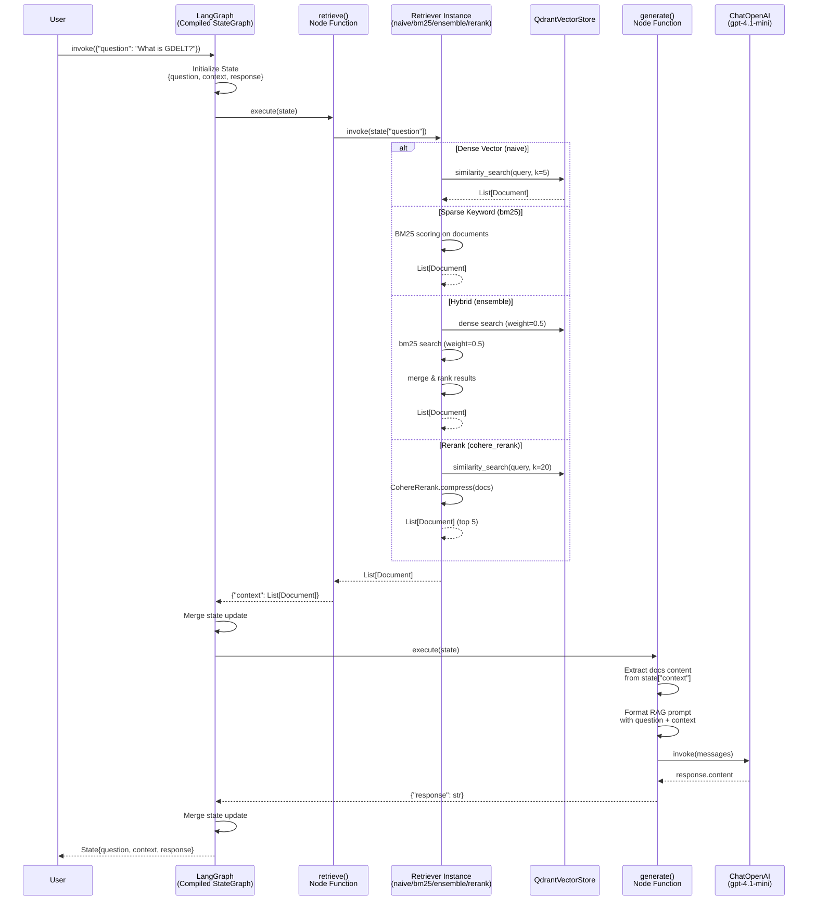
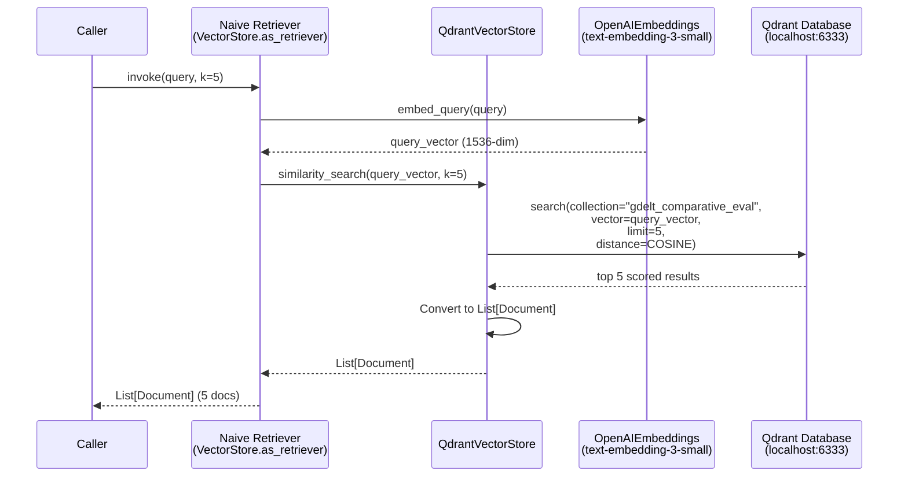
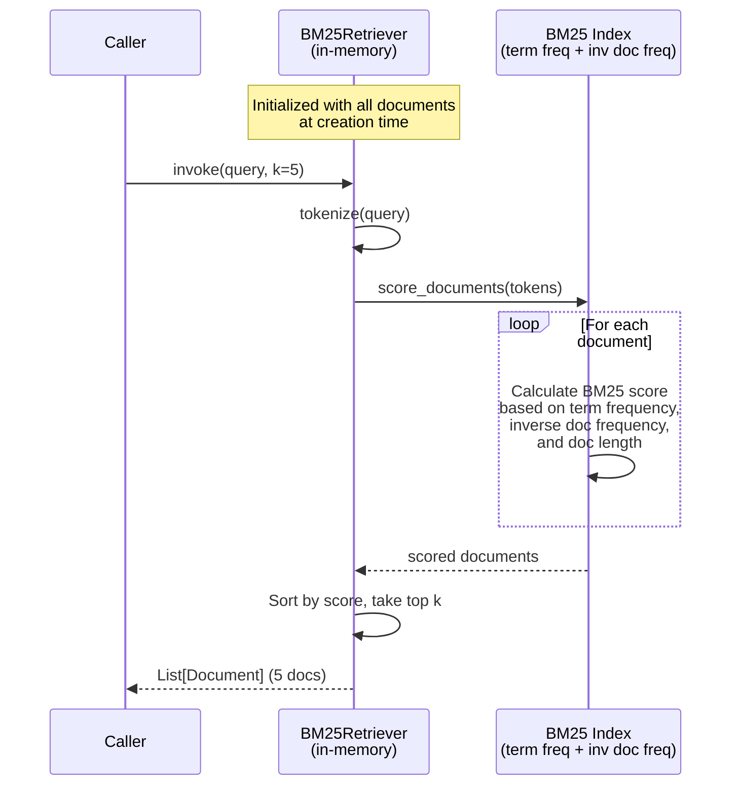
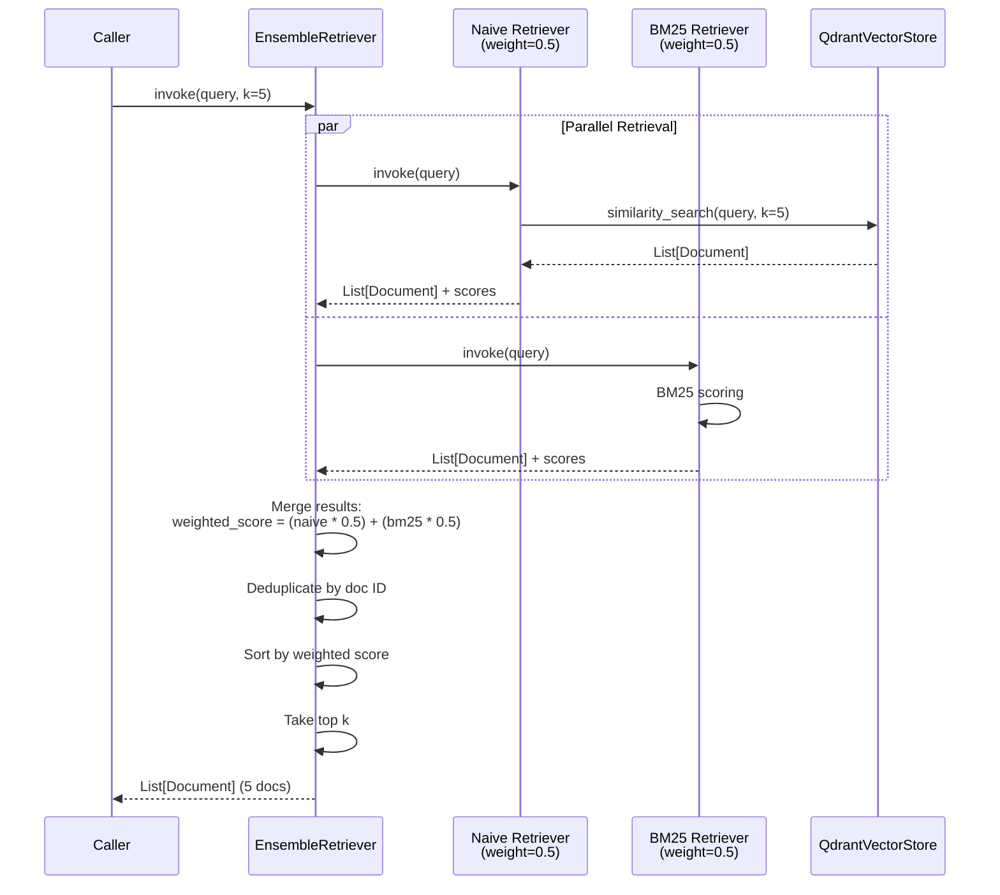
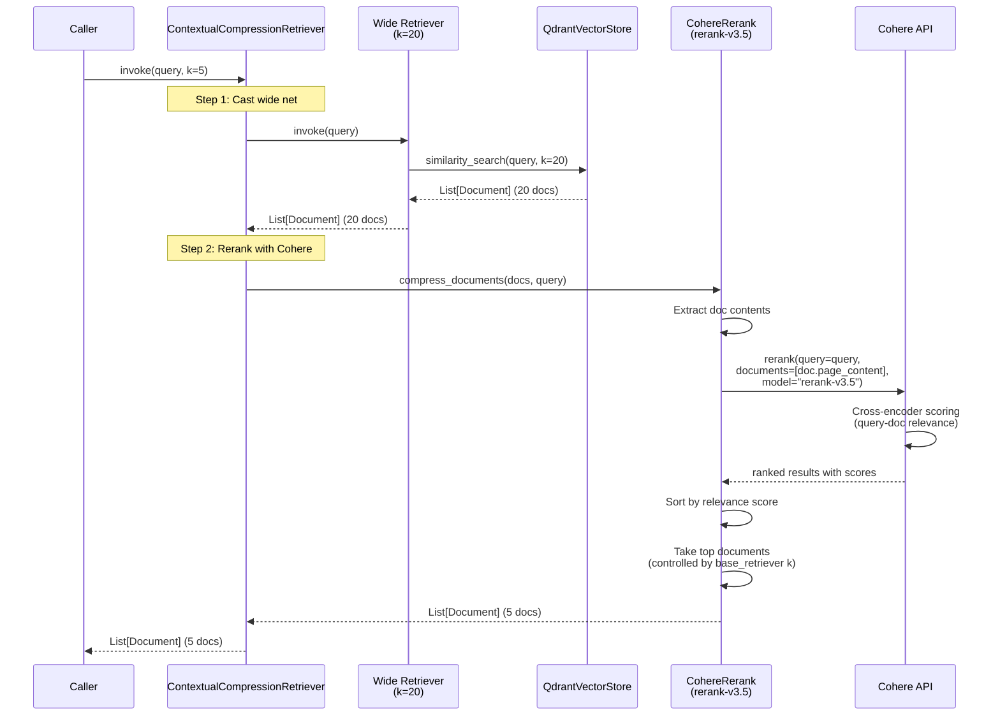
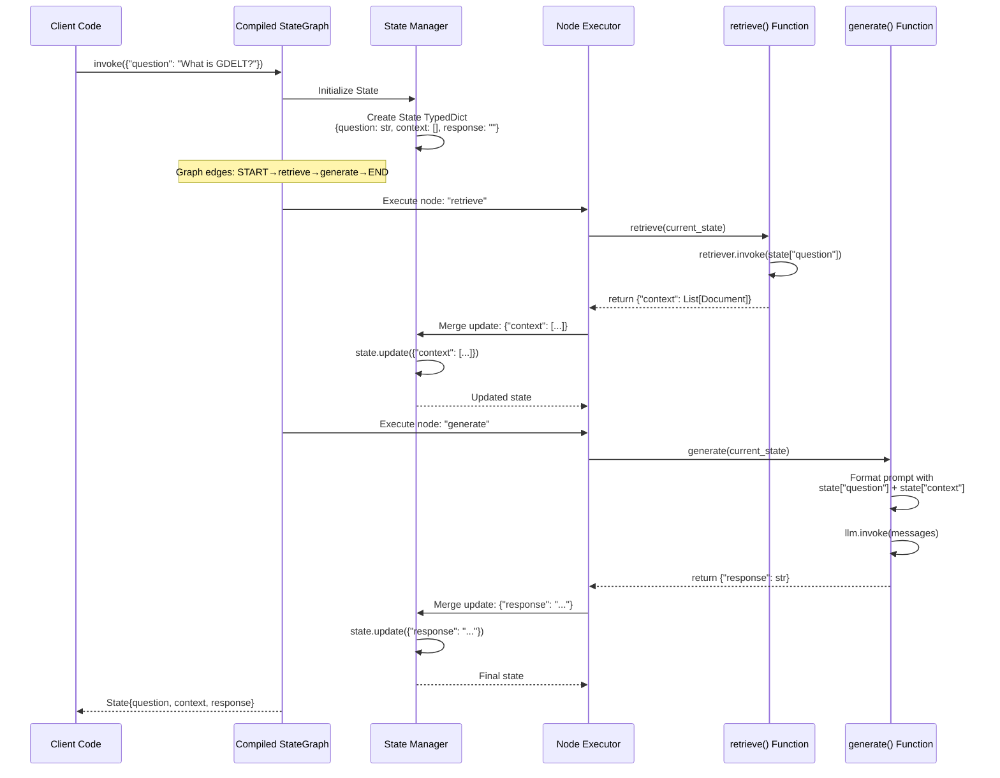
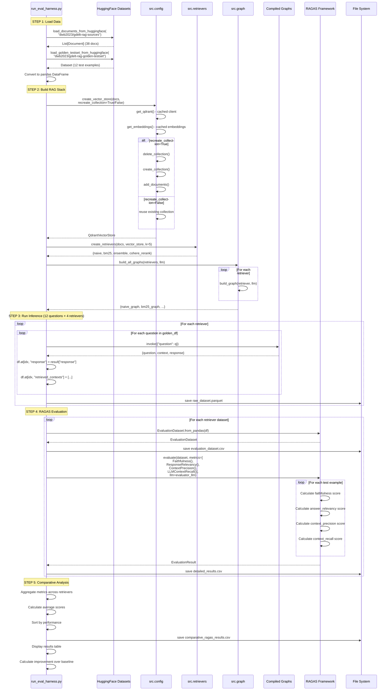
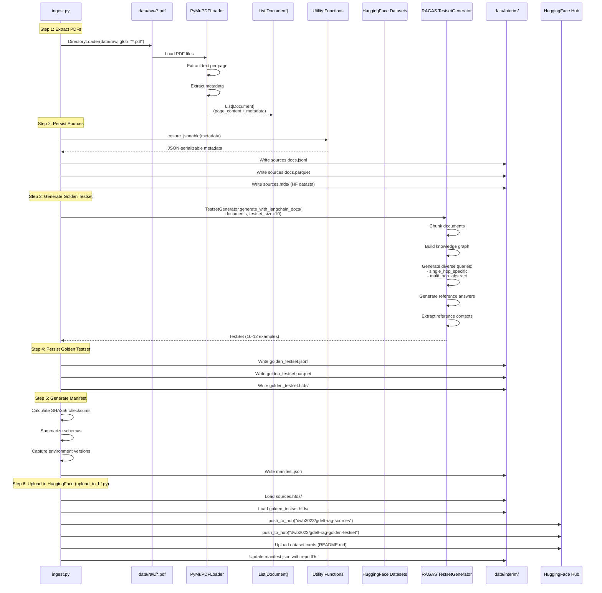
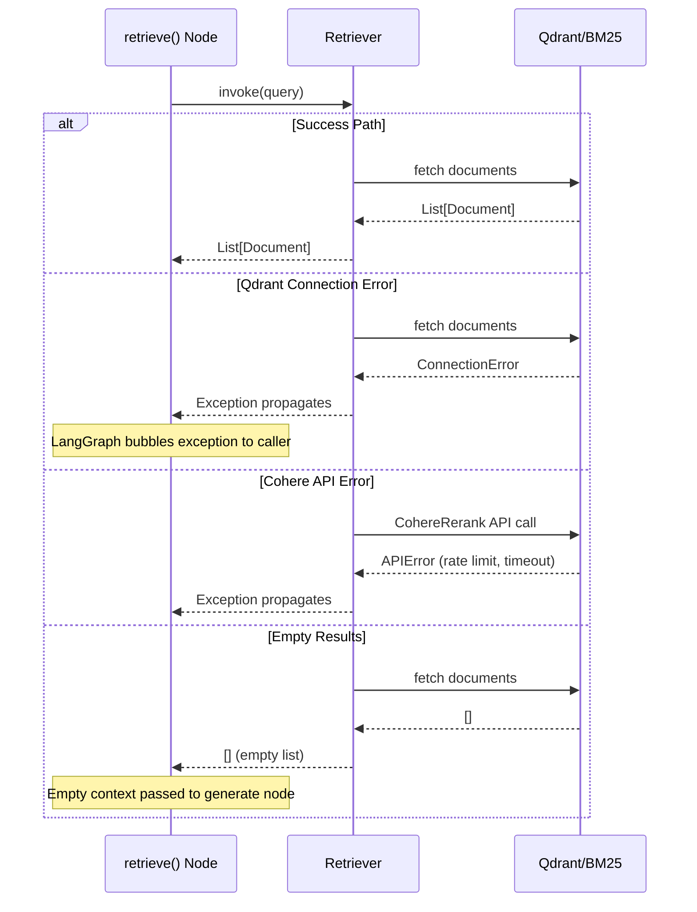
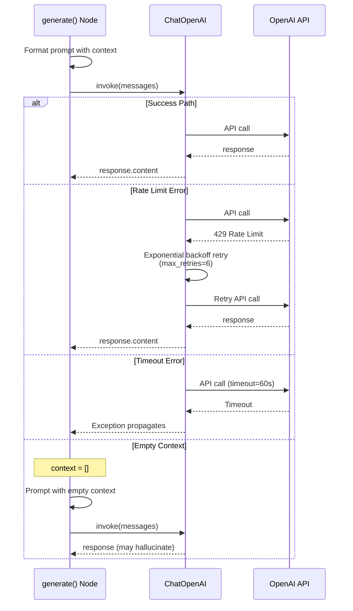

# Data Flow Analysis

## Overview

This document analyzes the actual data flows implemented in the GDELT RAG system. The system is built using LangGraph for orchestration, LangChain for RAG components, Qdrant for vector storage, and RAGAS for evaluation. The architecture supports multiple retrieval strategies (naive dense vector, BM25 sparse, ensemble hybrid, and Cohere rerank) with a modular factory pattern for initialization.

The system implements five primary data flows:
1. **Query Processing Flow** - End-to-end RAG pipeline execution
2. **Document Retrieval Flows** - Four distinct retrieval strategies
3. **LangGraph Workflow Execution** - State-based graph execution
4. **Evaluation Harness Flow** - RAGAS evaluation pipeline
5. **Data Ingestion Pipeline** - PDF extraction to vector store

## 1. Query Processing Flow (RAG Pipeline)

### Sequence Diagram



### Explanation

The query processing flow follows the LangGraph pattern with a two-node state machine:

1. **State Initialization** - Graph receives `{"question": str}` and initializes the State TypedDict
2. **Retrieve Node** - Invokes the configured retriever to fetch relevant documents
3. **State Update** - Returns `{"context": List[Document]}` which LangGraph merges into state
4. **Generate Node** - Formats prompt with question + context, invokes LLM
5. **Final State** - Returns complete state with question, context, and response

**Key Design Patterns:**
- Nodes return partial state updates (dict), not full state
- LangGraph automatically merges updates
- Stateless node functions enable reusability
- Factory pattern delays retriever creation until runtime

### Code References

- **State Schema**: `/home/donbr/don-aie-cohort8/cert-challenge/src/state.py` (lines 7-10)
  - `question: str` - User query
  - `context: List[Document]` - Retrieved documents
  - `response: str` - LLM-generated answer

- **Graph Factory**: `/home/donbr/don-aie-cohort8/cert-challenge/src/graph.py` (lines 21-106)
  - `build_graph(retriever, llm, prompt_template)` - Creates compiled StateGraph
  - `retrieve(state)` node (lines 67-78) - Invokes retriever, returns `{"context": docs}`
  - `generate(state)` node (lines 80-96) - Formats prompt, invokes LLM, returns `{"response": str}`

- **Prompt Template**: `/home/donbr/don-aie-cohort8/cert-challenge/src/prompts.py` (lines 4-12)
  - BASELINE_PROMPT - Instructs LLM to answer only from provided context

- **Graph Compilation**: `/home/donbr/don-aie-cohort8/cert-challenge/src/graph.py` (lines 99-106)
  - Adds retrieve and generate nodes
  - Connects: START → retrieve → generate → END

## 2. Document Retrieval Flows

### 2.1 Naive Retrieval (Dense Vector)



**Code**: `/home/donbr/don-aie-cohort8/cert-challenge/src/retrievers.py` (line 63)
```python
naive_retriever = vector_store.as_retriever(search_kwargs={"k": k})
```

### 2.2 BM25 Retrieval (Sparse)



**Code**: `/home/donbr/don-aie-cohort8/cert-challenge/src/retrievers.py` (line 66)
```python
bm25_retriever = BM25Retriever.from_documents(documents, k=k)
```

**Note**: BM25 operates on in-memory document collection, no external database.

### 2.3 Ensemble Retrieval (Hybrid)



**Code**: `/home/donbr/don-aie-cohort8/cert-challenge/src/retrievers.py` (lines 69-72)
```python
ensemble_retriever = EnsembleRetriever(
    retrievers=[naive_retriever, bm25_retriever],
    weights=[0.5, 0.5]
)
```

**Algorithm**: Reciprocal Rank Fusion with weighted scoring

### 2.4 Cohere Rerank Flow



**Code**: `/home/donbr/don-aie-cohort8/cert-challenge/src/retrievers.py` (lines 76-82)
```python
wide_retriever = vector_store.as_retriever(search_kwargs={"k": max(20, k)})
reranker = CohereRerank(model="rerank-v3.5")
compression_retriever = ContextualCompressionRetriever(
    base_compressor=reranker,
    base_retriever=wide_retriever
)
```

**Strategy**: Retrieve broadly (20 docs), then use cross-encoder to rerank to top 5

### Comparison Summary

| Strategy | Type | External Service | Performance | Use Case |
|----------|------|------------------|-------------|----------|
| **Naive** | Dense vector | Qdrant | Fast | Semantic similarity |
| **BM25** | Sparse keyword | In-memory | Fastest | Exact keyword matching |
| **Ensemble** | Hybrid | Qdrant + in-memory | Medium | Balance semantic + keyword |
| **Cohere Rerank** | Cross-encoder | Qdrant + Cohere API | Slowest | Highest precision |

**Code Reference**: All retrievers created in `/home/donbr/don-aie-cohort8/cert-challenge/src/retrievers.py` (lines 20-89)

## 3. LangGraph Workflow Execution

### Sequence Diagram



### Explanation

LangGraph manages the workflow execution through a state-based graph:

1. **Graph Initialization**:
   - Graph built with `StateGraph(State)` where State is a TypedDict
   - Nodes added: "retrieve" and "generate"
   - Edges define flow: START → retrieve → generate → END
   - Graph compiled for execution

2. **State Management**:
   - State initialized with input: `{"question": "..."}`
   - Each node returns partial state updates (dict)
   - LangGraph merges updates into state automatically
   - No manual state passing between nodes

3. **Node Execution**:
   - Nodes are pure functions: `(State) -> dict`
   - Each node receives current state, returns updates
   - Stateless design enables reusability

4. **Control Flow**:
   - Linear flow (no conditionals in this implementation)
   - Could be extended with conditional edges based on state
   - Error handling delegated to LangChain components

### Code References

- **Graph Construction**: `/home/donbr/don-aie-cohort8/cert-challenge/src/graph.py` (lines 98-106)
  ```python
  graph = StateGraph(State)
  graph.add_node("retrieve", retrieve)
  graph.add_node("generate", generate)
  graph.add_edge(START, "retrieve")
  graph.add_edge("retrieve", "generate")
  graph.add_edge("generate", END)
  return graph.compile()
  ```

- **State Schema**: `/home/donbr/don-aie-cohort8/cert-challenge/src/state.py` (lines 7-10)

- **Factory Pattern**: `/home/donbr/don-aie-cohort8/cert-challenge/src/graph.py` (lines 109-141)
  - `build_all_graphs(retrievers, llm)` - Creates graph for each retriever

## 4. Evaluation Harness Flow

### Sequence Diagram



### Explanation

The evaluation harness implements a comprehensive RAG evaluation workflow:

**Step 1: Data Loading** (lines 108-121)
- Load source documents from HuggingFace dataset
- Load golden testset (12 QA pairs with ground truth)
- Convert to pandas for manipulation

**Step 2: RAG Stack Construction** (lines 127-144)
- Create/reuse Qdrant vector store collection
- Initialize 4 retriever strategies
- Build LangGraph workflows for each retriever
- All use factory functions from src/ modules

**Step 3: Inference Execution** (lines 151-184)
- Process 12 questions through 4 retrievers = 48 total runs
- For each (question, retriever) pair:
  - Invoke graph to get response + retrieved contexts
  - Store results in DataFrame
- Immediate persistence to parquet (prevents data loss)
- Output: 4 raw dataset files (6 columns each)

**Step 4: RAGAS Evaluation** (lines 190-231)
- Convert each DataFrame to RAGAS EvaluationDataset
- Run 4 RAGAS metrics per example:
  - **Faithfulness**: Answer grounded in retrieved context
  - **Answer Relevancy**: Answer addresses the question
  - **Context Precision**: Relevant contexts ranked higher
  - **Context Recall**: Ground truth coverage
- Immediate persistence of evaluation datasets and detailed results
- Output: 4 evaluation datasets + 4 detailed results files

**Step 5: Comparative Analysis** (lines 237-273)
- Aggregate scores across all retrievers
- Calculate average score per retriever
- Sort by performance
- Calculate improvement over baseline (naive)
- Save comparative summary table

### Code References

- **Main Script**: `/home/donbr/don-aie-cohort8/cert-challenge/scripts/run_eval_harness.py`
  - Command line args (lines 52-65): `--recreate` flag
  - Configuration (lines 70-80): dataset names, k=5, output directory
  - Data loading (lines 112-119): Uses `src.utils` functions
  - RAG stack (lines 131-144): Uses `src.config`, `src.retrievers`, `src.graph`
  - Inference loop (lines 156-183): Graph invocation pattern
  - RAGAS evaluation (lines 200-230): Metrics configuration

- **Utility Functions**: `/home/donbr/don-aie-cohort8/cert-challenge/src/utils.py`
  - `load_documents_from_huggingface()` (lines 15-75)
  - `load_golden_testset_from_huggingface()` (lines 78-113)

- **Output Files** (in `deliverables/evaluation_evidence/`):
  - `{retriever}_raw_dataset.parquet` - Raw inference outputs (6 columns)
  - `{retriever}_evaluation_dataset.csv` - RAGAS format datasets
  - `{retriever}_detailed_results.csv` - Per-question metric scores
  - `comparative_ragas_results.csv` - Summary comparison table

### Performance Characteristics

- **Runtime**: 20-30 minutes for full evaluation
- **Cost**: ~$5-6 in OpenAI API calls
- **API Calls**:
  - 48 inference calls (12 questions × 4 retrievers)
  - RAGAS evaluation calls (metrics use LLM for scoring)
  - Cohere rerank API calls (for cohere_rerank retriever)

## 5. Data Ingestion Pipeline

### Sequence Diagram



### Explanation

The data ingestion pipeline transforms raw PDF files into vector-searchable documents:

**Step 1: PDF Extraction** (`ingest.py` lines 154-162)
- `DirectoryLoader` scans `data/raw/` for PDF files
- `PyMuPDFLoader` extracts text and metadata per page
- Creates LangChain `Document` objects with:
  - `page_content`: Extracted text
  - `metadata`: PDF metadata (title, author, page number, etc.)

**Step 2: Source Persistence** (`ingest.py` lines 166-174)
- Sanitize metadata to JSON-serializable format
- Write to 3 formats:
  - **JSONL**: Line-delimited JSON for streaming
  - **Parquet**: Columnar format for analytics
  - **HuggingFace Dataset**: Native HF format for fast loading

**Step 3: Golden Testset Generation** (`ingest.py` lines 202-232)
- RAGAS `TestsetGenerator` creates synthetic test data
- Algorithm:
  1. Chunk documents into smaller units
  2. Build knowledge graph of entities and relationships
  3. Generate diverse query types (single-hop, multi-hop)
  4. Generate reference answers using LLM
  5. Extract reference contexts from source documents
- Output: 10-12 QA pairs with ground truth

**Step 4: Testset Persistence** (`ingest.py` lines 236-258)
- Write golden testset to 3 formats (JSONL, Parquet, HF Dataset)
- Ensures compatibility with different consumption patterns

**Step 5: Manifest Generation** (`ingest.py` lines 262-330)
- Calculate SHA256 checksums for data integrity
- Capture environment versions (Python, LangChain, RAGAS, etc.)
- Document schemas and sample data
- Enables reproducibility and provenance tracking

**Step 6: HuggingFace Upload** (`upload_to_hf.py`)
- Authenticate with HF token
- Push datasets to HuggingFace Hub:
  - `dwb2023/gdelt-rag-sources` (38 documents)
  - `dwb2023/gdelt-rag-golden-testset` (12 examples)
- Generate dataset cards with metadata
- Update manifest with repo IDs and upload timestamp

### Code References

- **Ingestion Script**: `/home/donbr/don-aie-cohort8/cert-challenge/scripts/ingest.py`
  - PDF extraction (lines 154-162)
  - Metadata sanitization (lines 92-104)
  - Source persistence (lines 166-174)
  - RAGAS generation (lines 202-232)
  - Manifest creation (lines 262-330)

- **Upload Script**: `/home/donbr/don-aie-cohort8/cert-challenge/scripts/upload_to_hf.py`
  - Dataset card creation (lines 34-111, 113-191)
  - HF Hub upload (lines 219-289)
  - Manifest update (lines 200-216)

- **Data Flow**:
  ```
  data/raw/*.pdf
    → PyMuPDFLoader
    → List[Document]
    → data/interim/sources.*
    → RAGAS TestsetGenerator
    → data/interim/golden_testset.*
    → HuggingFace Hub
    → dwb2023/gdelt-rag-sources
    → dwb2023/gdelt-rag-golden-testset
  ```

### Output Artifacts

1. **Source Documents**:
   - `data/interim/sources.docs.jsonl` - 38 documents
   - `data/interim/sources.docs.parquet`
   - `data/interim/sources.hfds/`

2. **Golden Testset**:
   - `data/interim/golden_testset.jsonl` - 12 examples
   - `data/interim/golden_testset.parquet`
   - `data/interim/golden_testset.hfds/`

3. **Manifest**:
   - `data/interim/manifest.json` - Provenance metadata

4. **HuggingFace Datasets**:
   - https://huggingface.co/datasets/dwb2023/gdelt-rag-sources
   - https://huggingface.co/datasets/dwb2023/gdelt-rag-golden-testset

## Error Handling Flows

### Retriever Error Handling



**Error Handling Strategy**:
- **No try-catch in node functions** - Exceptions propagate to caller
- **LangChain handles retries** - Configured with max_retries
- **Empty results are valid** - System continues with empty context
- **Caller responsible for error handling** - Scripts wrap in try-except

### LLM Generation Error Handling



**Error Handling Configuration**:
- **Timeouts**: 60 seconds for LLM calls (ingest.py line 223)
- **Retries**: 6 max retries with exponential backoff (ingest.py line 223)
- **RAGAS timeout**: 360 seconds for evaluation metrics (run_eval_harness.py line 197)

### Evaluation Harness Error Handling

The evaluation harness implements immediate persistence to prevent data loss:

**Pattern** (`run_eval_harness.py` lines 177-180, 207-209, 227-229):
```python
# Save immediately after each retriever completes
for name, graph in graphs.items():
    # Run inference
    for idx, row in df.iterrows():
        result = graph.invoke({"question": q})
        df.at[idx, "response"] = result["response"]

    # SAVE IMMEDIATELY - don't wait until end
    raw_file = OUT_DIR / f"{name}_raw_dataset.parquet"
    df.to_parquet(raw_file, index=False)
```

**Benefits**:
- If script crashes mid-evaluation, partial results are saved
- No need to re-run expensive LLM calls
- Can resume from last saved retriever

## State Management

### LangGraph State Management

```mermaid
graph LR
    A[Initial State<br/>{question: str}] --> B[After retrieve()<br/>{question: str,<br/>context: List[Document]}]
    B --> C[After generate()<br/>{question: str,<br/>context: List[Document],<br/>response: str}]

    style A fill:#e1f5ff
    style B fill:#fff4e1
    style C fill:#e8f5e9
```

**Key Principles**:

1. **TypedDict State Schema** (`src/state.py`):
   ```python
   class State(TypedDict):
       question: str
       context: List[Document]
       response: str
   ```
   - Provides type hints for IDE support
   - Documents expected state shape
   - No runtime validation (Python TypedDict limitation)

2. **Partial Updates**:
   - Nodes return `dict` (subset of State), not full State
   - LangGraph merges updates: `state.update(node_output)`
   - Nodes don't need to return unchanged fields

3. **Immutability**:
   - Each node receives current state (read-only)
   - Returns new dict with updates
   - LangGraph handles state mutation internally

4. **No Side Effects**:
   - Node functions are pure: `(State) -> dict`
   - No global variables or shared state
   - Enables parallel execution (not used in this implementation)

### Configuration Caching

```python
# src/config.py - LRU cache pattern
@lru_cache(maxsize=1)
def get_llm():
    return ChatOpenAI(model=OPENAI_MODEL, temperature=0)

@lru_cache(maxsize=1)
def get_embeddings():
    return OpenAIEmbeddings(model=OPENAI_EMBED_MODEL)

@lru_cache(maxsize=1)
def get_qdrant():
    return QdrantClient(host=QDRANT_HOST, port=QDRANT_PORT)
```

**Benefits**:
- Single instance of expensive resources (LLM, embeddings, DB client)
- Safe for multi-graph execution (all graphs share same instances)
- No threading issues (LangChain clients are thread-safe)

### Factory Pattern State Management

**Problem**: Retrievers need documents and vector store at creation time

**Solution**: Factory functions delay creation until runtime

```python
# WRONG - fails at import time
# src/retrievers.py (if written incorrectly)
documents = load_documents_from_huggingface()  # No docs exist yet!
naive_retriever = vector_store.as_retriever()  # No vector_store exists!

# CORRECT - factory pattern
# src/retrievers.py (actual implementation)
def create_retrievers(documents, vector_store, k=5):
    naive_retriever = vector_store.as_retriever(search_kwargs={"k": k})
    bm25_retriever = BM25Retriever.from_documents(documents, k=k)
    # ...
    return {"naive": naive_retriever, "bm25": bm25_retriever, ...}
```

**Usage Pattern**:
```python
# 1. Load data
documents = load_documents_from_huggingface()

# 2. Create vector store
vector_store = create_vector_store(documents)

# 3. Create retrievers (NOW we have docs + vector_store)
retrievers = create_retrievers(documents, vector_store)

# 4. Create graphs (NOW we have retrievers)
graphs = build_all_graphs(retrievers)
```

**Code References**:
- Factory validation: `/home/donbr/don-aie-cohort8/cert-challenge/scripts/validate_langgraph.py` (lines 181-221)
- Correct usage: `/home/donbr/don-aie-cohort8/cert-challenge/scripts/run_eval_harness.py` (lines 112-144)

## Performance Considerations

### 1. Vector Store Optimization

**Collection Reuse** (`src/config.py` lines 101-125):
```python
def create_vector_store(documents, recreate_collection=False):
    if collection_exists and recreate_collection:
        client.delete_collection(collection)

    if collection_not_exists:
        client.create_collection(...)
        vector_store.add_documents(documents)  # Expensive!

    return vector_store
```

**Performance Impact**:
- **First run** (recreate=True): ~30 seconds to embed 38 documents
- **Subsequent runs** (recreate=False): <1 second to connect
- **Embedding cost**: 38 documents × 1536 dimensions = ~$0.01

**Usage**:
```bash
# First time or data changed
python scripts/run_eval_harness.py --recreate true

# Reuse existing embeddings
python scripts/run_eval_harness.py --recreate false
```

### 2. Retriever Performance Characteristics

| Retriever | Latency (avg) | Cost per Query | Bottleneck |
|-----------|---------------|----------------|------------|
| **Naive** | ~50ms | Embedding API call | OpenAI API |
| **BM25** | ~5ms | None (in-memory) | CPU (scoring) |
| **Ensemble** | ~55ms | Embedding API call | OpenAI API |
| **Cohere Rerank** | ~200ms | Embedding + Rerank API | Cohere API (20 docs) |

**Optimization Opportunities**:
- **Batch embedding**: Embed queries in batches (not implemented)
- **Cache embeddings**: Cache query embeddings (not implemented)
- **Async retrieval**: Parallelize retriever calls (not implemented)

### 3. Evaluation Performance

**Bottleneck Analysis** (run_eval_harness.py):
```
Total runtime: 20-30 minutes
├── Data loading: ~10 seconds
├── Vector store creation: ~30 seconds (if recreate=True)
├── Inference (48 queries): ~5 minutes
│   ├── 48 × LLM calls (generate): ~240 seconds
│   └── 12 × Cohere rerank calls: ~60 seconds
└── RAGAS evaluation: ~15-20 minutes
    ├── 48 examples × 4 metrics = 192 metric calculations
    └── Each metric makes multiple LLM calls
```

**Cost Breakdown**:
- **Inference**: 48 LLM calls × ~$0.01 = ~$0.50
- **RAGAS metrics**: 192 calculations × ~$0.02 = ~$3.84
- **Cohere rerank**: 12 calls × ~$0.02 = ~$0.24
- **Total**: ~$5-6 per full evaluation run

**Optimization Strategies**:
1. **Reduce test set size**: 12 → 6 examples (halves cost)
2. **Reduce metrics**: Remove expensive metrics (context_recall)
3. **Increase timeout**: Avoid retries (run_config timeout=360s)
4. **Batch API calls**: Use batch endpoints (not implemented)

### 4. Caching Strategy

**Current Caching**:
- ✅ LLM instance cached (`@lru_cache` in config.py)
- ✅ Embeddings instance cached (`@lru_cache` in config.py)
- ✅ Qdrant client cached (`@lru_cache` in config.py)
- ✅ Vector store collection reused (recreate_collection flag)

**Not Cached** (opportunities):
- ❌ Query embeddings (re-computed for every query)
- ❌ Retrieved documents (no semantic cache)
- ❌ LLM responses (no response cache)
- ❌ RAGAS metric scores (re-computed every run)

**Potential Improvements**:
```python
# Example: Query embedding cache
@lru_cache(maxsize=1000)
def cached_embed_query(query: str) -> List[float]:
    return embeddings.embed_query(query)
```

### 5. Memory Management

**Memory Profile**:
- **Documents in memory**: 38 docs × ~2KB = ~76KB
- **BM25 index**: ~100KB (in-memory tokenized index)
- **Vector store**: 38 vectors × 1536 × 4 bytes = ~234KB (in Qdrant)
- **Evaluation DataFrames**: 4 retrievers × 12 rows × 6 cols = ~48KB
- **Total**: <1MB for this dataset

**Scalability Considerations**:
- BM25 retriever loads all documents in memory (38 docs OK, 1M docs NOT OK)
- Qdrant handles large vector collections efficiently
- Evaluation harness processes one retriever at a time (sequential, memory-efficient)

### 6. Parallelization Opportunities

**Current Implementation**: Sequential execution
- Retrievers run one at a time
- Questions processed sequentially within each retriever
- RAGAS metrics calculated sequentially

**Potential Parallelization**:
```python
# Parallel retriever evaluation (not implemented)
from concurrent.futures import ThreadPoolExecutor

with ThreadPoolExecutor(max_workers=4) as executor:
    futures = {
        executor.submit(run_retriever_evaluation, name, graph, golden_df): name
        for name, graph in graphs.items()
    }
    results = {futures[f]: f.result() for f in as_completed(futures)}
```

**Benefits**: 4× speedup on inference (retriever runs independent)
**Risks**:
- Higher concurrent API usage (may hit rate limits)
- Increased memory usage (4 DataFrames in memory)
- More complex error handling

## Summary

### Key Data Flows

1. **Query → Response** (RAG Pipeline)
   - User provides question
   - Retriever fetches relevant documents from Qdrant/BM25
   - LLM generates answer from context
   - ~50-200ms latency depending on retriever

2. **Documents → Vector Store** (Ingestion)
   - PDF → PyMuPDF → LangChain Documents
   - Documents → OpenAI embeddings → Qdrant
   - ~30 seconds for 38 documents

3. **Source Docs → Golden Testset** (RAGAS Generation)
   - Documents → RAGAS knowledge graph
   - RAGAS → LLM → Synthetic QA pairs
   - ~5-10 minutes for 12 examples

4. **Questions → Metrics** (Evaluation)
   - 12 questions × 4 retrievers = 48 inference runs
   - 48 results × 4 RAGAS metrics = 192 metric calculations
   - ~20-30 minutes, ~$5-6 cost

5. **Local → HuggingFace Hub** (Publishing)
   - Local datasets → HuggingFace Hub
   - Includes dataset cards and metadata
   - Enables reproducible evaluation

### Design Patterns

1. **Factory Pattern** - Delayed retriever/graph creation
2. **State Management** - LangGraph TypedDict state with partial updates
3. **Caching** - LRU cache for expensive resources
4. **Immediate Persistence** - Save results after each retriever (error resilience)
5. **Modular Architecture** - Separate modules for config, retrievers, graphs, utils

### Performance Hotspots

1. **RAGAS Evaluation** - 15-20 minutes (75% of runtime)
2. **Cohere Rerank** - 200ms per query (4× slower than naive)
3. **Vector Store Creation** - 30 seconds (first run only)
4. **LLM Generation** - ~5 seconds per query (gpt-4.1-mini)

### Extensibility Points

1. **Add new retriever** - Implement in `create_retrievers()`, auto-creates graph
2. **Add new metric** - Add to RAGAS metrics list in eval harness
3. **Change LLM** - Update `OPENAI_MODEL` in config.py
4. **Add conditional routing** - Extend LangGraph with conditional edges
5. **Add caching** - Wrap functions with `@lru_cache` or semantic cache

---

**Document Generated**: 2025-10-18
**Codebase Version**: GDELT branch
**Analysis Scope**: Main project code (excluding ra_* analysis framework)
