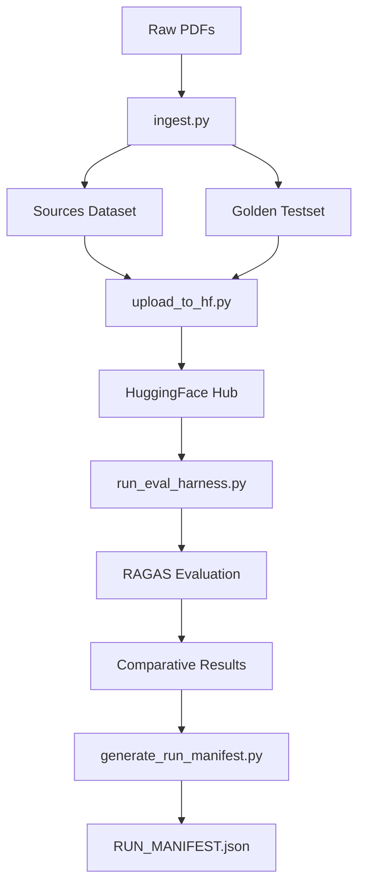
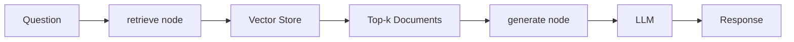

# API Reference

## Overview

This API reference documents all public functions, classes, and configuration options in the GDELT RAG system. The system is organized into modular components:

- **Core Modules** (`src/`): Configuration, retrievers, graph workflows, utilities
- **Scripts**: Data ingestion, evaluation, validation utilities
- **Configuration**: Environment variables and system settings

### Quick Start

```python
from src.utils import load_documents_from_huggingface
from src.config import create_vector_store
from src.retrievers import create_retrievers
from src.graph import build_all_graphs

# Load data
documents = load_documents_from_huggingface()

# Create vector store
vector_store = create_vector_store(documents, recreate_collection=True)

# Create retrievers
retrievers = create_retrievers(documents, vector_store)

# Build LangGraph workflows
graphs = build_all_graphs(retrievers)

# Query the system
result = graphs['naive'].invoke({"question": "What is GDELT?"})
print(result['response'])
```

---

## Core Modules (src/)

### config.py

**Source**: `/home/donbr/don-aie-cohort8/cert-challenge/src/config.py`

Configuration module providing cached getter functions for LLM, embeddings, and Qdrant client. Configuration is read from environment variables with sensible defaults.

#### Module Constants

##### `QDRANT_HOST`
**Type**: `str`
**Default**: `"localhost"`
**Environment Variable**: `QDRANT_HOST`
**Description**: Qdrant server hostname

##### `QDRANT_PORT`
**Type**: `int`
**Default**: `6333`
**Environment Variable**: `QDRANT_PORT`
**Description**: Qdrant server port

##### `COLLECTION_NAME`
**Type**: `str`
**Default**: `"gdelt_comparative_eval"`
**Environment Variable**: `QDRANT_COLLECTION`
**Description**: Default Qdrant collection name

##### `OPENAI_MODEL`
**Type**: `str`
**Default**: `"gpt-4.1-mini"`
**Environment Variable**: `OPENAI_MODEL`
**Description**: OpenAI LLM model identifier

##### `OPENAI_EMBED_MODEL`
**Type**: `str`
**Default**: `"text-embedding-3-small"`
**Environment Variable**: `OPENAI_EMBED_MODEL`
**Description**: OpenAI embeddings model identifier

---

#### Functions

##### `get_llm()`

**Description**: Get cached LLM instance for RAG generation.

**Signature**:
```python
@lru_cache(maxsize=1)
def get_llm() -> ChatOpenAI:
```

**Parameters**: None

**Returns**:
- `ChatOpenAI`: Configured OpenAI LLM instance with `temperature=0` for deterministic outputs

**Caching**: Results are cached using `@lru_cache` - subsequent calls return the same instance

**Example**:
```python
from src.config import get_llm

llm = get_llm()
response = llm.invoke("What is GDELT?")
print(response.content)
```

**Source**: `src/config.py:27-35`

---

##### `get_embeddings()`

**Description**: Get cached embeddings instance for document and query vectorization.

**Signature**:
```python
@lru_cache(maxsize=1)
def get_embeddings() -> OpenAIEmbeddings:
```

**Parameters**: None

**Returns**:
- `OpenAIEmbeddings`: Configured OpenAI embeddings instance (1536 dimensions)

**Caching**: Results are cached using `@lru_cache`

**Example**:
```python
from src.config import get_embeddings

embeddings = get_embeddings()
vectors = embeddings.embed_documents(["Sample text"])
print(f"Vector dimensions: {len(vectors[0])}")  # 1536
```

**Source**: `src/config.py:38-46`

---

##### `get_qdrant()`

**Description**: Get cached Qdrant client instance.

**Signature**:
```python
@lru_cache(maxsize=1)
def get_qdrant() -> QdrantClient:
```

**Parameters**: None

**Returns**:
- `QdrantClient`: Qdrant client connected to configured host/port

**Caching**: Results are cached using `@lru_cache`

**Example**:
```python
from src.config import get_qdrant

client = get_qdrant()
collections = client.get_collections()
print(f"Available collections: {[c.name for c in collections.collections]}")
```

**Source**: `src/config.py:49-57`

---

##### `get_collection_name()`

**Description**: Get configured Qdrant collection name.

**Signature**:
```python
def get_collection_name() -> str:
```

**Parameters**: None

**Returns**:
- `str`: Collection name string (default: "gdelt_comparative_eval")

**Example**:
```python
from src.config import get_collection_name

collection = get_collection_name()
print(f"Using collection: {collection}")
```

**Source**: `src/config.py:60-67`

---

##### `create_vector_store()`

**Description**: Create and populate Qdrant vector store. This factory function handles creating the Qdrant collection, optionally recreating if it exists, and populating it with documents.

**Signature**:
```python
def create_vector_store(
    documents: List[Document],
    collection_name: str = None,
    recreate_collection: bool = False
) -> QdrantVectorStore:
```

**Parameters**:
- `documents` (List[Document]): List of LangChain Document objects to add to vector store
- `collection_name` (str, optional): Override default collection name. Defaults to `get_collection_name()`
- `recreate_collection` (bool, optional): If True, delete existing collection first. Default: False

**Returns**:
- `QdrantVectorStore`: Populated QdrantVectorStore instance ready for retrieval

**Vector Configuration**:
- Vector size: 1536 (matches text-embedding-3-small)
- Distance metric: COSINE
- Automatically creates collection if it doesn't exist

**Example**:
```python
from src.utils import load_documents_from_huggingface
from src.config import create_vector_store

# Load documents
documents = load_documents_from_huggingface()

# Create new vector store (recreate if exists)
vector_store = create_vector_store(
    documents,
    collection_name="my_collection",
    recreate_collection=True
)

# Use as retriever
retriever = vector_store.as_retriever(search_kwargs={"k": 5})
results = retriever.invoke("What is GDELT?")
```

**Important Notes**:
- Set `recreate_collection=True` to force fresh ingestion
- Reuses existing collection if `recreate_collection=False` and collection exists
- Documents are only added if collection is new or recreated

**Source**: `src/config.py:70-127`

---

### state.py

**Source**: `/home/donbr/don-aie-cohort8/cert-challenge/src/state.py`

Defines the LangGraph state schema using TypedDict.

#### Classes

##### `State`

**Description**: TypedDict defining the state schema for LangGraph workflows. Represents the data flow through retrieval and generation nodes.

**Signature**:
```python
class State(TypedDict):
    question: str
    context: List[Document]
    response: str
```

**Fields**:
- `question` (str): User's input question
- `context` (List[Document]): Retrieved documents from vector store
- `response` (str): Generated answer from LLM

**Usage in LangGraph**:
```python
from src.state import State
from langgraph.graph import StateGraph

# Nodes return partial state updates
def retrieve(state: State) -> dict:
    # Retrieve documents
    return {"context": retrieved_docs}

def generate(state: State) -> dict:
    # Generate answer
    return {"response": answer}

# Build graph
graph = StateGraph(State)
graph.add_node("retrieve", retrieve)
graph.add_node("generate", generate)
```

**Example**:
```python
from src.state import State

# Initial state
initial_state: State = {
    "question": "What is GDELT?",
    "context": [],
    "response": ""
}

# After retrieval
after_retrieval: State = {
    "question": "What is GDELT?",
    "context": [doc1, doc2, doc3],
    "response": ""
}

# After generation
final_state: State = {
    "question": "What is GDELT?",
    "context": [doc1, doc2, doc3],
    "response": "GDELT is the Global Database of Events, Language, and Tone..."
}
```

**Source**: `src/state.py:7-10`

---

### prompts.py

**Source**: `/home/donbr/don-aie-cohort8/cert-challenge/src/prompts.py`

Prompt templates for RAG generation.

#### Constants

##### `BASELINE_PROMPT`

**Description**: Standard RAG prompt template that instructs the LLM to answer based only on provided context.

**Type**: `str`

**Template Variables**:
- `{question}`: User's input question
- `{context}`: Retrieved document content (concatenated)

**Value**:
```python
BASELINE_PROMPT = """\
You are a helpful assistant who answers questions based on provided context. You must only use the provided context, and cannot use your own knowledge.

### Question
{question}

### Context
{context}
"""
```

**Usage**:
```python
from langchain.prompts import ChatPromptTemplate
from src.prompts import BASELINE_PROMPT

# Create prompt template
prompt = ChatPromptTemplate.from_template(BASELINE_PROMPT)

# Format with actual values
messages = prompt.format_messages(
    question="What is GDELT?",
    context="GDELT is a global database..."
)
```

**Design Notes**:
- Constrains LLM to use only retrieved context (reduces hallucination)
- Clear section headers for question and context
- Used consistently across all 4 retriever types for fair comparison

**Source**: `src/prompts.py:3-12`

---

### retrievers.py

**Source**: `/home/donbr/don-aie-cohort8/cert-challenge/src/retrievers.py`

Retriever factory functions for creating different retrieval strategies.

#### Functions

##### `create_retrievers()`

**Description**: Create all retriever instances using factory pattern. This is the main entry point for creating retrievers - they cannot be instantiated at module level because they require documents and vector stores.

**Signature**:
```python
def create_retrievers(
    documents: List[Document],
    vector_store: QdrantVectorStore,
    k: int = 5,
) -> Dict[str, object]:
```

**Parameters**:
- `documents` (List[Document]): List of Document objects (required for BM25 in-memory index)
- `vector_store` (QdrantVectorStore): Populated QdrantVectorStore instance
- `k` (int, optional): Number of documents to retrieve. Default: 5

**Returns**:
- `Dict[str, object]`: Dictionary mapping retriever names to retriever instances
  - Keys: `'naive'`, `'bm25'`, `'ensemble'`, `'cohere_rerank'`
  - Values: Configured retriever objects

**Retriever Types**:

1. **Naive** (Dense Vector Search):
   - Uses OpenAI embeddings for semantic similarity
   - Returns top-k most similar documents by cosine distance
   - Baseline for comparison

2. **BM25** (Sparse Keyword Matching):
   - Traditional lexical search using TF-IDF weighting
   - Operates on in-memory document collection
   - Good for exact term matches

3. **Ensemble** (Hybrid Search):
   - Combines dense vector + sparse keyword search
   - 50/50 weighting between naive and BM25
   - Balances semantic and lexical matching

4. **Cohere Rerank** (Contextual Compression):
   - First retrieves 20 documents using dense search
   - Reranks using Cohere rerank-v3.5 model
   - Returns top-k after reranking
   - Best quality but highest latency/cost

**Example**:
```python
from src.utils import load_documents_from_huggingface
from src.config import create_vector_store
from src.retrievers import create_retrievers

# Setup
documents = load_documents_from_huggingface()
vector_store = create_vector_store(documents, recreate_collection=True)

# Create all retrievers
retrievers = create_retrievers(documents, vector_store, k=5)

# Use individual retrievers
question = "What is GDELT?"
naive_docs = retrievers['naive'].invoke(question)
bm25_docs = retrievers['bm25'].invoke(question)
ensemble_docs = retrievers['ensemble'].invoke(question)
rerank_docs = retrievers['cohere_rerank'].invoke(question)

print(f"Naive retrieved: {len(naive_docs)} docs")
print(f"BM25 retrieved: {len(bm25_docs)} docs")
```

**Environment Requirements**:
- `OPENAI_API_KEY`: Required for all retrievers (embeddings)
- `COHERE_API_KEY`: Required only for `cohere_rerank`

**Performance Characteristics**:
| Retriever | Latency | Quality | Cost |
|-----------|---------|---------|------|
| Naive | Low | Good | Low |
| BM25 | Very Low | Good | None |
| Ensemble | Low | Better | Low |
| Cohere Rerank | High | Best | High |

**Source**: `src/retrievers.py:20-89`

---

### graph.py

**Source**: `/home/donbr/don-aie-cohort8/cert-challenge/src/graph.py`

LangGraph workflow factory functions for building RAG pipelines.

#### Functions

##### `build_graph()`

**Description**: Build a compiled LangGraph pipeline for a single retriever. Creates a simple two-node graph: `START → retrieve → generate → END`.

**Signature**:
```python
def build_graph(
    retriever,
    llm=None,
    prompt_template: str = None
) -> CompiledGraph:
```

**Parameters**:
- `retriever` (object): Retriever instance to use for document retrieval
- `llm` (ChatOpenAI, optional): ChatOpenAI instance. Defaults to `get_llm()` if None
- `prompt_template` (str, optional): RAG prompt template string. Defaults to `BASELINE_PROMPT`

**Returns**:
- `CompiledGraph`: Compiled StateGraph that can be invoked with `{"question": "..."}`

**Graph Structure**:
```
START → retrieve → generate → END
```

**Node Functions** (internal):

- **retrieve(state: State) → dict**:
  - Invokes retriever with `state["question"]`
  - Returns `{"context": List[Document]}`

- **generate(state: State) → dict**:
  - Formats prompt with question and context
  - Invokes LLM to generate answer
  - Returns `{"response": str}`

**Example**:
```python
from src.utils import load_documents_from_huggingface
from src.config import create_vector_store
from src.retrievers import create_retrievers
from src.graph import build_graph

# Setup
documents = load_documents_from_huggingface()
vector_store = create_vector_store(documents)
retrievers = create_retrievers(documents, vector_store)

# Build graph for naive retriever
graph = build_graph(retrievers['naive'])

# Execute query
result = graph.invoke({"question": "What is GDELT?"})

# Access results
print(f"Question: {result['question']}")
print(f"Retrieved {len(result['context'])} documents")
print(f"Response: {result['response']}")
```

**Custom Prompt Example**:
```python
custom_prompt = """
Answer the question based on the context below.
Be concise and factual.

Question: {question}

Context: {context}
"""

graph = build_graph(
    retrievers['naive'],
    prompt_template=custom_prompt
)
```

**State Management**:
- Node functions return partial state updates (dict)
- LangGraph automatically merges updates into state
- Follows LangGraph best practices for state management

**Source**: `src/graph.py:21-106`

---

##### `build_all_graphs()`

**Description**: Build compiled graphs for all retrievers. Convenience function to create a graph for each retriever in one call.

**Signature**:
```python
def build_all_graphs(
    retrievers: Dict[str, object],
    llm=None
) -> Dict[str, object]:
```

**Parameters**:
- `retrievers` (Dict[str, object]): Dictionary of retriever instances from `create_retrievers()`
- `llm` (ChatOpenAI, optional): Optional ChatOpenAI instance (shared across all graphs)

**Returns**:
- `Dict[str, object]`: Dictionary mapping retriever names to compiled graphs
  - Same keys as input retrievers dict
  - Values: Compiled LangGraph workflows

**Example**:
```python
from src.utils import load_documents_from_huggingface
from src.config import create_vector_store, get_llm
from src.retrievers import create_retrievers
from src.graph import build_all_graphs

# Setup
documents = load_documents_from_huggingface()
vector_store = create_vector_store(documents)
retrievers = create_retrievers(documents, vector_store)

# Build all graphs at once
graphs = build_all_graphs(retrievers, llm=get_llm())

# All graphs ready to use
result_naive = graphs['naive'].invoke({"question": "What is GDELT?"})
result_bm25 = graphs['bm25'].invoke({"question": "What is GDELT?"})
result_ensemble = graphs['ensemble'].invoke({"question": "What is GDELT?"})
result_rerank = graphs['cohere_rerank'].invoke({"question": "What is GDELT?"})

# Compare responses
for name, graph in graphs.items():
    result = graph.invoke({"question": "What is GDELT?"})
    print(f"\n{name}: {result['response'][:100]}...")
```

**Batch Processing Example**:
```python
questions = [
    "What is GDELT?",
    "How does GDELT measure tone?",
    "What languages does GDELT support?"
]

results = {}
for name, graph in graphs.items():
    results[name] = []
    for question in questions:
        result = graph.invoke({"question": question})
        results[name].append(result['response'])
```

**Source**: `src/graph.py:109-141`

---

### utils.py

**Source**: `/home/donbr/don-aie-cohort8/cert-challenge/src/utils.py`

Utility functions for loading and processing documents from HuggingFace datasets.

#### Functions

##### `load_documents_from_huggingface()`

**Description**: Load documents from HuggingFace dataset and convert to LangChain Documents. Handles conversion from HuggingFace dataset format to LangChain Document objects, properly extracting page_content and metadata.

**Signature**:
```python
def load_documents_from_huggingface(
    dataset_name: str = "dwb2023/gdelt-rag-sources",
    split: str = "train",
    revision: str = None
) -> List[Document]:
```

**Parameters**:
- `dataset_name` (str, optional): HuggingFace dataset identifier. Default: `"dwb2023/gdelt-rag-sources"`
- `split` (str, optional): Dataset split to load. Default: `"train"`
- `revision` (str, optional): Dataset revision/commit SHA to pin. Default: None (uses `HF_SOURCES_REV` env var if set, otherwise latest)

**Returns**:
- `List[Document]`: List of LangChain Document objects with page_content and metadata

**Environment Variables**:
- `HF_SOURCES_REV`: Optional dataset revision to pin for reproducibility

**Example**:
```python
from src.utils import load_documents_from_huggingface

# Load latest version
documents = load_documents_from_huggingface()
print(f"Loaded {len(documents)} documents")

# Pin to specific revision for reproducibility
documents = load_documents_from_huggingface(
    revision="abc123def456"
)

# Or use environment variable
import os
os.environ["HF_SOURCES_REV"] = "abc123def456"
documents = load_documents_from_huggingface()

# Load from different dataset
documents = load_documents_from_huggingface(
    dataset_name="my-org/my-dataset",
    split="test"
)

# Inspect documents
doc = documents[0]
print(f"Content: {doc.page_content[:100]}...")
print(f"Metadata: {doc.metadata}")
```

**Data Structure**:
```python
# Each Document has:
Document(
    page_content="The text content of the document...",
    metadata={
        "title": "Paper title",
        "author": "Authors",
        "page": 1,
        "total_pages": 38,
        "file_path": "/path/to/source.pdf",
        # ... other metadata fields
    }
)
```

**Important Notes**:
- Handles nested metadata structures automatically
- Preserves all metadata fields from HuggingFace dataset
- Empty or missing page_content defaults to empty string
- Revision pinning prevents dataset drift over time
- First call downloads dataset (cached locally afterward)

**Source**: `src/utils.py:15-75`

---

##### `load_golden_testset_from_huggingface()`

**Description**: Load golden testset from HuggingFace dataset for evaluation purposes.

**Signature**:
```python
def load_golden_testset_from_huggingface(
    dataset_name: str = "dwb2023/gdelt-rag-golden-testset",
    split: str = "train",
    revision: str = None
) -> Dataset:
```

**Parameters**:
- `dataset_name` (str, optional): HuggingFace dataset identifier. Default: `"dwb2023/gdelt-rag-golden-testset"`
- `split` (str, optional): Dataset split to load. Default: `"train"`
- `revision` (str, optional): Dataset revision/commit SHA to pin. Default: None (uses `HF_GOLDEN_REV` env var if set, otherwise latest)

**Returns**:
- `Dataset`: HuggingFace Dataset object with evaluation examples

**Environment Variables**:
- `HF_GOLDEN_REV`: Optional dataset revision to pin for reproducibility

**Example**:
```python
from src.utils import load_golden_testset_from_huggingface
import pandas as pd

# Load golden testset
golden_dataset = load_golden_testset_from_huggingface()

# Convert to pandas for inspection
golden_df = golden_dataset.to_pandas()
print(f"Loaded {len(golden_df)} test examples")
print(f"Columns: {golden_df.columns.tolist()}")

# Pin to specific revision
golden_dataset = load_golden_testset_from_huggingface(
    revision="abc123def456"
)

# Or use environment variable
import os
os.environ["HF_GOLDEN_REV"] = "abc123def456"
golden_dataset = load_golden_testset_from_huggingface()

# Inspect examples
for example in golden_dataset:
    print(f"Question: {example['user_input']}")
    print(f"Reference: {example['reference']}")
    print(f"Contexts: {len(example['reference_contexts'])}")
    print()
```

**Dataset Schema**:
- `user_input` (str): Question/query
- `reference` (str): Ground truth answer
- `reference_contexts` (list[str]): Ground truth context passages
- `synthesizer_name` (str): RAGAS synthesizer used

**Use Cases**:
- RAGAS evaluation (faithfulness, relevancy, precision, recall)
- Benchmarking retriever quality
- Regression testing for system changes

**Important Notes**:
- Revision pinning ensures test set consistency across runs
- Prevents score drift due to dataset updates
- Used in evaluation harness (`run_eval_harness.py`, `single_file.py`)

**Source**: `src/utils.py:78-113`

---

## Scripts

### run_eval_harness.py

**Source**: `/home/donbr/don-aie-cohort8/cert-challenge/scripts/run_eval_harness.py`

RAGAS evaluation harness using `src/` modules. This is the production evaluation script.

**Description**: Runs comprehensive RAGAS evaluation across all 4 retrievers using factory functions from `src/` modules. Evaluates 12 test questions with 4 RAGAS metrics.

**Usage**:
```bash
# Using Make
make eval

# Direct execution
export PYTHONPATH=.
python scripts/run_eval_harness.py

# With collection recreation
python scripts/run_eval_harness.py --recreate true

# Reuse existing collection (faster)
python scripts/run_eval_harness.py --recreate false
```

**Command Line Arguments**:
- `--recreate` (str): Recreate Qdrant collection. Choices: `"true"`, `"false"`. Default: `"false"`

**Environment Variables Required**:
- `OPENAI_API_KEY`: For LLM and embeddings
- `COHERE_API_KEY`: For cohere_rerank retriever (optional, that retriever will be skipped)

**Output Files** (saved to `deliverables/evaluation_evidence/`):

1. **Raw Datasets** (6 columns each):
   - `{retriever}_raw_dataset.parquet`
   - Columns: user_input, reference_contexts, reference, synthesizer_name, response, retrieved_contexts

2. **Evaluation Datasets** (RAGAS format):
   - `{retriever}_evaluation_dataset.csv`

3. **Detailed Results** (per-question scores):
   - `{retriever}_detailed_results.csv`
   - Includes: faithfulness, answer_relevancy, context_precision, context_recall

4. **Comparative Summary**:
   - `comparative_ragas_results.csv`
   - Aggregated scores by retriever

**Evaluation Metrics**:
- **Faithfulness**: Answer grounded in retrieved context (no hallucination)
- **Answer Relevancy**: Answer addresses the question
- **Context Precision**: Relevant contexts ranked higher
- **Context Recall**: Ground truth coverage by retrieved contexts

**Example Output**:
```
================================================================================
COMPARATIVE RAGAS RESULTS
================================================================================

Retriever             Faithfulness  Answer Relevancy  Context Precision  Context Recall  Average
Cohere Rerank         0.9583        0.9123           0.8750             0.9167          0.9156
Ensemble              0.9375        0.8945           0.8542             0.8958          0.8955
Naive                 0.9167        0.8734           0.8333             0.8750          0.8746
Bm25                  0.8958        0.8512           0.8125             0.8542          0.8534

🏆 Winner: Cohere Rerank with 91.56% average score
   Improvement over baseline: +4.7%
```

**Performance**:
- **Time**: 20-30 minutes
- **Cost**: ~$5-6 in OpenAI API calls
- **Test Set**: 12 questions × 4 retrievers = 48 total evaluations

**Important Notes**:
- Set `--recreate true` for fresh evaluation (rebuilds vector store)
- Set `--recreate false` to reuse existing collection (faster, for re-evaluation)
- All LLM calls use `temperature=0` for determinism
- Results are identical to `single_file.py` but uses modular `src/` code

**Source**: `scripts/run_eval_harness.py:1-323`

**Key Functions**:

```python
# Main workflow (simplified)
def main():
    # 1. Load data
    docs = load_documents_from_huggingface(DATASET_SOURCES, "train")
    golden_ds = load_golden_testset_from_huggingface(DATASET_GOLDEN, "train")
    golden_df = golden_ds.to_pandas()

    # 2. Build RAG stack
    vs = create_vector_store(docs, recreate_collection=RECREATE_COLLECTION)
    retrievers = create_retrievers(docs, vs, k=K)
    graphs = build_all_graphs(retrievers, llm=get_llm())

    # 3. Run inference
    for name, graph in graphs.items():
        for idx, row in df.iterrows():
            result = graph.invoke({"question": row["user_input"]})
            df.at[idx, "response"] = result["response"]
            df.at[idx, "retrieved_contexts"] = [d.page_content for d in result["context"]]

    # 4. RAGAS evaluation
    for name, df in datasets.items():
        eval_ds = EvaluationDataset.from_pandas(df)
        res = evaluate(dataset=eval_ds, metrics=[...], llm=evaluator_llm)

    # 5. Comparative analysis
    # Aggregate and compare results
```

---

### single_file.py

**Source**: `/home/donbr/don-aie-cohort8/cert-challenge/scripts/single_file.py`

Comprehensive RAG evaluation with RAGAS (standalone version). This is the original evaluation script with all code inline.

**Description**: Self-contained evaluation script that implements the full RAG pipeline inline (without using `src/` modules). Evaluates 4 retrievers using RAGAS metrics. Functionally identical to `run_eval_harness.py` but with duplicated code.

**Usage**:
```bash
python scripts/single_file.py
```

**Environment Variables Required**:
- `OPENAI_API_KEY`: Required for LLM and embeddings
- `COHERE_API_KEY`: Optional (for cohere_rerank)

**Output Files**: Same as `run_eval_harness.py` (see above)

**Key Differences from `run_eval_harness.py`**:
1. All code inline (no imports from `src/`)
2. Always recreates Qdrant collection
3. No command-line arguments
4. Demonstrates inline implementation pattern

**Use Cases**:
- Reference implementation for understanding the full workflow
- Standalone execution without dependencies on `src/` modules
- Educational purposes (all code visible in one file)

**Important Functions**:

##### `validate_and_normalize_ragas_schema()`

**Description**: Ensure DataFrame matches RAGAS 0.2.10 schema requirements. Handles different column naming conventions and validates required fields.

**Signature**:
```python
def validate_and_normalize_ragas_schema(
    df: pd.DataFrame,
    retriever_name: str = "unknown"
) -> pd.DataFrame:
```

**Parameters**:
- `df` (pd.DataFrame): DataFrame to validate and normalize
- `retriever_name` (str, optional): Name of retriever for logging. Default: "unknown"

**Returns**:
- `pd.DataFrame`: DataFrame with normalized column names

**Raises**:
- `ValueError`: If required columns are missing after normalization

**Column Mapping**:
```python
rename_map = {
    'question': 'user_input',
    'answer': 'response',
    'contexts': 'retrieved_contexts',
    'ground_truth': 'reference',
    'ground_truths': 'reference',
    'reference_contexts': 'reference',
}
```

**Required Columns**: `user_input`, `response`, `retrieved_contexts`, `reference`

**Example**:
```python
import pandas as pd
from scripts.single_file import validate_and_normalize_ragas_schema

# DataFrame with alternative column names
df = pd.DataFrame({
    'question': ['What is GDELT?'],
    'answer': ['GDELT is...'],
    'contexts': [['doc1', 'doc2']],
    'ground_truth': ['Ground truth answer']
})

# Normalize to RAGAS schema
normalized_df = validate_and_normalize_ragas_schema(df, "naive")

# Now has: user_input, response, retrieved_contexts, reference
print(normalized_df.columns.tolist())
```

**Source**: `scripts/single_file.py:66-125`

---

### validate_langgraph.py

**Source**: `/home/donbr/don-aie-cohort8/cert-challenge/scripts/validate_langgraph.py`

LangGraph configuration validation script. Validates the LangGraph implementation and demonstrates correct initialization patterns.

**Description**: Validates environment configuration, module imports, retriever factory patterns, graph compilation, and functional execution. Serves as diagnostic tool and reference implementation.

**Usage**:
```bash
python scripts/validate_langgraph.py
```

**Exit Codes**:
- `0`: All validations passed
- `1`: One or more validations failed

**Validation Stages**:

1. **Environment Validation**:
   - Check API keys (OPENAI_API_KEY, COHERE_API_KEY)
   - Test Qdrant connectivity
   - Verify critical Python imports

2. **Module Import Validation**:
   - Test importing each `src/` module individually
   - Identify broken imports with detailed tracebacks

3. **Initialization Pattern Validation**:
   - Demonstrate correct factory pattern usage
   - Load documents using `src.utils`
   - Create vector store using `src.config`
   - Create retrievers using `src.retrievers`

4. **Graph Compilation Validation**:
   - Build graphs using `src.graph`
   - Verify all 4 retrievers compile successfully

5. **Functional Testing**:
   - Execute test query through each graph
   - Validate result structure
   - Check context retrieval and response generation

**Example Output**:
```
================================================================================
1. ENVIRONMENT VALIDATION
================================================================================

✓ OPENAI_API_KEY set                                       [PASS]
✓ COHERE_API_KEY set                                       [PASS]
✓ Qdrant at localhost:6333                                 [PASS]
✓ Import langchain                                         [PASS]
✓ Import langchain_openai                                  [PASS]
✓ Import langgraph                                         [PASS]

================================================================================
2. MODULE IMPORT VALIDATION
================================================================================

✓ src.config         - Configuration                       [PASS]
✓ src.state          - State schema                        [PASS]
✓ src.prompts        - Prompt templates                    [PASS]
✓ src.retrievers     - Retriever instances                 [PASS]
✓ src.graph          - LangGraph workflows                 [PASS]
✓ src.utils          - Utility functions                   [PASS]

================================================================================
3. VALIDATION OF src/ MODULE IMPLEMENTATION
================================================================================

ℹ Loading documents using src.utils...
✓ Load documents from HuggingFace                          [PASS]
ℹ Creating vector store using src.config...
✓ Create vector store via factory                          [PASS]
ℹ Creating retrievers using src.retrievers...
✓ Create retrievers via factory                            [PASS]

================================================================================
4. GRAPH COMPILATION VALIDATION
================================================================================

✓ Compile naive graph                                      [PASS]
✓ Compile bm25 graph                                       [PASS]
✓ Compile ensemble graph                                   [PASS]
✓ Compile cohere_rerank graph                              [PASS]

================================================================================
5. FUNCTIONAL TESTING
================================================================================

ℹ Test question: 'What is GDELT?'
✓ naive              functional test                       [PASS]
✓ bm25               functional test                       [PASS]
✓ ensemble           functional test                       [PASS]
✓ cohere_rerank      functional test                       [PASS]

================================================================================
6. DIAGNOSTIC REPORT
================================================================================

Overall Results:
  Total checks: 25
  Passed: 25
  Failed: 0
  Pass rate: 100.0%

✅ ALL VALIDATIONS PASSED
```

**Key Functions**:

##### `check_environment()`

**Signature**: `def check_environment() -> Dict[str, bool]:`

Validates environment configuration (API keys, Qdrant, imports).

##### `test_module_imports()`

**Signature**: `def test_module_imports() -> Dict[str, Dict[str, Any]]:`

Tests importing each `src/` module individually.

##### `demonstrate_correct_pattern()`

**Signature**: `def demonstrate_correct_pattern() -> Optional[Dict[str, Any]]:`

Demonstrates correct retriever factory pattern using actual `src/` modules.

##### `validate_graph_compilation()`

**Signature**: `def validate_graph_compilation(components: Optional[Dict[str, Any]]) -> Dict[str, bool]:`

Validates LangGraph compilation for all retrievers.

##### `run_functional_tests()`

**Signature**: `def run_functional_tests(components: Optional[Dict[str, Any]]) -> Dict[str, bool]:`

Runs functional tests with actual queries.

**Source**: `scripts/validate_langgraph.py:1-486`

---

### Data Pipeline Scripts

#### ingest.py

**Source**: `/home/donbr/don-aie-cohort8/cert-challenge/scripts/ingest.py`

Standardized RAGAS golden testset pipeline. Extracts PDFs, generates golden testset, and persists to multiple formats.

**Description**: End-to-end pipeline for creating source documents and golden testset from PDFs. Generates RAGAS synthetic test data and saves in multiple formats (JSONL, Parquet, HuggingFace Dataset).

**Workflow**:
1. Extract PDFs → LangChain Documents
2. Sanitize metadata for Arrow/JSON
3. Persist SOURCES to `/data/interim` (JSONL, Parquet, HF dataset)
4. Generate RAGAS golden testset
5. Persist GOLDEN TESTSET to `/data/interim`
6. Write manifest with checksums & schema

**Output Formats**:
- **JSONL**: Native for RAG eval workflows
- **Parquet**: For analytics / quick vector-store ingestion
- **HF Dataset on disk**: Fast rehydrate into `datasets`

**Configuration** (in script):
```python
OPENAI_MODEL = "gpt-4.1-mini"
OPENAI_EMBED_MODEL = "text-embedding-3-small"
TESTSET_SIZE = 10
MAX_DOCS = None  # Set to int to limit docs during prototyping
RANDOM_SEED = 42
```

**Output Files**:
- `data/interim/sources.docs.jsonl`
- `data/interim/sources.docs.parquet`
- `data/interim/sources.hfds/` (directory)
- `data/interim/golden_testset.jsonl`
- `data/interim/golden_testset.parquet`
- `data/interim/golden_testset.hfds/` (directory)
- `data/interim/manifest.json`

**Key Functions**:

##### `ensure_jsonable()`

**Signature**: `def ensure_jsonable(obj: Any) -> Any:`

Make metadata JSON-serializable without losing information.

##### `docs_to_jsonl()`

**Signature**: `def docs_to_jsonl(docs: Iterable[Document], path: Path) -> int:`

Write documents to JSONL format.

##### `docs_to_parquet()`

**Signature**: `def docs_to_parquet(docs: Iterable[Document], path: Path) -> int:`

Write documents to Parquet format.

##### `docs_to_hfds()`

**Signature**: `def docs_to_hfds(docs: Iterable[Document], path: Path) -> int:`

Write documents to HuggingFace Dataset on disk.

##### `build_testset()`

**Signature**: `def build_testset(docs, size: int):`

Generate RAGAS testset with retry logic for API failures. Supports both RAGAS 0.3.x and 0.2.x APIs.

**Retry Configuration**:
- Max attempts: 3
- Wait strategy: Exponential backoff (1-20 seconds)
- Retry on: RateLimitError, APITimeoutError, APIStatusError, APIConnectionError

**Source**: `scripts/ingest.py:1-336`

---

#### upload_to_hf.py

**Source**: `/home/donbr/don-aie-cohort8/cert-challenge/scripts/upload_to_hf.py`

Upload GDELT RAG datasets to Hugging Face Hub.

**Description**: Uploads source documents and golden testset to HuggingFace Hub with dataset cards. Updates manifest with dataset repo IDs.

**Usage**:
```bash
export HF_TOKEN=your_token_here
python scripts/upload_to_hf.py
```

**Environment Variables Required**:
- `HF_TOKEN`: HuggingFace API token with write access

**Dataset Repositories**:
- Sources: `dwb2023/gdelt-rag-sources`
- Golden Testset: `dwb2023/gdelt-rag-golden-testset`

**Features**:
- Automatic dataset card generation
- Public datasets (not private)
- Manifest update with repo IDs and upload timestamp

**Key Functions**:

##### `create_sources_card()`

**Signature**: `def create_sources_card() -> str:`

Create dataset card for sources dataset with metadata and citation.

##### `create_golden_testset_card()`

**Signature**: `def create_golden_testset_card() -> str:`

Create dataset card for golden testset with schema and usage info.

##### `update_manifest()`

**Signature**: `def update_manifest(sources_repo: str, golden_testset_repo: str):`

Update manifest.json with dataset repo IDs and upload timestamp.

**Example Output**:
```
🔐 Logging in to Hugging Face...

📂 Loading datasets from data/interim...
   • Sources dataset: 38 documents
   • Golden testset: 12 examples

📤 Uploading sources dataset to dwb2023/gdelt-rag-sources...
   • Creating dataset card...
   ✅ Sources dataset uploaded successfully!
      View at: https://huggingface.co/datasets/dwb2023/gdelt-rag-sources

📤 Uploading golden testset to dwb2023/gdelt-rag-golden-testset...
   • Creating dataset card...
   ✅ Golden testset uploaded successfully!
      View at: https://huggingface.co/datasets/dwb2023/gdelt-rag-golden-testset

📝 Updating manifest...
✅ Updated manifest.json with dataset repo IDs

🎉 All datasets uploaded successfully!
```

**Source**: `scripts/upload_to_hf.py:1-292`

---

#### generate_run_manifest.py

**Source**: `/home/donbr/don-aie-cohort8/cert-challenge/scripts/generate_run_manifest.py`

Generate RUN_MANIFEST.json for reproducibility.

**Description**: Captures exact configuration of RAGAS evaluation runs including model versions, retriever configurations, evaluation settings, and dependencies.

**Usage**:
```bash
# Standalone execution
python scripts/generate_run_manifest.py

# Programmatic usage
from scripts.generate_run_manifest import generate_manifest

manifest = generate_manifest(
    output_path=Path("deliverables/evaluation_evidence/RUN_MANIFEST.json"),
    evaluation_results=results,
    retrievers_config=retrievers
)
```

**Key Functions**:

##### `generate_manifest()`

**Description**: Generate run manifest JSON for reproducibility.

**Signature**:
```python
def generate_manifest(
    output_path: Path,
    evaluation_results: Optional[Dict[str, Any]] = None,
    retrievers_config: Optional[Dict[str, Any]] = None,
) -> Dict[str, Any]:
```

**Parameters**:
- `output_path` (Path): Path to save manifest JSON
- `evaluation_results` (Optional[Dict[str, Any]]): RAGAS evaluation results
- `retrievers_config` (Optional[Dict[str, Any]]): Retriever configurations

**Returns**:
- `Dict[str, Any]`: Dictionary containing the manifest

**Manifest Structure**:
```json
{
  "ragas_version": "0.2.10",
  "python_version": "3.11",
  "llm": {
    "model": "gpt-4.1-mini",
    "temperature": 0,
    "provider": "openai",
    "purpose": "RAG generation and RAGAS evaluation"
  },
  "embeddings": {
    "model": "text-embedding-3-small",
    "dimensions": 1536,
    "provider": "openai"
  },
  "retrievers": [
    {
      "name": "naive",
      "type": "dense_vector_search",
      "k": 5,
      "distance_metric": "cosine"
    },
    {
      "name": "bm25",
      "type": "sparse_keyword",
      "k": 5
    },
    {
      "name": "cohere_rerank",
      "type": "contextual_compression",
      "initial_k": 20,
      "top_n": 3,
      "rerank_model": "rerank-v3.5"
    },
    {
      "name": "ensemble",
      "type": "hybrid",
      "weights": [0.5, 0.5]
    }
  ],
  "evaluation": {
    "golden_testset": "dwb2023/gdelt-rag-golden-testset",
    "golden_testset_size": 12,
    "metrics": ["faithfulness", "answer_relevancy", "context_precision", "context_recall"]
  },
  "vector_store": {
    "type": "qdrant",
    "collection_name": "gdelt_comparative_eval",
    "distance": "cosine"
  },
  "results_summary": {
    "naive": {
      "faithfulness": 0.9167,
      "answer_relevancy": 0.8734,
      "context_precision": 0.8333,
      "context_recall": 0.8750,
      "average": 0.8746
    }
  },
  "generated_at": "2025-10-18T12:05:46Z"
}
```

**Source**: `scripts/generate_run_manifest.py:1-187`

---

#### enrich_manifest.py

**Source**: `/home/donbr/don-aie-cohort8/cert-challenge/scripts/enrich_manifest.py`

Enrich manifest.json with environment, metrics, and compliance metadata.

**Description**: Post-processes manifest.json to add checksums, row counts, schemas, package versions, and compliance scaffolding.

**Usage**:
```bash
# Default path (data/interim/manifest.json)
python scripts/enrich_manifest.py

# Custom path
python scripts/enrich_manifest.py data/processed/manifest.json
```

**Enrichments**:
1. **Environment**: Python version, OS, package versions
2. **Artifacts**: File checksums, row counts, schemas
3. **Metrics**: Document stats, character counts, reference context averages
4. **Lineage**: HuggingFace, LangSmith, Phoenix scaffolding
5. **Compliance**: License, PII policy, notes
6. **Run Details**: Git commit SHA, random seed

**Key Functions**:

##### `sha256()`

**Signature**: `def sha256(path: Path) -> str:`

Compute SHA-256 hash of file.

##### `count_jsonl_rows()`

**Signature**: `def count_jsonl_rows(path: Path) -> int:`

Count rows in JSONL file.

##### `parquet_rows()`

**Signature**: `def parquet_rows(path: Path) -> int:`

Count rows in Parquet file using PyArrow or Pandas.

##### `hfds_rows()`

**Signature**: `def hfds_rows(path: Path) -> int:`

Count rows in HuggingFace Dataset on disk.

##### `pandas_schema_from_parquet()`

**Signature**: `def pandas_schema_from_parquet(path: Path):`

Extract schema from Parquet file as list of {name, dtype} dicts.

##### `char_stats_jsonl()`

**Signature**: `def char_stats_jsonl(path: Path, field="page_content", max_scan=5000):`

Compute character statistics for a JSONL field (avg, max).

**Source**: `scripts/enrich_manifest.py:1-243`

---

## Configuration Reference

### Environment Variables

#### Required

| Variable | Description | Default | Example |
|----------|-------------|---------|---------|
| `OPENAI_API_KEY` | OpenAI API key for LLM and embeddings | None | `sk-...` |

#### Optional

| Variable | Description | Default | Example |
|----------|-------------|---------|---------|
| `COHERE_API_KEY` | Cohere API key for reranking | None | `...` |
| `QDRANT_HOST` | Qdrant server hostname | `"localhost"` | `"qdrant.example.com"` |
| `QDRANT_PORT` | Qdrant server port | `6333` | `6333` |
| `QDRANT_COLLECTION` | Qdrant collection name | `"gdelt_comparative_eval"` | `"my_collection"` |
| `OPENAI_MODEL` | OpenAI LLM model | `"gpt-4.1-mini"` | `"gpt-4o"` |
| `OPENAI_EMBED_MODEL` | OpenAI embeddings model | `"text-embedding-3-small"` | `"text-embedding-3-large"` |
| `HF_SOURCES_REV` | HuggingFace sources dataset revision | None | `"abc123def456"` |
| `HF_GOLDEN_REV` | HuggingFace golden testset revision | None | `"abc123def456"` |
| `HF_TOKEN` | HuggingFace API token (for uploads) | None | `hf_...` |

#### Configuration Loading

```python
import os
from src.config import QDRANT_HOST, QDRANT_PORT, COLLECTION_NAME

# Override defaults via environment
os.environ["QDRANT_HOST"] = "my-qdrant-server"
os.environ["QDRANT_PORT"] = "6333"
os.environ["OPENAI_MODEL"] = "gpt-4o"

# Values are loaded at module import
from src.config import get_llm, get_embeddings, get_qdrant

llm = get_llm()  # Uses gpt-4o
embeddings = get_embeddings()  # Uses text-embedding-3-small (default)
client = get_qdrant()  # Connects to my-qdrant-server:6333
```

---

### Configuration Dictionary Schema

The system doesn't use a centralized config dictionary. Instead, configuration is managed through:

1. **Environment variables** (see above)
2. **Module constants** in `src/config.py`
3. **Function parameters** (e.g., `k` in `create_retrievers()`)

**Best Practice**:
```python
# Centralize your config in one place
import os

class Config:
    # Qdrant
    QDRANT_HOST = os.getenv("QDRANT_HOST", "localhost")
    QDRANT_PORT = int(os.getenv("QDRANT_PORT", "6333"))
    COLLECTION_NAME = os.getenv("QDRANT_COLLECTION", "gdelt_eval")

    # OpenAI
    OPENAI_MODEL = os.getenv("OPENAI_MODEL", "gpt-4.1-mini")
    OPENAI_EMBED_MODEL = os.getenv("OPENAI_EMBED_MODEL", "text-embedding-3-small")

    # Retrieval
    TOP_K = int(os.getenv("TOP_K", "5"))
    RERANK_K = int(os.getenv("RERANK_K", "20"))

    # Datasets
    SOURCES_DATASET = os.getenv("SOURCES_DATASET", "dwb2023/gdelt-rag-sources")
    GOLDEN_DATASET = os.getenv("GOLDEN_DATASET", "dwb2023/gdelt-rag-golden-testset")

# Use in code
from config import Config
retrievers = create_retrievers(documents, vector_store, k=Config.TOP_K)
```

---

### Retriever Types

The system provides 4 retriever types, each with distinct characteristics:

#### 1. Naive (Dense Vector Search)

**Type**: Dense semantic search
**Implementation**: `QdrantVectorStore.as_retriever()`
**Embedding Model**: OpenAI text-embedding-3-small (1536 dimensions)
**Distance Metric**: Cosine similarity

**Configuration**:
```python
naive_retriever = vector_store.as_retriever(search_kwargs={"k": 5})
```

**Characteristics**:
- ✓ Good semantic understanding
- ✓ Handles paraphrasing and synonyms
- ✓ Low latency
- ✗ May miss exact keyword matches
- ✗ Requires quality embeddings

**Best For**: General-purpose semantic search

---

#### 2. BM25 (Sparse Keyword Matching)

**Type**: Lexical search
**Implementation**: `BM25Retriever.from_documents()`
**Algorithm**: Best Matching 25 (TF-IDF variant)
**Storage**: In-memory document index

**Configuration**:
```python
bm25_retriever = BM25Retriever.from_documents(documents, k=5)
```

**Characteristics**:
- ✓ Excellent for exact term matches
- ✓ No API costs (runs locally)
- ✓ Very low latency
- ✗ Poor with synonyms/paraphrasing
- ✗ Language-specific tokenization

**Best For**: Keyword-heavy queries, exact term matching

---

#### 3. Ensemble (Hybrid Search)

**Type**: Hybrid (dense + sparse)
**Implementation**: `EnsembleRetriever`
**Components**: Naive retriever + BM25 retriever
**Weighting**: 50% dense + 50% sparse

**Configuration**:
```python
ensemble_retriever = EnsembleRetriever(
    retrievers=[naive_retriever, bm25_retriever],
    weights=[0.5, 0.5]
)
```

**Characteristics**:
- ✓ Balances semantic and lexical matching
- ✓ More robust than individual retrievers
- ✓ Reasonable latency
- ✗ More complex to tune
- ✗ May retrieve duplicates

**Best For**: Production systems needing robustness

**Weight Tuning**:
```python
# More semantic
ensemble = EnsembleRetriever(
    retrievers=[naive_retriever, bm25_retriever],
    weights=[0.7, 0.3]
)

# More lexical
ensemble = EnsembleRetriever(
    retrievers=[naive_retriever, bm25_retriever],
    weights=[0.3, 0.7]
)
```

---

#### 4. Cohere Rerank (Contextual Compression)

**Type**: Reranking with contextual compression
**Implementation**: `ContextualCompressionRetriever`
**Base Retriever**: Dense vector search (k=20)
**Reranker**: Cohere rerank-v3.5
**Final K**: Controlled by base retriever, reranker returns top results

**Configuration**:
```python
wide_retriever = vector_store.as_retriever(search_kwargs={"k": 20})
reranker = CohereRerank(model="rerank-v3.5")
compression_retriever = ContextualCompressionRetriever(
    base_compressor=reranker,
    base_retriever=wide_retriever
)
```

**Characteristics**:
- ✓ Highest quality results
- ✓ Contextual understanding
- ✓ Better ranking than dense search alone
- ✗ Highest latency (~1-2s per query)
- ✗ API costs (Cohere)
- ✗ Requires COHERE_API_KEY

**Best For**: Quality-critical applications, complex queries

**Performance Tuning**:
```python
# Retrieve more candidates for better reranking
wide_retriever = vector_store.as_retriever(search_kwargs={"k": 50})

# Use different Cohere model
reranker = CohereRerank(model="rerank-english-v2.0")  # Faster, English-only
```

---

## Usage Patterns

### Basic RAG Query

Complete example of querying the RAG system:

```python
from src.utils import load_documents_from_huggingface
from src.config import create_vector_store
from src.retrievers import create_retrievers
from src.graph import build_graph

# 1. Load documents (cached locally after first download)
documents = load_documents_from_huggingface()
print(f"Loaded {len(documents)} documents")

# 2. Create vector store
vector_store = create_vector_store(
    documents,
    collection_name="gdelt_rag",
    recreate_collection=True  # Set False to reuse existing
)

# 3. Create retrievers
retrievers = create_retrievers(documents, vector_store, k=5)

# 4. Build graph for naive retriever
graph = build_graph(retrievers['naive'])

# 5. Query the system
result = graph.invoke({"question": "What is GDELT?"})

# 6. Access results
print(f"Question: {result['question']}")
print(f"Retrieved {len(result['context'])} documents:")
for i, doc in enumerate(result['context'], 1):
    print(f"  {i}. {doc.page_content[:100]}...")
print(f"\nResponse: {result['response']}")
```

---

### Running Evaluation

Complete example of running RAGAS evaluation:

```python
from pathlib import Path
import pandas as pd
from ragas import EvaluationDataset, RunConfig, evaluate
from ragas.metrics import Faithfulness, ResponseRelevancy, ContextPrecision, LLMContextRecall
from ragas.llms import LangchainLLMWrapper

from src.utils import load_documents_from_huggingface, load_golden_testset_from_huggingface
from src.config import create_vector_store, get_llm
from src.retrievers import create_retrievers
from src.graph import build_all_graphs

# 1. Load data
documents = load_documents_from_huggingface()
golden_ds = load_golden_testset_from_huggingface()
golden_df = golden_ds.to_pandas()

# 2. Build RAG stack
vector_store = create_vector_store(documents, recreate_collection=False)
retrievers = create_retrievers(documents, vector_store, k=5)
graphs = build_all_graphs(retrievers)

# 3. Run inference for one retriever
name = 'naive'
graph = graphs[name]

# Add response and retrieved_contexts columns
golden_df['response'] = None
golden_df['retrieved_contexts'] = None

for idx, row in golden_df.iterrows():
    result = graph.invoke({"question": row['user_input']})
    golden_df.at[idx, 'response'] = result['response']
    golden_df.at[idx, 'retrieved_contexts'] = [d.page_content for d in result['context']]

# 4. Create RAGAS evaluation dataset
eval_ds = EvaluationDataset.from_pandas(golden_df)

# 5. Run evaluation
evaluator_llm = LangchainLLMWrapper(get_llm())
run_cfg = RunConfig(timeout=360)

result = evaluate(
    dataset=eval_ds,
    metrics=[
        Faithfulness(),
        ResponseRelevancy(),
        ContextPrecision(),
        LLMContextRecall()
    ],
    llm=evaluator_llm,
    run_config=run_cfg
)

# 6. Analyze results
result_df = result.to_pandas()
print("\nMetric Scores:")
print(f"Faithfulness:       {result_df['faithfulness'].mean():.4f}")
print(f"Answer Relevancy:   {result_df['answer_relevancy'].mean():.4f}")
print(f"Context Precision:  {result_df['context_precision'].mean():.4f}")
print(f"Context Recall:     {result_df['context_recall'].mean():.4f}")

# 7. Save results
output_dir = Path("evaluation_results")
output_dir.mkdir(exist_ok=True)
result_df.to_csv(output_dir / f"{name}_results.csv", index=False)
```

---

### Data Ingestion

Complete example of ingesting new documents:

```python
from pathlib import Path
from langchain_community.document_loaders import DirectoryLoader, PyMuPDFLoader
from src.config import create_vector_store

# 1. Load PDFs from directory
raw_data_dir = Path("data/raw")
loader = DirectoryLoader(
    str(raw_data_dir),
    glob="*.pdf",
    loader_cls=PyMuPDFLoader
)
documents = loader.load()

print(f"Loaded {len(documents)} document pages")

# 2. Inspect first document
doc = documents[0]
print(f"\nSample document:")
print(f"  Content: {doc.page_content[:200]}...")
print(f"  Metadata: {doc.metadata}")

# 3. Create vector store
vector_store = create_vector_store(
    documents,
    collection_name="my_new_collection",
    recreate_collection=True
)

print(f"\n✓ Ingested {len(documents)} documents to Qdrant")

# 4. Test retrieval
retriever = vector_store.as_retriever(search_kwargs={"k": 3})
results = retriever.invoke("test query")
print(f"✓ Retrieved {len(results)} documents")

# 5. Upload to HuggingFace (optional)
from datasets import Dataset

# Convert to HuggingFace Dataset format
hf_data = []
for doc in documents:
    hf_data.append({
        "page_content": doc.page_content,
        "metadata": doc.metadata
    })

dataset = Dataset.from_list(hf_data)

# Push to Hub (requires HF_TOKEN env var)
dataset.push_to_hub(
    "your-username/your-dataset-name",
    private=False
)
```

---

### Custom Retriever Configuration

Example of creating custom retriever configurations:

```python
from langchain.retrievers import EnsembleRetriever
from langchain_community.retrievers import BM25Retriever
from langchain.retrievers.contextual_compression import ContextualCompressionRetriever
from langchain_cohere import CohereRerank

from src.utils import load_documents_from_huggingface
from src.config import create_vector_store

# Load data
documents = load_documents_from_huggingface()
vector_store = create_vector_store(documents)

# 1. Custom k value
custom_naive = vector_store.as_retriever(search_kwargs={"k": 10})

# 2. Custom ensemble weights (favor semantic)
naive_5 = vector_store.as_retriever(search_kwargs={"k": 5})
bm25_5 = BM25Retriever.from_documents(documents, k=5)

semantic_heavy = EnsembleRetriever(
    retrievers=[naive_5, bm25_5],
    weights=[0.8, 0.2]  # 80% semantic, 20% lexical
)

# 3. Custom reranker configuration
wide_retriever = vector_store.as_retriever(search_kwargs={"k": 50})
reranker = CohereRerank(
    model="rerank-english-v2.0",  # Different model
    top_n=3  # Return only top 3
)
custom_rerank = ContextualCompressionRetriever(
    base_compressor=reranker,
    base_retriever=wide_retriever
)

# 4. Multi-retriever ensemble
naive_10 = vector_store.as_retriever(search_kwargs={"k": 10})
bm25_10 = BM25Retriever.from_documents(documents, k=10)
naive_bm25_ensemble = EnsembleRetriever(
    retrievers=[naive_10, bm25_10],
    weights=[0.5, 0.5]
)

# Add reranker on top of ensemble
final_retriever = ContextualCompressionRetriever(
    base_compressor=CohereRerank(model="rerank-v3.5"),
    base_retriever=naive_bm25_ensemble
)

# 5. Use custom retriever in graph
from src.graph import build_graph

graph = build_graph(final_retriever)
result = graph.invoke({"question": "What is GDELT?"})
print(result['response'])
```

---

## Best Practices

### Configuration Management

**1. Use Environment Variables for Secrets**

```python
# ✓ Good - secrets in environment
import os
os.environ["OPENAI_API_KEY"] = "sk-..."
os.environ["COHERE_API_KEY"] = "..."

from src.config import get_llm
llm = get_llm()
```

```python
# ✗ Bad - hardcoded secrets
llm = ChatOpenAI(api_key="sk-hardcoded-key")
```

**2. Pin Dataset Revisions for Reproducibility**

```python
# ✓ Good - pinned revision
import os
os.environ["HF_SOURCES_REV"] = "abc123def456"
os.environ["HF_GOLDEN_REV"] = "xyz789"

documents = load_documents_from_huggingface()
golden = load_golden_testset_from_huggingface()
```

```python
# ✗ Bad - floating revision (dataset may change)
documents = load_documents_from_huggingface()
```

**3. Use Cached Instances**

```python
# ✓ Good - use cached getters
from src.config import get_llm, get_embeddings, get_qdrant

llm = get_llm()  # Cached
embeddings = get_embeddings()  # Cached
client = get_qdrant()  # Cached
```

```python
# ✗ Bad - create new instances
from langchain_openai import ChatOpenAI, OpenAIEmbeddings

llm1 = ChatOpenAI(model="gpt-4.1-mini")
llm2 = ChatOpenAI(model="gpt-4.1-mini")  # Duplicate!
```

**4. Centralize Configuration**

```python
# ✓ Good - single source of truth
# config/settings.py
class Settings:
    QDRANT_HOST = os.getenv("QDRANT_HOST", "localhost")
    QDRANT_PORT = int(os.getenv("QDRANT_PORT", "6333"))
    TOP_K = int(os.getenv("TOP_K", "5"))

from config.settings import Settings
retrievers = create_retrievers(docs, vs, k=Settings.TOP_K)
```

---

### Error Handling

**1. Handle Missing API Keys**

```python
import os

def check_api_keys():
    """Validate required API keys are set."""
    if not os.getenv("OPENAI_API_KEY"):
        raise RuntimeError("OPENAI_API_KEY environment variable must be set")

    cohere_key = os.getenv("COHERE_API_KEY")
    if not cohere_key:
        print("⚠ COHERE_API_KEY not set - cohere_rerank will be unavailable")

    return True

# At script start
check_api_keys()
```

**2. Handle Qdrant Connection Errors**

```python
from qdrant_client import QdrantClient
from qdrant_client.http.exceptions import UnexpectedResponse

def safe_get_qdrant():
    """Get Qdrant client with connection validation."""
    try:
        client = QdrantClient(host="localhost", port=6333, timeout=5)
        client.get_collections()  # Test connection
        return client
    except UnexpectedResponse:
        raise RuntimeError(
            "Cannot connect to Qdrant at localhost:6333. "
            "Ensure Qdrant is running: docker-compose up -d qdrant"
        )
    except Exception as e:
        raise RuntimeError(f"Qdrant connection error: {e}")
```

**3. Handle Dataset Loading Errors**

```python
from datasets.exceptions import DatasetNotFoundError

def safe_load_documents(dataset_name, revision=None):
    """Load documents with error handling."""
    try:
        return load_documents_from_huggingface(
            dataset_name=dataset_name,
            revision=revision
        )
    except DatasetNotFoundError:
        raise RuntimeError(
            f"Dataset '{dataset_name}' not found on HuggingFace Hub. "
            f"Check dataset name and ensure you have access."
        )
    except Exception as e:
        raise RuntimeError(f"Error loading dataset: {e}")
```

**4. Handle Retriever Failures Gracefully**

```python
from typing import Dict, List
from langchain_core.documents import Document

def safe_retrieve(retrievers: Dict, question: str) -> Dict[str, List[Document]]:
    """Retrieve with fallback on failure."""
    results = {}

    for name, retriever in retrievers.items():
        try:
            docs = retriever.invoke(question)
            results[name] = docs
        except Exception as e:
            print(f"⚠ {name} retriever failed: {e}")
            results[name] = []  # Empty results as fallback

    return results
```

---

### Performance Optimization

**1. Reuse Vector Store Collection**

```python
# ✓ Good - reuse existing collection (fast)
vector_store = create_vector_store(
    documents,
    recreate_collection=False  # Reuse if exists
)
```

```python
# ✗ Bad - recreate every time (slow)
vector_store = create_vector_store(
    documents,
    recreate_collection=True  # Always rebuilds
)
```

**2. Batch Processing**

```python
# ✓ Good - batch processing with progress
from tqdm import tqdm

questions = [...]  # Many questions
results = []

for question in tqdm(questions, desc="Processing"):
    result = graph.invoke({"question": question})
    results.append(result)
```

**3. Parallel Retrieval (Multiple Retrievers)**

```python
from concurrent.futures import ThreadPoolExecutor
from typing import Dict

def parallel_retrieve(retrievers: Dict, question: str) -> Dict:
    """Retrieve from all retrievers in parallel."""
    def retrieve_one(name, retriever):
        return name, retriever.invoke(question)

    with ThreadPoolExecutor(max_workers=4) as executor:
        futures = [
            executor.submit(retrieve_one, name, ret)
            for name, ret in retrievers.items()
        ]
        results = dict(f.result() for f in futures)

    return results

# Usage
docs_by_retriever = parallel_retrieve(retrievers, "What is GDELT?")
```

**4. Caching LLM Responses**

```python
from functools import lru_cache
import hashlib

def hash_question(question: str) -> str:
    """Create hash of question for cache key."""
    return hashlib.md5(question.encode()).hexdigest()

class CachedGraph:
    def __init__(self, graph):
        self.graph = graph
        self.cache = {}

    def invoke(self, state):
        question = state["question"]
        cache_key = hash_question(question)

        if cache_key in self.cache:
            return self.cache[cache_key]

        result = self.graph.invoke(state)
        self.cache[cache_key] = result
        return result

# Usage
cached_graph = CachedGraph(graph)
result1 = cached_graph.invoke({"question": "What is GDELT?"})
result2 = cached_graph.invoke({"question": "What is GDELT?"})  # Cached!
```

**5. Optimize Embeddings Batch Size**

```python
# When adding many documents, batch them
from typing import List
from langchain_core.documents import Document

def batch_add_documents(
    vector_store,
    documents: List[Document],
    batch_size: int = 100
):
    """Add documents in batches for better performance."""
    for i in range(0, len(documents), batch_size):
        batch = documents[i:i + batch_size]
        vector_store.add_documents(batch)
        print(f"Added batch {i//batch_size + 1}/{len(documents)//batch_size + 1}")
```

---

## Type Definitions

### State TypedDict

**Source**: `src/state.py:7-10`

```python
from typing import List
from typing_extensions import TypedDict
from langchain_core.documents import Document

class State(TypedDict):
    question: str              # User's input question
    context: List[Document]    # Retrieved documents
    response: str              # Generated answer
```

**Field Descriptions**:

- **question** (str):
  - User's input question/query
  - Set at graph invocation: `graph.invoke({"question": "..."})`
  - Never modified during graph execution

- **context** (List[Document]):
  - Retrieved documents from retriever
  - Populated by `retrieve` node
  - Each Document has `page_content` and `metadata`

- **response** (str):
  - Generated answer from LLM
  - Populated by `generate` node
  - Final output of the RAG pipeline

**Usage in LangGraph**:

```python
from src.state import State
from langgraph.graph import StateGraph, START, END

# Define nodes
def retrieve(state: State) -> dict:
    # Partial update
    return {"context": retrieved_docs}

def generate(state: State) -> dict:
    # Partial update
    return {"response": generated_answer}

# Build graph
graph = StateGraph(State)
graph.add_node("retrieve", retrieve)
graph.add_node("generate", generate)
graph.add_edge(START, "retrieve")
graph.add_edge("retrieve", "generate")
graph.add_edge("generate", END)

compiled_graph = graph.compile()

# Invoke
result = compiled_graph.invoke({"question": "What is GDELT?"})
# result is a State dict with all fields populated
```

---

### Custom Types

The system uses standard LangChain and Python types. No custom type definitions beyond `State`.

**Common Types**:

```python
from typing import List, Dict, Optional
from langchain_core.documents import Document
from langchain_openai import ChatOpenAI, OpenAIEmbeddings
from langchain_qdrant import QdrantVectorStore
from qdrant_client import QdrantClient

# Document
doc: Document  # Has page_content (str) and metadata (dict)

# Retrievers
RetrieverType = object  # Any retriever implementing .invoke(query: str) -> List[Document]

# Retriever dictionary
retrievers: Dict[str, RetrieverType]  # {"naive": retriever1, "bm25": retriever2, ...}

# Graph
CompiledGraph = object  # From StateGraph.compile()

# Graphs dictionary
graphs: Dict[str, CompiledGraph]  # {"naive": graph1, "bm25": graph2, ...}
```

---

## Dependencies

### Required Packages

Core dependencies with their purposes:

```python
# LangChain Core
langchain                    # Core LangChain functionality
langchain-core              # Core abstractions (Document, etc.)
langchain-community         # Community integrations (BM25, loaders)

# LangChain Integrations
langchain-openai            # OpenAI LLM and embeddings
langchain-qdrant            # Qdrant vector store integration
langchain-cohere            # Cohere reranker

# LangGraph
langgraph                   # Workflow orchestration

# Vector Store
qdrant-client              # Qdrant client

# Data & Evaluation
datasets                    # HuggingFace datasets
ragas                       # RAGAS evaluation framework
pandas                      # Data manipulation
pyarrow                     # Parquet support

# Utilities
python-dotenv              # Environment variable loading
tenacity                    # Retry logic
tqdm                        # Progress bars
```

**Installation**:

```bash
# Install all dependencies
pip install -r requirements.txt

# Or install individually
pip install langchain langchain-openai langchain-qdrant langchain-cohere
pip install langgraph qdrant-client
pip install datasets ragas pandas pyarrow
pip install python-dotenv tenacity tqdm
```

**Version Compatibility**:

```
langchain>=0.1.0
langchain-openai>=0.0.5
langgraph>=0.0.20
ragas>=0.2.10
qdrant-client>=1.7.0
```

---

### External Services

#### Qdrant (Vector Database)

**Purpose**: Store and search document embeddings

**Setup**:
```bash
# Start with Docker Compose
docker-compose up -d qdrant

# Or with Docker
docker run -p 6333:6333 -p 6334:6334 qdrant/qdrant
```

**Configuration**:
```python
# Environment variables
QDRANT_HOST=localhost
QDRANT_PORT=6333
```

**Health Check**:
```bash
curl http://localhost:6333/health
# Should return: {"title":"qdrant","version":"..."}
```

**Web UI**: http://localhost:6333/dashboard

---

#### OpenAI (LLM & Embeddings)

**Purpose**: Generate answers and create embeddings

**Setup**:
```bash
export OPENAI_API_KEY=sk-...
```

**Models Used**:
- LLM: `gpt-4.1-mini` (temperature=0 for determinism)
- Embeddings: `text-embedding-3-small` (1536 dimensions)

**Cost Estimates** (as of 2024):
- LLM: ~$0.10-0.15 per 1M tokens
- Embeddings: ~$0.02 per 1M tokens
- Evaluation (12 questions × 4 retrievers): ~$5-6

**Rate Limits**:
- Tier 1: 200 RPM, 40,000 TPM
- Tier 2: 500 RPM, 100,000 TPM

---

#### Cohere (Reranker)

**Purpose**: Contextual reranking for improved retrieval quality

**Setup**:
```bash
export COHERE_API_KEY=...
```

**Models Used**:
- `rerank-v3.5`: Latest reranker (multilingual)
- `rerank-english-v2.0`: English-only (faster)

**Cost Estimates**:
- Reranking: ~$1.00 per 1000 searches
- Evaluation (12 questions): ~$0.01-0.02

**Optional**: System works without Cohere (3 out of 4 retrievers)

---

#### HuggingFace Hub (Datasets)

**Purpose**: Host and version datasets

**Setup**:
```bash
# For reading public datasets (no token required)
# Automatic on first use

# For uploading datasets
export HF_TOKEN=hf_...
```

**Datasets**:
- Sources: `dwb2023/gdelt-rag-sources` (38 documents)
- Golden Testset: `dwb2023/gdelt-rag-golden-testset` (12 QA pairs)

**Revision Pinning**:
```bash
export HF_SOURCES_REV=abc123def456
export HF_GOLDEN_REV=xyz789
```

---

## Appendix

### File Structure

```
cert-challenge/
├── src/                           # Core modules
│   ├── __init__.py               # Package initialization
│   ├── config.py                 # Configuration & caching
│   ├── state.py                  # State schema
│   ├── prompts.py                # Prompt templates
│   ├── retrievers.py             # Retriever factories
│   ├── graph.py                  # LangGraph builders
│   └── utils.py                  # Utility functions
│
├── scripts/                       # Executable scripts
│   ├── ingest.py                 # Data ingestion pipeline
│   ├── upload_to_hf.py           # Upload to HuggingFace
│   ├── generate_run_manifest.py  # Reproducibility manifest
│   ├── enrich_manifest.py        # Manifest enrichment
│   ├── run_eval_harness.py       # Production evaluation
│   ├── single_file.py            # Standalone evaluation
│   └── validate_langgraph.py     # Validation & diagnostics
│
├── deliverables/                  # Evaluation outputs
│   └── evaluation_evidence/
│       ├── *_raw_dataset.parquet
│       ├── *_evaluation_dataset.csv
│       ├── *_detailed_results.csv
│       └── comparative_ragas_results.csv
│
├── data/                          # Data storage
│   ├── raw/                       # Source PDFs
│   ├── interim/                   # Processed data
│   │   ├── sources.docs.jsonl
│   │   ├── sources.docs.parquet
│   │   ├── sources.hfds/
│   │   ├── golden_testset.jsonl
│   │   ├── golden_testset.parquet
│   │   ├── golden_testset.hfds/
│   │   └── manifest.json
│   └── processed/                 # Final outputs
│
├── docker-compose.yml             # Qdrant service
├── requirements.txt               # Python dependencies
├── Makefile                       # Common commands
└── README.md                      # Project documentation
```

---

### Common Workflows

#### 1. Complete Evaluation Workflow



**Steps**:
1. `scripts/ingest.py` - Extract PDFs, generate testset
2. `scripts/upload_to_hf.py` - Upload to HuggingFace
3. `scripts/run_eval_harness.py` - Run evaluation
4. `scripts/generate_run_manifest.py` - Create manifest

---

#### 2. Query Workflow



**Code**:
```python
result = graph.invoke({"question": "What is GDELT?"})
```

**Data Flow**:
1. `question` → retrieve node
2. Retriever queries vector store
3. Returns `context` (List[Document])
4. generate node formats prompt
5. LLM generates answer
6. Returns `response` (str)

---

#### 3. Data Ingestion Workflow

See documentation for `scripts/ingest.py` above.

**Outputs**:
- JSONL, Parquet, HuggingFace Dataset formats
- Manifest with checksums and metadata

---

#### 4. Validation Workflow

See documentation for `scripts/validate_langgraph.py` above.

**Use Cases**:
- Pre-deployment validation
- Debugging environment issues
- Demonstrating correct patterns

---

## Quick Reference

### Import Cheatsheet

```python
# Configuration
from src.config import (
    get_llm, get_embeddings, get_qdrant,
    get_collection_name, create_vector_store
)

# State
from src.state import State

# Prompts
from src.prompts import BASELINE_PROMPT

# Retrievers
from src.retrievers import create_retrievers

# Graph
from src.graph import build_graph, build_all_graphs

# Utils
from src.utils import (
    load_documents_from_huggingface,
    load_golden_testset_from_huggingface
)
```

### Common Commands

```bash
# Start Qdrant
docker-compose up -d qdrant

# Run evaluation
make eval
# or
python scripts/run_eval_harness.py --recreate false

# Validate setup
python scripts/validate_langgraph.py

# Ingest data
python scripts/ingest.py

# Upload to HuggingFace
export HF_TOKEN=...
python scripts/upload_to_hf.py
```

### Configuration Template

```bash
# .env file
OPENAI_API_KEY=sk-...
COHERE_API_KEY=...
HF_TOKEN=hf_...

QDRANT_HOST=localhost
QDRANT_PORT=6333
QDRANT_COLLECTION=gdelt_eval

OPENAI_MODEL=gpt-4.1-mini
OPENAI_EMBED_MODEL=text-embedding-3-small

HF_SOURCES_REV=abc123
HF_GOLDEN_REV=xyz789
```

---

## Troubleshooting

### Common Issues

**1. ImportError: No module named 'src'**

```bash
# Solution: Add project root to PYTHONPATH
export PYTHONPATH=.
python scripts/run_eval_harness.py
```

**2. Qdrant connection refused**

```bash
# Solution: Start Qdrant
docker-compose up -d qdrant

# Check status
curl http://localhost:6333/health
```

**3. OPENAI_API_KEY not set**

```bash
# Solution: Set environment variable
export OPENAI_API_KEY=sk-...

# Or in .env file
echo "OPENAI_API_KEY=sk-..." >> .env
```

**4. RAGAS schema validation error**

```python
# Solution: Use validation function
from scripts.single_file import validate_and_normalize_ragas_schema

df = validate_and_normalize_ragas_schema(df, "retriever_name")
```

**5. Out of memory during embedding**

```python
# Solution: Batch documents
from src.config import create_vector_store

# Process in smaller batches
batch_size = 100
for i in range(0, len(documents), batch_size):
    batch = documents[i:i + batch_size]
    # Process batch
```

---

**End of API Reference**

For more information, see:
- Project README: `/home/donbr/don-aie-cohort8/cert-challenge/README.md`
- Data Flow Documentation: `/home/donbr/don-aie-cohort8/cert-challenge/ra_output/architecture_20251018_120546/docs/02_data_flow.md`
- Architecture Documentation: `/home/donbr/don-aie-cohort8/cert-challenge/ra_output/architecture_20251018_120546/docs/01_architecture_overview.md`
