# GDELT RAG Application Architecture

Based on the [a16z LLM Application Stack](https://a16z.com/emerging-architectures-for-llm-applications/) reference architecture.

## Architecture Stack Mapping

This table maps the certification challenge requirements (Task 2 Deliverable #2) to the a16z LLM application stack layers:

| Stack Layer | Technology Choice | Rationale | Challenge Task |
|-------------|------------------|-----------|----------------|
| **LLM** | OpenAI GPT-4.1-mini | Industry-leading performance with cost efficiency for production RAG applications; strong reasoning capabilities for GDELT knowledge graph queries | Task 2.2.1 |
| **Embedding Model** | OpenAI text-embedding-3-small | State-of-the-art semantic search with 1536 dimensions; excellent balance of quality and cost; proven performance on technical documentation | Task 2.2.2 |
| **Orchestration** | LangGraph | Production-grade framework for RAG chains and agentic workflows; extensive ecosystem for tool integration; strong observability hooks | Task 2.2.3 |
| **Vector Database** | Qdrant | High-performance vector similarity search with production-grade filtering; native metadata support; excellent Docker deployment experience | Task 2.2.4 |
| **Monitoring** | LangSmith | LangSmith observability for embeddings and LLM traces | Task 2.2.5 |
| **Evaluation** | RAGAS 0.2.10 | Research-backed RAG evaluation metrics (faithfulness, context precision/recall, response relevancy); integrates with LangChain for automated assessments | Task 2.2.6 |
| **User Interface** | Streamlit (future) | Rapid prototyping with built-in chat components; Python-native development; ideal for technical demos and internal tools | Task 2.2.7 |
| **Serving & Inference** | Docker Compose (dev) → FastAPI (prod) | Docker Compose for local development with infrastructure services; FastAPI for production API endpoints with async support and OpenAPI docs | Task 2.2.8 |

## Extended Architecture Components

| Stack Layer (a16z) | Implementation | Purpose |
|-------------------|----------------|---------|
| **Data Pipeline** | HuggingFace Datasets + PyMuPDF | ETL for GDELT documentation: PDF ingestion, chunking, metadata enrichment, dataset versioning |
| **Caching** | Redis | LLM response caching for frequently asked questions; reduces API costs and latency |
| **Graph Database** | Neo4j with APOC | Knowledge graph storage for GDELT entity relationships; enables graph-based retrieval augmentation |
| **Object Storage** | MinIO (S3-compatible) | Artifact storage for embeddings cache, evaluation datasets, and model artifacts |
| **Reranking** | Cohere Rerank API | Advanced retrieval: re-scores retrieved contexts for improved relevance; critical for Task 6 |
| **Hybrid Search** | BM25 (rank-bm25) + Dense Vectors | Combines lexical and semantic search; addresses retrieval gaps in technical terminology |
| **APIs & Plugins** | Tavily Search API | External knowledge augmentation for current events and GDELT dataset updates beyond documentation |
| **Validation** | Guardrails (planned) | Detects hallucinations and ensures factual grounding in GDELT documentation |
| **LLM Ops** | LangSmith + Phoenix | Prompt versioning, A/B testing, evaluation tracking, embedding drift detection |

## Agentic Reasoning Strategy (Task 2 Deliverable #3)

### Agent 1: Retrieval Agent
**Purpose**: Dynamically selects optimal retrieval strategy based on query characteristics

**Capabilities**:
- Query classification (factual lookup vs. conceptual vs. relationship-based)
- Routing to dense vector search, hybrid search, or graph traversal
- Adaptive chunk selection based on query complexity

**Tools**:
- Qdrant vector store
- Neo4j graph traversal
- BM25 lexical search
- Cohere reranker

### Agent 2: GDELT Domain Expert Agent
**Purpose**: Applies domain-specific reasoning for GDELT knowledge graph queries

**Capabilities**:
- Interprets GDELT-specific terminology (CAMEO codes, GKG fields, GCAM)
- Reasons over knowledge graph structure (themes, organizations, locations, events)
- Validates query feasibility against GDELT schema constraints

**Tools**:
- GDELT schema validator
- Neo4j Cypher query generator
- Documentation retriever

### Agent 3: Response Synthesis Agent
**Purpose**: Constructs accurate, well-cited answers with GDELT-specific formatting

**Capabilities**:
- Synthesizes information from multiple retrieval sources
- Generates proper citations with page numbers and section references
- Formats code examples (SQL, Python, Cypher) when appropriate
- Detects and flags potential hallucinations

**Tools**:
- GPT-4.1-mini for generation
- Guardrails for validation
- Citation formatter

### Multi-Agent Orchestration
LangGraph supervisor pattern coordinates the three agents:
1. **Query Analysis**: Retrieval Agent classifies query and selects strategy
2. **Domain Reasoning**: GDELT Expert Agent validates and enriches query context
3. **Response Generation**: Synthesis Agent produces final answer with citations
4. **Feedback Loop**: Evaluation metrics (RAGAS) inform agent routing decisions

## System Architecture Diagram

## Data Flow: Query Execution

```mermaid
%%{init: {
  'theme':'base',
  'themeVariables': {
    'primaryColor':'#0277BD',
    'primaryTextColor':'#FFFFFF',
    'primaryBorderColor':'#01579B',
    'lineColor':'#455A64',
    'secondaryColor':'#E65100',
    'tertiaryColor':'#2E7D32',
    'fontSize':'14px',
    'textColor':'#212121',
    'labelTextColor':'#212121',
    'noteTextColor':'#000000',
    'noteBkgColor':'#E3F2FD',
    'noteBorderColor':'#0277BD',
    'actorBkg':'#0277BD',
    'actorTextColor':'#FFFFFF',
    'actorLineColor':'#01579B',
    'signalColor':'#455A64',
    'signalTextColor':'#212121'
  }
}}%%
sequenceDiagram
    autonumber

    participant U as 👤 User
    participant UI as 🖥️ Streamlit UI
    participant LG as 🧠 LangGraph<br/>Orchestrator
    participant RA as 🔍 Retrieval<br/>Agent
    participant QD as 📊 Qdrant<br/>Vector DB
    participant CO as ⚡ Cohere<br/>Reranker
    participant GE as 🎓 GDELT<br/>Expert
    participant SA as ✍️ Synthesis<br/>Agent
    participant GPT as 🤖 GPT-4
    participant LS as 📈 LangSmith

    rect rgb(230, 247, 255)
    Note over U,UI: User Interaction
    U->>+UI: "How does GDELT GKG 2.1<br/>structure themes?"
    UI->>+LG: Route query
    end

    rect rgb(255, 243, 224)
    Note over LG,CO: Retrieval Phase (k=20 → k=5)
    LG->>+RA: Analyze & retrieve
    RA->>+QD: Vector search (k=20)
    QD-->>-RA: 20 candidate chunks

    RA->>+CO: Rerank candidates
    CO-->>-RA: Top 5 reranked contexts
    RA-->>-LG: Retrieved contexts
    end

    rect rgb(232, 245, 233)
    Note over LG,GE: Validation Phase
    LG->>+GE: Validate & enrich context
    GE->>GE: Check GDELT schema
    GE-->>-LG: Enriched + validated context
    end

    rect rgb(252, 228, 236)
    Note over LG,GPT: Generation Phase
    LG->>+SA: Generate response
    SA->>+GPT: Prompt with context
    GPT-->>-SA: Generated answer

    SA->>SA: Format citations<br/>(page numbers)
    SA-->>-LG: Final response + sources
    end

    rect rgb(230, 247, 255)
    Note over LG,U: Response Delivery
    LG-->>-UI: Response with citations
    UI-->>-U: Display answer + sources
    end

    rect rgb(241, 248, 233)
    Note over LG,LS: Observability (Async)
    LG->>+LS: Log trace
    LS->>LS: Compute RAGAS metrics<br/>(faithfulness, relevancy)
    deactivate LS
    end
```

## Infrastructure Services (docker-compose.yml)

## Task Alignment

### Task 4: End-to-End Prototype
**Current Implementation**: [app/baseline_rag.py](../app/baseline_rag.py:1-1)
- Baseline RAG with Qdrant in-memory vector store
- OpenAI embeddings + GPT-4.1-mini
- LangChain LCEL orchestration
- Local deployment via Streamlit

### Task 5: RAGAS Evaluation Baseline
**Implementation**: [scripts/session08-ragas-rag-evals.py](../scripts/session08-ragas-rag-evals.py:1-1)
- Synthetic test dataset generation
- RAGAS metrics: faithfulness, response relevancy, context precision/recall
- Baseline performance benchmarking

### Task 6: Advanced Retrieval
**Reference**: [sample_code/adv-rag/src/rag/retriever.py](../sample_code/adv-rag/src/rag/retriever.py:1-1)
- Hybrid search (BM25 + dense vectors)
- Cohere reranking
- Query expansion
- Contextual compression
- Ensemble retrievers

### Task 7: Performance Assessment
**Evaluation Framework**: [sample_code/rag-eval-foundations/](../sample_code/rag-eval-foundations/:1-1)
- Comparative RAGAS benchmarks (baseline vs. advanced)
- Golden test dataset versioning
- A/B testing framework
- LangSmith experiment tracking

## Technology Decision Rationale

### Why Qdrant over Pinecone?
- **Cost**: Self-hosted deployment eliminates per-vector pricing
- **Flexibility**: Full control over infrastructure and scaling
- **Performance**: Native metadata filtering crucial for GDELT multi-field queries
- **Docker-first**: Seamless local development experience

### Why OpenAI Embeddings over Open Source?
- **Quality**: text-embedding-3-small achieves SOTA on MTEB benchmarks
- **Consistency**: Stable API ensures reproducible evaluations
- **Cost**: $0.02/1M tokens competitive with self-hosted GPU costs
- **Simplicity**: No model hosting overhead during prototyping phase

### Why LangChain over LlamaIndex?
- **Agent Support**: LangGraph provides superior multi-agent orchestration
- **Community**: Larger ecosystem for production patterns and integrations
- **Observability**: Native LangSmith integration for evaluation workflows
- **Flexibility**: LCEL enables custom chain composition without framework lock-in

### Why RAGAS over Custom Metrics?
- **Research-backed**: Metrics validated in academic literature
- **Comprehensive**: Covers both retrieval quality and generation quality
- **LangChain Integration**: Native support for Document and chain evaluation
- **Community**: Active development and benchmark datasets

## Future Enhancements (Post-Certification)

1. **Fine-tuned Embeddings**: Domain-specific embedding model for GDELT terminology
2. **GraphRAG**: Hybrid vector + graph traversal for relationship queries
3. **Agentic Query Planning**: LLM-driven retrieval strategy selection
4. **Streaming Responses**: Token-by-token generation for improved UX
5. **Multi-modal Support**: GDELT image analysis integration
6. **Production Deployment**: Kubernetes orchestration with autoscaling
7. **Real-time Ingestion**: GDELT daily update pipeline with incremental indexing

## References

- [a16z LLM Application Stack](https://a16z.com/emerging-architectures-for-llm-applications/)
- [a16z LLM App Stack GitHub](https://github.com/a16z-infra/llm-app-stack)
- [LangChain LCEL Documentation](https://python.langchain.com/docs/expression_language/)
- [RAGAS Framework](https://docs.ragas.io/)
- [Qdrant Documentation](https://qdrant.tech/documentation/)
- [Phoenix (Arize) Observability](https://docs.arize.com/phoenix/)
