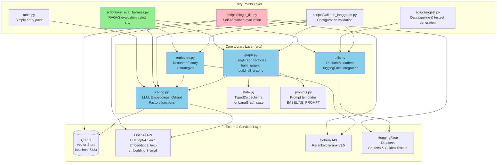
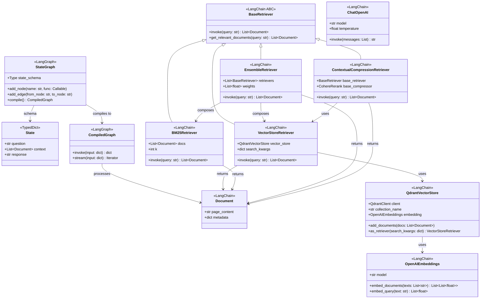
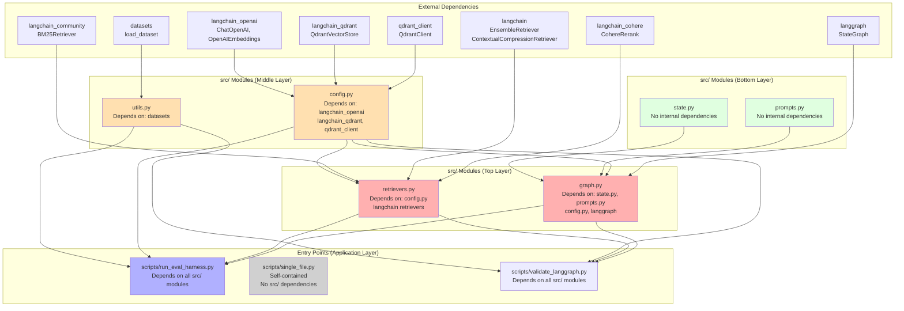
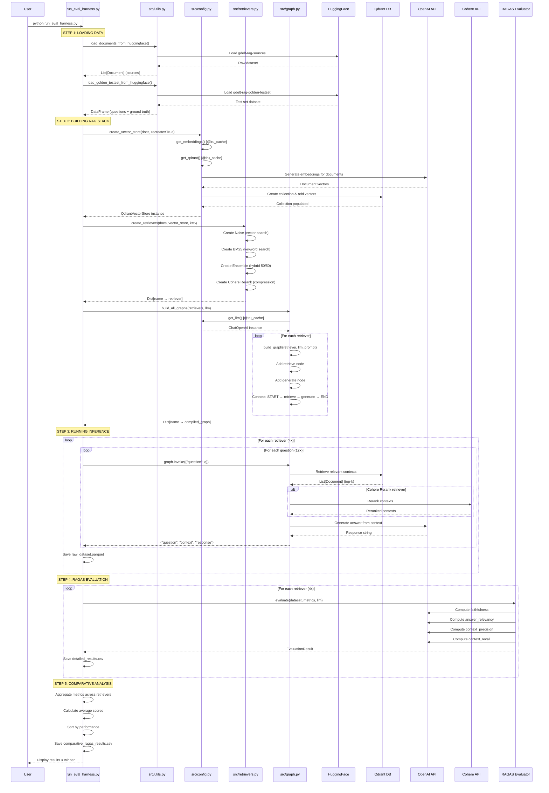
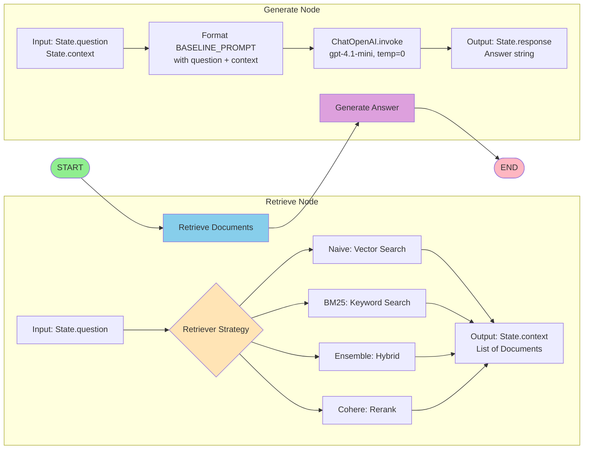

# Architecture Diagrams

## Overview

This document provides comprehensive Mermaid diagrams visualizing the architecture of the GDELT RAG (Retrieval-Augmented Generation) system. The project implements a comparative evaluation framework for multiple retrieval strategies, built on LangChain, LangGraph, and RAGAS evaluation metrics.

The system is organized into three main layers:
1. **Entry Points** - Scripts and applications that use the core library
2. **Core Library** - Reusable modules in the `src/` directory
3. **External Services** - Qdrant vector database, OpenAI API, Cohere API, HuggingFace datasets

The architecture follows factory pattern principles, enabling flexible initialization and configuration of RAG pipelines.

---

## 1. System Architecture (Layered View)

### Description

The GDELT RAG system follows a classic layered architecture pattern with clear separation of concerns:

- **Entry Layer**: Contains executable scripts and applications that orchestrate the RAG workflow
- **Core Library Layer**: Provides reusable components for RAG implementation (configuration, retrievers, graphs, utilities)
- **External Services Layer**: Interfaces with third-party services for vector storage, LLM inference, and data sources

This layered approach enables:
- **Modularity**: Each layer can be developed and tested independently
- **Reusability**: Core library components are shared across multiple entry points
- **Flexibility**: Easy to swap implementations (e.g., different vector stores or LLMs)
- **Testability**: Factory patterns enable easy mocking and testing

### Diagram



### Key Points

- **Dual Entry Points**: The system has two primary evaluation harnesses:
  - `run_eval_harness.py` - Uses modular `src/` components (recommended)
  - `single_file.py` - Self-contained implementation (reference/fallback)

- **Factory Pattern**: All core components use factory functions instead of module-level instances, enabling proper initialization order and dependency injection

- **Configuration Centralization**: `config.py` provides cached singleton access to LLM, embeddings, and Qdrant client via `@lru_cache` decorators

- **Data Pipeline**: `ingest.py` handles the complete data pipeline from PDF extraction through RAGAS golden testset generation

- **Validation Tools**: `validate_langgraph.py` provides comprehensive validation of the LangGraph implementation and environment setup

---

## 2. Component Relationships

### Description

The component relationship diagram shows how the core library modules interact with each other and orchestrate the RAG workflow. The system follows a clear data flow pattern:

1. **Configuration Phase**: `config.py` initializes shared resources (LLM, embeddings, Qdrant client)
2. **Data Loading Phase**: `utils.py` loads documents and test sets from HuggingFace
3. **Retriever Creation Phase**: `retrievers.py` creates four different retrieval strategies
4. **Graph Building Phase**: `graph.py` compiles LangGraph workflows for each retriever
5. **Execution Phase**: Compiled graphs process questions through retrieve → generate pipeline

The factory pattern ensures proper initialization order and enables flexible configuration.

### Diagram

```mermaid
graph LR
    subgraph "Data Sources"
        HF1[HuggingFace<br/>gdelt-rag-sources]
        HF2[HuggingFace<br/>gdelt-rag-golden-testset]
    end

    subgraph "src/utils.py"
        U1[load_documents_from_huggingface]
        U2[load_golden_testset_from_huggingface]
    end

    subgraph "src/config.py"
        C1[get_llm<br/>@lru_cache]
        C2[get_embeddings<br/>@lru_cache]
        C3[get_qdrant<br/>@lru_cache]
        C4[create_vector_store<br/>Factory function]
    end

    subgraph "src/retrievers.py"
        R1[create_retrievers<br/>Factory function]
        R2[Naive: Vector search]
        R3[BM25: Keyword search]
        R4[Ensemble: Hybrid 50/50]
        R5[Cohere Rerank: Compression]
    end

    subgraph "src/graph.py"
        G1[build_graph<br/>Single retriever]
        G2[build_all_graphs<br/>All retrievers]
        G3[Retrieve Node]
        G4[Generate Node]
    end

    subgraph "src/state.py"
        S1[State: TypedDict<br/>question, context, response]
    end

    subgraph "src/prompts.py"
        P1[BASELINE_PROMPT<br/>Template string]
    end

    HF1 --> U1
    HF2 --> U2

    U1 --> C4
    C2 --> C4
    C3 --> C4

    C4 --> R1
    U1 --> R1

    R1 --> R2 & R3 & R4 & R5

    R2 & R3 & R4 & R5 --> G2
    C1 --> G1 & G2
    P1 --> G1 & G2
    S1 --> G1 & G2

    G1 --> G3 & G4
    G2 --> G3 & G4

    style U1 fill:#FFE4B5
    style U2 fill:#FFE4B5
    style C4 fill:#B0E0E6
    style R1 fill:#DDA0DD
    style G1 fill:#98FB98
    style G2 fill:#98FB98
```

### Key Points

- **Factory Chain**: The system uses a chain of factory functions, each depending on outputs from previous stages:
  1. `load_documents_from_huggingface()` → Documents
  2. `create_vector_store(documents)` → QdrantVectorStore
  3. `create_retrievers(documents, vector_store)` → Dict[retriever_name, retriever]
  4. `build_all_graphs(retrievers)` → Dict[retriever_name, compiled_graph]

- **Singleton Resources**: LLM, embeddings, and Qdrant client are cached singletons (`@lru_cache`) to avoid redundant initialization

- **Four Retrieval Strategies**:
  - **Naive**: Dense vector similarity search (baseline)
  - **BM25**: Sparse keyword matching (TF-IDF based)
  - **Ensemble**: Weighted combination of Naive + BM25 (50/50)
  - **Cohere Rerank**: Contextual compression with neural reranking

- **State Management**: The `State` TypedDict defines the contract for data flowing through LangGraph nodes

- **Prompt Templates**: Centralized in `prompts.py` for consistency across all retrievers

---

## 3. Class Hierarchies

### Description

The GDELT RAG system primarily uses factory functions and composition rather than deep class hierarchies. However, there are important class relationships to understand:

1. **State Schema**: TypedDict defining the LangGraph state structure
2. **LangChain Components**: Various retriever implementations and document types
3. **Configuration Components**: Factory functions that return configured instances

The design favors composition over inheritance, using LangChain's existing class hierarchies rather than creating custom subclasses.

### Diagram



### Key Points

- **Composition Over Inheritance**: The system uses LangChain's existing retriever classes rather than creating custom subclasses

- **TypedDict State Schema**: The `State` TypedDict provides type hints and IDE support without runtime overhead

- **Retriever Hierarchy**: All retrievers implement the `BaseRetriever` interface:
  - `VectorStoreRetriever`: Dense vector search (Naive strategy)
  - `BM25Retriever`: Sparse keyword search
  - `EnsembleRetriever`: Combines multiple retrievers with weights
  - `ContextualCompressionRetriever`: Wraps base retriever with compression/reranking

- **Vector Store Integration**: `QdrantVectorStore` acts as the bridge between embeddings and retrieval:
  - Uses `OpenAIEmbeddings` to convert documents/queries to vectors
  - Stores vectors in Qdrant database
  - Returns `VectorStoreRetriever` instances via `as_retriever()`

- **LangGraph Compilation**: `StateGraph` uses the `State` schema and compiles to an executable `CompiledGraph` that enforces state contracts

---

## 4. Module Dependencies

### Description

The module dependency structure shows the import relationships and initialization order requirements. The system is designed to avoid circular dependencies through careful layering:

- **Bottom Layer**: `state.py` and `prompts.py` have no dependencies on other `src/` modules
- **Middle Layer**: `config.py` and `utils.py` depend only on external libraries
- **Upper Layer**: `retrievers.py` and `graph.py` depend on lower layers

All modules follow the factory pattern to avoid initialization-order issues.

### Diagram



### Key Points

- **Layered Dependencies**: The module structure enforces clear dependency flow:
  - Bottom layer (green): No internal dependencies
  - Middle layer (orange): Depend on external libs + bottom layer
  - Top layer (red): Depend on all lower layers
  - Application layer (blue): Depend on all src/ modules

- **No Circular Dependencies**: The design prevents circular imports:
  - `state.py` and `prompts.py` are pure data/constants
  - `config.py` and `utils.py` are independent utilities
  - `retrievers.py` and `graph.py` compose lower-layer components

- **Factory Pattern Benefits**:
  - All modules export factory functions, not instances
  - Enables proper initialization order (e.g., documents before retrievers)
  - Allows dependency injection for testing

- **Two Evaluation Paths**:
  - **Modular**: `run_eval_harness.py` imports from `src/` (recommended)
  - **Monolithic**: `single_file.py` is self-contained (reference implementation)

- **Validation Tools**: `validate_langgraph.py` checks that all modules import correctly and factory patterns work as expected

---

## 5. Data Flow

### Description

The data flow diagram illustrates how data moves through the system during a typical RAG evaluation workflow. The process follows these stages:

1. **Data Ingestion**: Load documents from HuggingFace and create vector embeddings
2. **Retriever Setup**: Initialize four different retrieval strategies
3. **Graph Compilation**: Build LangGraph workflows for each retriever
4. **Query Processing**: Execute questions through retrieve → generate pipeline
5. **Evaluation**: Measure performance with RAGAS metrics

This workflow is orchestrated by `run_eval_harness.py` (modular) or `single_file.py` (self-contained).

### Diagram



### Key Points

- **Five-Stage Pipeline**: The evaluation workflow consists of distinct stages:
  1. **Data Loading**: Pull source documents and test questions from HuggingFace
  2. **RAG Stack Building**: Create vector store and initialize retrievers
  3. **Graph Compilation**: Build executable LangGraph workflows
  4. **Inference**: Run 12 questions × 4 retrievers = 48 total executions
  5. **Evaluation**: Compute RAGAS metrics for each retriever

- **Lazy Initialization**: Cached singletons (`@lru_cache`) ensure resources are created once:
  - LLM instance is reused across all graph invocations
  - Embeddings instance is reused for vectorization
  - Qdrant client is reused for all retrieval operations

- **External Service Calls**: The system makes multiple API calls:
  - **OpenAI**: Document embeddings (one-time), query embeddings (per question), LLM generation (per question), RAGAS evaluation (multiple per question)
  - **Cohere**: Reranking (only for cohere_rerank retriever)
  - **Qdrant**: Vector similarity search (per question)
  - **HuggingFace**: Dataset downloads (one-time, cached)

- **Data Persistence**: Results are saved at multiple stages:
  - Raw outputs: `{retriever}_raw_dataset.parquet` (6 columns: user_input, reference_contexts, reference, synthesizer_name, response, retrieved_contexts)
  - Evaluation datasets: `{retriever}_evaluation_dataset.csv` (RAGAS format)
  - Detailed results: `{retriever}_detailed_results.csv` (per-question metric scores)
  - Comparative summary: `comparative_ragas_results.csv` (aggregated metrics)

- **Retriever-Specific Flows**:
  - **Naive**: Qdrant vector search only
  - **BM25**: In-memory keyword search (no Qdrant)
  - **Ensemble**: Parallel calls to Naive + BM25, then weighted merge
  - **Cohere Rerank**: Qdrant retrieves 20 documents → Cohere reranks to top 5

---

## 6. LangGraph Workflow Details

### Description

This diagram zooms into the LangGraph workflow structure, showing how the `StateGraph` orchestrates the retrieve → generate pipeline. Each compiled graph follows the same node structure but uses a different retriever strategy.

The workflow is stateful: each node receives the current state, performs transformations, and returns partial state updates that are automatically merged by LangGraph.

### Diagram



### Key Points

- **Linear Pipeline**: The workflow follows a simple two-node pipeline:
  1. **Retrieve Node**: Fetches relevant documents based on the question
  2. **Generate Node**: Produces an answer using the retrieved context

- **State Transformations**:
  - **Initial State**: `{"question": "What is GDELT?"}`
  - **After Retrieve**: `{"question": "...", "context": [Doc1, Doc2, ...]}`
  - **After Generate**: `{"question": "...", "context": [...], "response": "GDELT is..."}`

- **Retriever Strategy Injection**: The same graph structure works with all four retrievers:
  - Graph compilation: `build_graph(retriever_instance, llm, prompt_template)`
  - The retriever is captured in the closure of the `retrieve` node function
  - Different graphs use different retrievers but identical node logic

- **Deterministic Generation**: LLM is configured with `temperature=0` for reproducible outputs in evaluation

- **Prompt Formatting**: The `BASELINE_PROMPT` template is filled with:
  ```
  Question: {state["question"]}
  Context: {"\n\n".join(doc.page_content for doc in state["context"])}
  ```

---

## Summary

### Architectural Insights

The GDELT RAG system demonstrates several important architectural patterns:

1. **Factory Pattern Throughout**: All components use factory functions instead of module-level instances, enabling:
   - Proper initialization ordering
   - Dependency injection for testing
   - Configuration flexibility
   - Reusability across different scripts

2. **Separation of Concerns**: Clear layering with well-defined responsibilities:
   - `src/config.py`: Resource management and singletons
   - `src/utils.py`: Data loading from external sources
   - `src/retrievers.py`: Retrieval strategy implementations
   - `src/graph.py`: Workflow orchestration
   - `src/state.py` & `src/prompts.py`: Shared schemas and templates

3. **Dual Implementation Strategy**:
   - **Modular** (`run_eval_harness.py`): Uses `src/` modules for maintainability
   - **Monolithic** (`single_file.py`): Self-contained for reference and portability
   - Both produce identical results, validated by comparative evaluation

4. **External Service Integration**: The system integrates multiple external services:
   - **Qdrant**: Persistent vector storage for semantic search
   - **OpenAI**: LLM inference and embeddings
   - **Cohere**: Neural reranking for improved relevance
   - **HuggingFace**: Dataset versioning and distribution
   - **RAGAS**: Standardized RAG evaluation metrics

5. **Evaluation-First Design**: The architecture is built around comparative evaluation:
   - Four retrieval strategies (Naive, BM25, Ensemble, Cohere Rerank)
   - Standardized evaluation with RAGAS metrics (Faithfulness, Answer Relevancy, Context Precision, Context Recall)
   - Detailed result persistence for reproducibility
   - Manifest generation for run provenance

### Key Architectural Benefits

- **Modularity**: Easy to swap LLMs, vector stores, or retrieval strategies
- **Testability**: Factory pattern enables mocking and unit testing
- **Reproducibility**: Cached dependencies and version pinning ensure consistent results
- **Extensibility**: New retrievers can be added without modifying existing code
- **Observability**: Comprehensive logging and result persistence at each stage
- **Validation**: Built-in validation tools (`validate_langgraph.py`) for environment checks

### Design Patterns Used

1. **Factory Pattern**: `create_retrievers()`, `create_vector_store()`, `build_graph()`
2. **Singleton Pattern**: `@lru_cache` on `get_llm()`, `get_embeddings()`, `get_qdrant()`
3. **Strategy Pattern**: Four different retriever strategies with identical interface
4. **Template Method Pattern**: Shared `BASELINE_PROMPT` with variable context insertion
5. **Composition Over Inheritance**: Uses LangChain's retriever hierarchy instead of custom subclasses

### File Reference Summary

**Core Library** (`/home/donbr/don-aie-cohort8/cert-challenge/src/`):
- `config.py` (lines 27-128): Configuration and factory functions
- `state.py` (lines 7-10): State schema definition
- `prompts.py` (lines 4-12): Prompt templates
- `retrievers.py` (lines 20-89): Retriever factory and strategies
- `graph.py` (lines 21-141): LangGraph workflow factories
- `utils.py` (lines 15-114): HuggingFace data loaders

**Entry Points** (`/home/donbr/don-aie-cohort8/cert-challenge/scripts/`):
- `run_eval_harness.py` (lines 1-323): Modular evaluation harness
- `single_file.py` (lines 1-511): Self-contained evaluation harness
- `validate_langgraph.py` (lines 1-487): Configuration validation tool
- `ingest.py` (lines 1-336): Data pipeline and testset generation

**Root** (`/home/donbr/don-aie-cohort8/cert-challenge/`):
- `main.py` (lines 1-6): Simple entry point

This architecture provides a robust, maintainable foundation for RAG system development and comparative evaluation.
